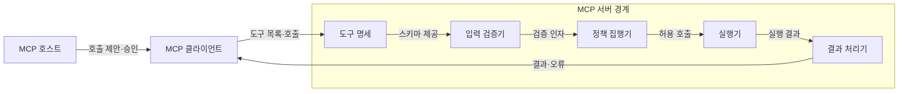
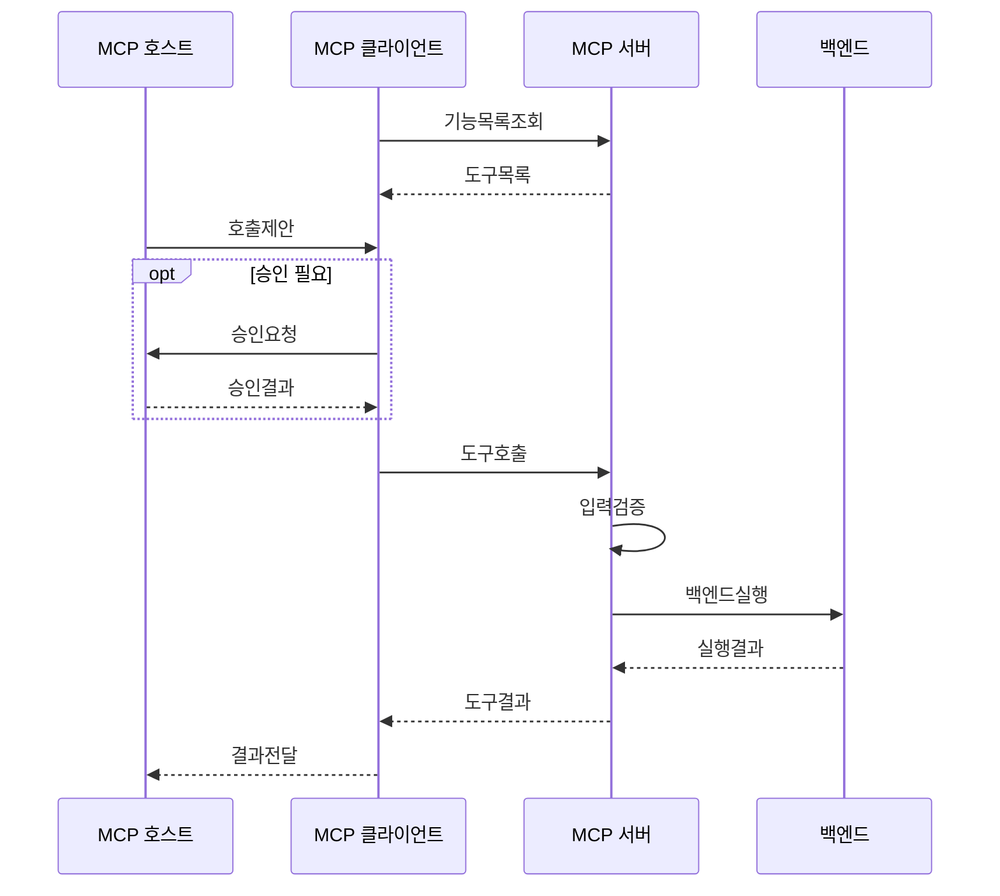

---
sidebar:
  order: 10
  label: "010. MCP Tool (모델 컨텍스트 프로토콜 도구)"
  badge:
    text: "기출 · 30%"
    variant: note
title: "MCP Tool (모델 컨텍스트 프로토콜 도구)"
date: "2026-07-27T23:59:59+09:00"
tags:
  - "notes-latest_tech"
weight: 10
extra:
  question_no: "010"
  source_status: "기출"
  source_history: "138회"
  priority: 30
  priority_note: "도구 노출은 MCP 실행 구조의 핵심"
---

## 미리 알고가기

- **모델 컨텍스트 프로토콜 (Model Context Protocol, MCP)**: 호스트와 서버의 기능·컨텍스트 교환 규격
- **대규모 언어 모델 (Large Language Model, LLM)**: 도구 호출 인자를 생성하는 모델
- **제이에스온 (JavaScript Object Notation, JSON)**: 도구 인자를 구조화하는 데이터 형식
- **JSON 스키마 (JSON Schema)**: 도구 입력·출력 구조를 정의하는 규격
- **부작용 (Side Effect)**: 실행으로 외부 시스템 상태가 바뀌는 현상
- **인간 개입 (Human-in-the-Loop, HITL)**: 고위험 호출을 사람이 승인하는 통제
- **프롬프트 주입 (Prompt Injection)**: 악성 지시로 도구 호출을 유도하는 공격
- **약어 읽기·표기**: MCP·LLM·HITL은 ‘엠시피·엘엘엠·에이치아이티엘’, JSON은 ‘제이슨’으로 읽고 영문 머리글자로 프로토콜·모델·승인·데이터 형식을 구분함

## Ⅰ. 개요
- 정의/개념: 서버가 스키마로 노출하는 모델 제어형 실행 기능
- 기존 한계: 앱별 함수 연동은 인자·결과·권한 계약이 상이

### 쉽게 이해하기 (학습용)
- AI가 설명서를 보고 필요한 기계를 호출하는 기능임

## Ⅱ. 특징
- **모델 제어**: 모델이 문맥에 맞는 도구·인자를 제안한다
- **스키마 호출**: 목록·호출로 입력 계약을 표준화한다
- **안전 집행**: 서버 검증과 사용자 승인으로 부작용을 통제한다

### 쉽게 이해하기 (학습용)
- 도구 설명서를 보고 호출하지만 위험한 일은 서버와 사람이 한 번 더 확인함

## Ⅲ. 아키텍처 및 구성요소

| 설계 요소 | 설명 |
|:---|:---|
| 도구 명세 | 이름·설명·입력 스키마를 제공 |
| 입력 검증기 | 인자 구조와 값의 유효성을 검사 |
| 정책 집행기 | 권한·동의·부작용 정책을 적용 |
| 실행기 | 허용된 도구를 백엔드에서 실행 |
| 결과 처리기 | 콘텐츠·오류를 클라이언트로 반환 |

> 요약: 명세·검증·정책을 거쳐 도구를 실행

### 쉽게 이해하기 (학습용)
- 설명서와 검사 담당자를 거쳐 허용된 명령만 실행하고 결과를 돌려줌

## Ⅳ. 원리 및 절차 흐름도

| 절차 | 설명 |
|:---|:---|
| 기능목록조회 | 사용 가능한 도구를 요청 |
| 도구목록 | 도구명·설명·스키마를 수신 |
| 호출제안 | 모델이 도구와 인자를 제안 |
| 승인요청 | 고위험 호출의 사용자 승인을 요청 |
| 승인결과 | 호출 허용·거부를 반환 |
| 도구호출 | 도구명과 인자를 서버에 전송 |
| 입력검증 | 스키마와 권한을 검사 |
| 백엔드실행 | 허용된 기능을 실행 |
| 실행결과 | 백엔드 결과를 서버에 반환 |
| 도구결과 | 콘텐츠와 오류 상태를 반환 |
| 결과전달 | 도구 결과를 모델 입력에 반영 |

> 요약: 제안·승인·검증 후 도구 결과를 반영

### 쉽게 이해하기 (학습용)
- AI가 도구를 고르면 사람이 승인하고 서버가 검사한 뒤 실행함

## Ⅴ. MCP 서버 기본 기능 비교

| 비교 기준 | Resource | Tool | Prompt |
|:---|:---|:---|:---|
| 적용 기준 | 문맥 데이터를 제공할 때 | 외부 기능을 실행할 때 | 사용자용 작업 틀을 제공할 때 |
| 핵심 특징 | 앱 제어·URI 조회 | 모델 제어·스키마 호출 | 사용자 제어·메시지 생성 |
| 한계 | 직접 행동 수행 불가 | 부작용·권한 위험 | 사용자 선택·입력 필요 |

> 요약: 데이터·실행·템플릿의 제어 주체가 다름

### 쉽게 이해하기 (학습용)
- 도구는 일을 시키고 리소스는 필요한 자료를 읽는 기능임

## Ⅵ. 실무 사례
- 서버 운영: **재시작 Tool**을 대상 검증·승인 후 호출

### 쉽게 이해하기 (학습용)
- 서버를 다시 켜는 명령은 대상을 확인하고 사람 허락 뒤 실행함

## Ⅶ. 결론
- 외부 상태 변경을 위해 최소 권한·HITL을 검토하여 **MCP Tool** 활용

### 쉽게 이해하기 (학습용)
- 위험한 도구일수록 권한을 좁히고 사람 확인을 거침
