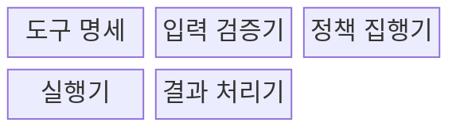
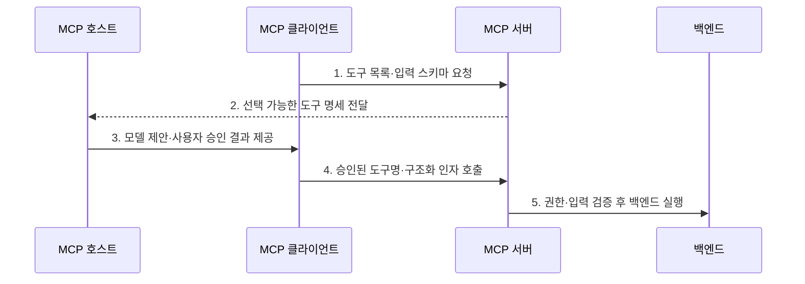

---
sidebar:
  order: 10
  label: "010. MCP Tool (모델 컨텍스트 프로토콜 도구)"
  badge:
    text: "기출 · 30%"
    variant: note
title: "MCP Tool (모델 컨텍스트 프로토콜 도구)"
date: "2026-07-30T11:04:43+09:00"
tags:
  - "notes-latest_tech"
weight: 10
extra:
  question_no: "010"
  source_status: "기출"
  source_history: "138회"
  priority: 30
  priority_note: "도구 노출은 MCP 실행 구조의 핵심"
---

## 미리 알고가기

- **모델 컨텍스트 프로토콜(Model Context Protocol, MCP)**: 호스트와 서버의 기능·컨텍스트 교환을 표준화한 프로토콜
- **대규모 언어 모델(Large Language Model, LLM)**: 문맥과 도구 명세를 바탕으로 호출할 도구와 인자를 생성하는 모델이다.
- **JSON(JavaScript Object Notation)**: 도구명과 호출 인자를 구조화하는 데이터 형식이다.
- **JSON 스키마(JSON Schema)**: 도구 입력·출력 구조와 자료형·필수 필드를 정의하는 규격
- **부작용(Side Effect)**: 도구 실행으로 외부 시스템의 데이터나 상태가 바뀌는 현상
- **인간 개입(Human-in-the-Loop, HITL)**: 고위험 호출을 사람이 검토·승인하는 통제
- **프롬프트 주입(Prompt Injection)**: 비신뢰 콘텐츠의 악성 지시로 도구 호출을 유도하는 공격

## Ⅰ. 개요

- 정의/개념: MCP 서버가 이름·설명·입력 스키마로 노출하고 호스트·서버의 검증을 통과한 모델 제안에 따라 외부 시스템의 조회·변경 기능을 실행하는 서버 기능
- 배경/필요성: 애플리케이션별 함수 연동은 기능 발견과 인자·결과·권한 계약이 달라 모델이 여러 외부 행동을 일관되게 선택·호출하기 곤란

### 쉽게 이해하기 (학습용)
- AI가 설명서를 보고 필요한 기계를 호출하는 기능임

## Ⅱ. 특징

- 모델 제어 방식으로 모델이 사용자 목표와 문맥에 맞는 도구·인자를 제안
- tools/list와 tools/call 메시지 및 JSON 스키마로 기능 발견과 입력 계약을 표준화
- 호스트의 사용자 동의와 서버의 권한·업무 규칙 재검증으로 실제 부작용을 통제

### 쉽게 이해하기 (학습용)
- 도구 설명서를 보고 호출하지만 위험한 일은 서버와 사람이 한 번 더 확인함

## Ⅲ. 구조 및 구성요소

| 구성요소 | 책임 |
|:---|:---|
| 도구 명세 | 이름·설명·입력 스키마를 제공 |
| 입력 검증기 | 인자 구조와 값의 유효성을 검사 |
| 정책 집행기 | 권한·동의·부작용 정책을 적용 |
| 실행기 | 허용된 도구를 백엔드에서 실행 |
| 결과 처리기 | 콘텐츠·오류를 클라이언트로 반환 |

### 쉽게 이해하기 (학습용)
- 설명서와 검사 담당자를 거쳐 허용된 명령만 실행하고 결과를 돌려줌

## Ⅳ. 흐름도

### 동작 원리

1. **도구 목록·입력 스키마 요청**: 협상된 서버에서 사용 가능한 행동과 인자 계약 탐색
2. **선택 가능한 도구 명세 전달**: 호스트가 출처·위험과 함께 모델에 노출할 기능 결정
3. **모델 제안·사용자 승인 결과 제공**: 도구·인자를 선택하고 고위험 호출의 동의 여부 판정
4. **승인된 도구명·구조화 인자 호출**: MCP 클라이언트가 tools/call 요청 전송
5. **권한·입력 검증 후 백엔드 실행**: 서버가 주체·대상·업무 규칙을 재검증하고 결과·오류 반환

### 쉽게 이해하기 (학습용)
- AI가 도구를 고르면 사람이 승인하고 서버가 검사한 뒤 실행함

## Ⅴ. 종류 및 비교

| 비교 기준 | Resource | Tool | Prompt |
|:---|:---|:---|:---|
| 적용 기준 | 문맥 데이터를 제공할 때 | 외부 기능을 실행할 때 | 사용자용 작업 틀을 제공할 때 |
| 핵심 특징 | 앱 제어·URI 조회 | 모델 제어·스키마 호출 | 사용자 제어·메시지 생성 |
| 한계 | 직접 행동 수행 불가 | 부작용·권한 위험 | 사용자 선택·입력 필요 |

### 쉽게 이해하기 (학습용)
- 도구는 일을 시키고 리소스는 필요한 자료를 읽는 기능임

## Ⅵ. 실무 고려사항 및 대책

| 고려사항 | 대책 | 효과 |
|:---|:---|:---|
| 도구 설명을 이용한 과도한 호출 | 호스트가 목적별 도구 허용 목록과 최소권한을 적용 | 모델의 행동 범위 제한 |
| 프롬프트 주입에 따른 상태 변경 | 비신뢰 콘텐츠와 명령을 분리하고 변경 호출에 사용자 승인 요구 | 간접 지시의 권한 상승 방지 |
| 서버 재시작 대상·인자 오류 | 서버가 대상·현재 상태·업무 규칙을 재검증하고 감사 로그 기록 | 잘못된 부작용과 책임 공백 축소 |

### 쉽게 이해하기 (학습용)
- 서버를 다시 켜는 명령은 대상을 확인하고 사람 허락 뒤 실행함

## Ⅶ. 결론

- 외부 시스템의 행동을 모델이 선택해야 하면 MCP 도구를 사용하되, 읽기와 변경 권한을 분리하고 호스트 승인과 서버 재검증을 모두 통과한 호출만 실행

### 쉽게 이해하기 (학습용)
- 위험한 도구일수록 권한을 좁히고 사람 확인을 거침
