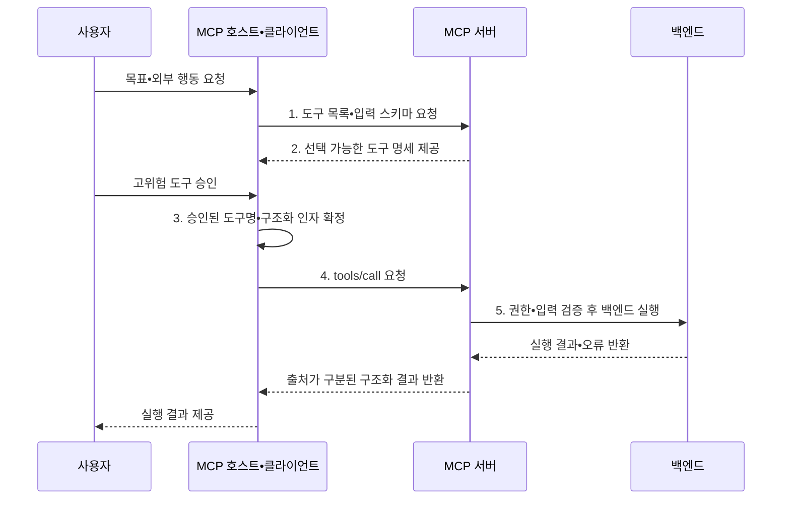

---
sidebar:
  order: 10
  label: "010. MCP Tool (모델 컨텍스트 프로토콜 도구)"
  badge:
    text: "기출 • 30%"
    variant: note
title: "MCP Tool (모델 컨텍스트 프로토콜 도구)"
date: "2026-08-05T14:23:10+09:00"
tags:
  - "notes-latest_tech"
weight: 10
extra:
  question_no: "010"
  source_status: "기출"
  source_history: "138회"
  priority: 30
  priority_note: "도구 노출은 MCP 실행 구조의 핵심"
---

## Ⅰ. 개요

<details>
<summary>핵심 용어</summary>

- **모델 컨텍스트 프로토콜(Model Context Protocol, MCP)**: 호스트와 서버의 기능•컨텍스트 교환을 표준화한 프로토콜
- **모델 컨텍스트 프로토콜 도구(Model Context Protocol Tool, MCP Tool)**: 구조화된 인자로 외부 시스템의 행동을 실행하는 MCP 기능
- **대규모 언어 모델(Large Language Model, LLM)**: 문맥과 도구 명세를 바탕으로 호출할 도구와 인자를 생성하는 모델

</details>

- 정의/개념: 서버가 구조화 명세로 외부 행동을 공개하는 **MCP Tool**
- 배경/필요성: 함수별 인자•권한 계약 차이로 **LLM의 일관된 행동 호출 곤란**

#### 한줄 요약
- AI가 설명서를 보고 필요한 기계를 호출하는 기능임

## Ⅱ. 특징

<details>
<summary>핵심 용어</summary>

- **자바스크립트 객체 표기법 스키마(JavaScript Object Notation Schema, JSON Schema)**: 도구 입력•출력 구조와 자료형•필수 필드를 정의하는 규격
- **부작용(Side Effect)**: 도구 실행으로 외부 시스템의 데이터나 상태가 바뀌는 현상

</details>

- **선택 축**: **LLM** 기반 목표•문맥별 도구•인자 제안
- **계약 축**: tools/list•tools/call•**JSON Schema** 표준화
- **통제 축**: 호스트 동의•서버 재검증으로 부작용 통제

#### 한줄 요약
- 도구 설명서를 보고 호출하지만 위험한 일은 서버와 사람이 한 번 더 확인함

## Ⅲ. 구조 및 구성요소

<details>
<summary>핵심 용어</summary>

- **정책 집행기**: 권한•사용자 동의•부작용 허용 범위를 확인해 실행 여부를 결정하는 구성요소
- **백엔드 도구**: MCP 서버가 검증 후 실제 외부 시스템에서 실행하는 기능
- **모델 컨텍스트 프로토콜 서버(Model Context Protocol Server, MCP Server)**: 도구 명세를 제공하고 검증된 백엔드 행동을 실행하는 구성요소

</details>

- **JSON Schema** 기반 명세를 입력 검증기와 정책 집행기가 확인한 뒤 **MCP Server** 내부 실행기가 백엔드 도구를 호출한다.

```text
                         [정책 집행기]
                        /             \
              [입력 검증기]         [실행기]
                    |                   |
                [도구 명세]        [결과 처리기]
```

선의 의미: 정책 집행기는 입력 검증기와 실행기의 권한 경계를 통제하고, 입력 검증기는 도구 명세를 기준으로 인자를 검사하며, 실행기의 결과는 결과 처리기가 구조화한다.

| 구성요소 | 책임 |
|:---|:---|
| 도구 명세 | **이름•설명•JSON 스키마** 제공 |
| 입력 검증기 | **인자 구조•값 유효성** 검사 |
| 정책 집행기 | **권한•동의•부작용 정책** 적용 |
| 실행기 | 허용된 **백엔드 도구** 실행 |
| 결과 처리기 | **구조화 콘텐츠•오류** 반환 |

#### 한줄 요약
- 설명서와 검사 담당자를 거쳐 허용된 명령만 실행하고 결과를 돌려줌

## Ⅳ. 흐름도

<details>
<summary>핵심 용어</summary>

- **인간 개입(Human-in-the-Loop, HITL)**: 고위험 호출을 사람이 검토•승인하는 통제
- **tools/list•tools/call**: MCP 서버의 도구 명세를 조회하고 선택한 도구를 실행하는 표준 요청
- **모델 컨텍스트 프로토콜 호스트(Model Context Protocol Host, MCP Host)**: 사용자 동의와 정책에 따라 도구 호출을 중개하는 AI 애플리케이션

</details>

- **MCP Host**와 **MCP Server** 사이에서 **JSON** 인자를 교환하고 고위험 호출에는 **HITL** 승인을 적용한다.



1. **도구 목록•입력 스키마 요청**: 사용 가능한 행동•인자 계약 탐색
2. **선택 가능한 도구 명세 제공**: 허용 기능의 명세 반환
3. **승인된 도구명•구조화 인자 제공**: 모델 제안•HITL 결과 전달
4. **tools/call 요청**: 도구명과 JSON 구조화 인자 전송
5. **권한•입력 검증 후 백엔드 실행**: 허용된 행동만 수행

#### 한줄 요약
- AI가 도구를 고르면 사람이 승인하고 서버가 검사한 뒤 실행함

## Ⅴ. 종류 및 비교

<details>
<summary>핵심 용어</summary>

- **Resource**: 애플리케이션이 제공하고 모델이 문맥으로 읽는 데이터
- **Tool**: 모델이 구조화된 인자로 호출해 외부 행동을 수행하는 기능
- **Prompt**: 사용자가 선택해 작업 메시지와 입력 틀을 만드는 기능
- **모델 컨텍스트 프로토콜 리소스(Model Context Protocol Resource, MCP Resource)**: URI로 식별한 읽기 문맥을 제공하는 MCP 기능
- **통합 자원 식별자(Uniform Resource Identifier, URI)**: 리소스를 고유하게 가리키는 주소 표기

</details>

- **MCP Resource•Tool•Prompt**를 **URI 조회**, 스키마 호출, 메시지 생성 기준으로 구분한다.

| 비교 기준 | Resource | Tool | Prompt |
|:---|:---|:---|:---|
| 적용 기준 | **문맥 데이터 제공** | **외부 기능 실행** | **사용자 작업 틀 제공** |
| 핵심 특징 | 앱 제어•**URI 조회** | 모델 제어•**스키마 호출** | 사용자 제어•**메시지 생성** |
| 한계 | **직접 행동 수행 불가** | **부작용•권한 위험** | **사용자 선택•입력 필요** |

> 요약: 문맥 조회에는 **Resource**, 행동에는 **Tool**, 작업 틀에는 **Prompt** 적용

#### 한줄 요약
- 도구는 일을 시키고 리소스는 필요한 자료를 읽는 기능임

## Ⅵ. 실무 고려사항 및 대책

<details>
<summary>핵심 용어</summary>

- **프롬프트 주입(Prompt Injection)**: 비신뢰 콘텐츠의 악성 지시로 도구 호출을 유도하는 공격
- **최소권한**: 도구에 업무 수행에 필요한 최소 범위의 권한만 부여하는 원칙

</details>

| 문제 | 대책 | 효과 |
|:---|:---|:---|
| 과도한 도구 호출로 **행동 범위 확대** | **허용 목록•최소권한** 적용 | 모델 행동 범위 제한 |
| 프롬프트 주입으로 **무단 상태 변경** | 비신뢰 명령 분리•**HITL 승인** | 간접 권한 상승 방지 |
| 대상•인자 오류로 **잘못된 부작용** | **현재 상태•업무 규칙** 재검증 | 오실행•책임 공백 축소 |

#### 한줄 요약
- 서버를 다시 켜는 명령은 대상을 확인하고 사람 허락 뒤 실행함

## Ⅶ. 결론

<details>
<summary>핵심 용어</summary>

</details>

- 외부 행동에는 **MCP Tool**, 읽기 문맥에는 **Resource** 선택

#### 한줄 요약
- 위험한 도구일수록 권한을 좁히고 사람 확인을 거침
