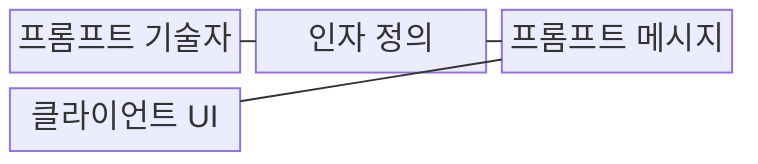
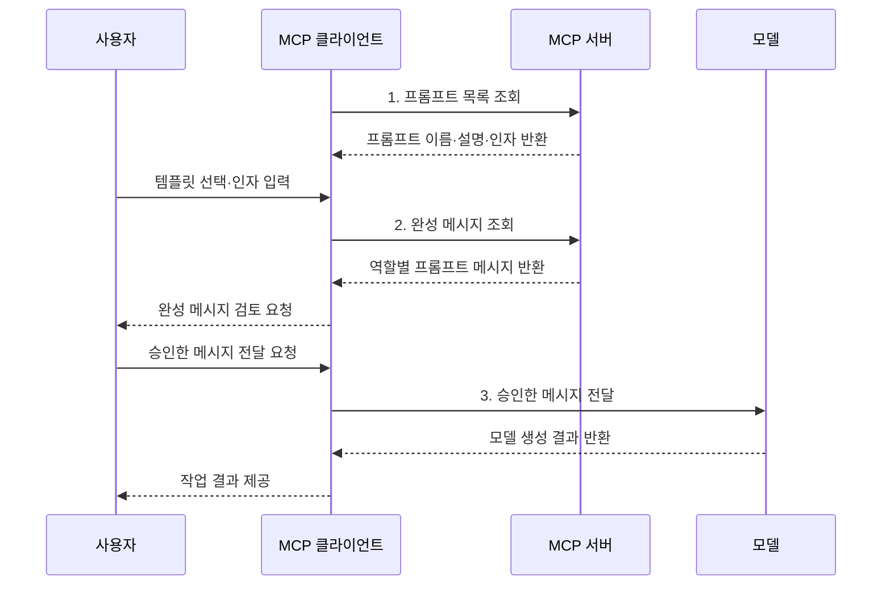

---
sidebar:
  order: 11
  label: "011. MCP Prompt (모델 컨텍스트 프로토콜 프롬프트)"
  badge:
    text: "기출 · 30%"
    variant: note
title: "MCP Prompt (모델 컨텍스트 프로토콜 프롬프트)"
date: "2026-08-02T08:46:00+09:00"
tags:
  - "notes-latest_tech"
weight: 11
extra:
  question_no: "011"
  source_status: "기출"
  source_history: "138회"
  priority: 30
  priority_note: "프롬프트 제공은 MCP 세부 구성요소"
---

## Ⅰ. 개요

핵심 용어

- **MCP 프롬프트(MCP Prompt)**: 서버가 제공한 작업 양식에 사용자가 값을 채우고 검토한 뒤 모델에 전달하는 재사용 기능
- **모델 컨텍스트 프로토콜(Model Context Protocol, MCP)**: 인공지능 애플리케이션과 외부 서버가 컨텍스트와 기능을 교환하는 표준 프로토콜

- 정의/개념: 서버가 **메시지 템플릿**을 제공하고 사용자가 선택·검토해 모델에 전달하는 **MCP 기능**
- 배경/필요성: 앱별 지시문은 작업 양식의 **공유·재사용**과 사용자 통제가 곤란

### 쉽게 이해하기 (학습용)

- 식당 메뉴에서 양식을 고르듯 사용자가 서버의 프롬프트를 선택하고 빈칸을 채운 뒤, 완성 내용을 확인해야 모델에 전달된다.

## Ⅱ. 특징

핵심 용어

- **사용자 제어(User-controlled)**: 프롬프트 선택과 모델 전달 여부를 사용자가 결정하는 제어 방식
- **프롬프트 메시지(PromptMessage)**: 역할과 텍스트·이미지·내장 리소스 등의 콘텐츠를 묶은 메시지
- **내장 리소스(Embedded Resource)**: 프롬프트 메시지 안에 직접 포함된 문서나 코드 같은 컨텍스트

- **사용자 제어**: 사용자가 템플릿 선택·모델 전달 결정
- **생성 축**: 인자값으로 역할별 메시지 생성
- **프롬프트 메시지**: 역할과 텍스트·이미지·**내장 리소스** 구성

### 쉽게 이해하기 (학습용)

- 같은 신청서도 입력값에 따라 내용이 달라지듯 서버는 인자로 메시지를 완성하지만, 제출 단추는 사용자가 누른다.

## Ⅲ. 구조 및 구성요소

핵심 용어

- **프롬프트 기술자**: 템플릿의 이름·설명과 입력할 인자 목록을 제공하는 구성요소
- **인자 정의**: 템플릿에 채울 값의 이름·설명·필수 여부를 정한 계약
- **콘텐츠 블록**: 프롬프트 메시지 안에서 텍스트·이미지·리소스를 구분해 담는 단위

| 구성요소 | 책임 |
|:---|:---|
| 프롬프트 기술자 | **이름·설명**과 인자 목록 제공 |
| 인자 정의 | 인자명·설명·**필수 여부** 명시 |
| 프롬프트 메시지 | 역할과 **콘텐츠 블록** 구성 |
| 클라이언트 UI | 탐색·입력·검토·**사용자 전달** 지원 |

### 쉽게 이해하기 (학습용)

- 서버의 양식 설명서와 빈칸 정의가 완성 메시지를 만들 재료라면, 클라이언트 화면은 사용자가 그 재료를 고르고 확인하는 창구다.

## Ⅳ. 흐름도

핵심 용어

- **프롬프트 목록(prompts/list)**: 서버가 제공하는 프롬프트의 이름·설명·인자를 조회하는 요청
- **프롬프트 조회(prompts/get)**: 프롬프트 이름과 인자를 보내 완성된 메시지를 받는 요청
- **모델 문맥**: 모델이 응답을 생성할 때 함께 참고하는 지시와 입력 정보

1. **프롬프트 목록 조회**: **prompts/list**로 사용 가능한 템플릿 계약 확인
2. **완성 메시지 조회**: **prompts/get**으로 인자가 반영된 메시지 생성
3. **승인한 메시지 전달**: 검토된 메시지만 **모델 문맥**에 반영

### 쉽게 이해하기 (학습용)

- 사용자가 메뉴판에서 양식을 고르고 빈칸을 채우면 서버가 완성본을 돌려주며, 사용자가 마지막으로 확인한 종이만 모델의 작업대에 올라간다.

## Ⅴ. 종류 및 비교

핵심 용어

- **Resource**: 애플리케이션이 제공하고 모델이 문맥으로 읽는 데이터
- **Tool**: 모델이 구조화된 인자로 호출해 외부 행동을 수행하는 기능
- **Prompt**: 사용자가 선택해 작업 메시지와 입력 틀을 만드는 기능

| MCP 기능 | Resource | Tool | Prompt |
|:---|:---|:---|:---|
| 적용 기준 | **문맥 데이터** 제공 | **외부 기능** 실행 | **작업 지시 틀** 제공 |
| 핵심 특징 | 앱 제어·**URI 조회** | 모델 제어·**스키마 호출** | 사용자 제어·**메시지 생성** |
| 한계 | 직접 행동 수행 불가 | **부작용·권한** 위험 | 사용자 선택·입력 필요 |

> 요약: **Resource**는 문맥, **Tool**은 행동, **Prompt**는 작업 지시

### 쉽게 이해하기 (학습용)

- 리소스가 자료함이고 도구가 실행 단추라면 프롬프트는 사용자가 골라 작성하는 공용 작업 지시서다.

## Ⅵ. 실무 고려사항 및 대책

핵심 용어

- **악성 지시**: 사용자의 의도와 달리 모델 행동을 바꾸려고 템플릿에 숨겨 넣은 명령
- **마스킹**: 비밀정보의 일부나 전부를 가려 노출을 제한하는 처리
- **작업 재현성**: 같은 템플릿과 입력에서 일관된 작업 결과를 다시 얻을 수 있는 성질

| 고려사항 | 대책 | 효과 |
|:---|:---|:---|
| 서버 템플릿의 **악성 지시** 혼입 | 서버 신뢰도와 메시지 출처를 표시하고 전달 전 전체 내용 검토 | 비신뢰 지시의 **모델 문맥 유입** 차단 |
| 인자에 비밀정보를 넣는 **정보 노출** | 인자별 민감도 표시와 마스킹·입력 제한 적용 | 템플릿 재사용 중 **최소 정보 공개** |
| 템플릿 변경에 따른 **결과 비일관성** | 버전·변경 이력과 승인된 템플릿을 고정 | 여러 클라이언트의 **작업 재현성** 확보 |

### 쉽게 이해하기 (학습용)

- 여러 개발 도구가 같은 코드 검토 양식을 쓰더라도, 새 문구가 몰래 끼어들지 않았는지 버전과 출처를 확인하고 비밀번호 같은 값은 빈칸에 넣지 않아야 한다.

## Ⅶ. 결론

핵심 용어

- **MCP 프롬프트(MCP Prompt)**: 반복 작업의 지시 양식을 서버에서 공유하고 사용자가 선택·검토하는 기능
- **사용자 검토**: 완성된 메시지의 출처와 인자값을 사람이 확인한 뒤 모델 전달을 승인하는 통제

- 반복 작업의 지시를 공유할 때 **MCP 프롬프트**를 선택하고 출처·인자·사용자 검토로 **모델 전달** 통제

### 쉽게 이해하기 (학습용)

- 여러 도구가 같은 양식을 재사용해도 사용자가 출처와 채워진 내용을 확인한 뒤 제출해야 모델이 안전하고 일관된 지시를 받는다.
