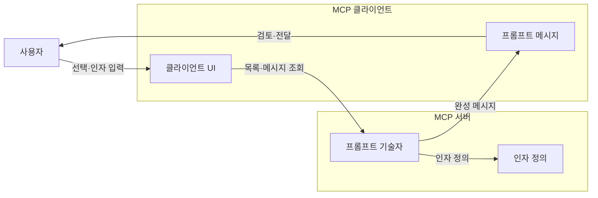
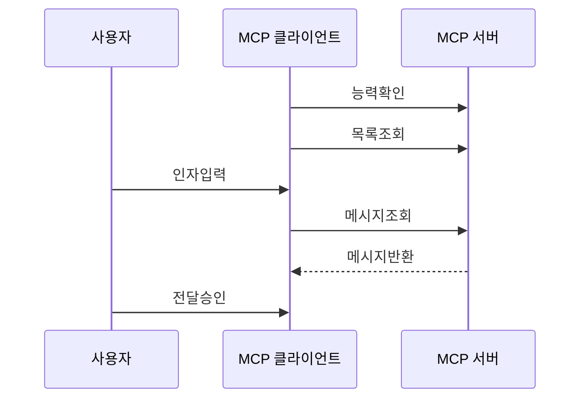

---
sidebar:
  order: 11
  label: "011. MCP Prompt (모델 컨텍스트 프로토콜 프롬프트)"
  badge:
    text: "기출 · 30%"
    variant: note
title: "MCP Prompt (모델 컨텍스트 프로토콜 프롬프트)"
date: "2026-07-27T23:59:59+09:00"
tags:
  - "notes-latest_tech"
weight: 11
extra:
  question_no: "011"
  source_status: "기출"
  source_history: "138회"
  priority: 30
  priority_note: "프롬프트 제공은 MCP 세부 구성요소"
---

## 미리 알고가기

- **모델 컨텍스트 프로토콜(Model Context Protocol, MCP)**: 모델과 서버의 컨텍스트 교환 표준
- **MCP 프롬프트(MCP Prompt)**: 서버가 이름·설명·인자로 제공하고 사용자가 선택하여 모델에 전달하는 재사용 가능한 메시지 템플릿이다.
- **사용자 제어(User-controlled)**: 사용자가 선택·전달 여부를 결정
- **프롬프트 목록(prompts/list)**: 템플릿 이름·설명·인자 조회
- **프롬프트 조회(prompts/get)**: 이름·인자로 완성 메시지 조회
- **프롬프트 메시지(PromptMessage)**: 역할과 콘텐츠 블록의 묶음
- **내장 리소스(Embedded Resource)**: 메시지에 포함된 문서·코드
- **자동완성(Completion)**: 프롬프트 인자 후보값 제안
- **사용자 인터페이스(User Interface, UI)**: 탐색·입력·검토·전달 화면

## Ⅰ. 개요

- 정의/개념: **MCP 프롬프트**는 서버가 작업별 메시지 템플릿과 인자를 제공하고, 사용자가 완성된 내용을 검토하여 모델 전달 여부를 결정하는 MCP 기능이다.
- 기존 한계: 앱별 프롬프트는 작업 양식의 공유·재사용이 어려움

### 쉽게 이해하기 (학습용)

- 서버가 만든 양식에 사용자가 값을 채워 모델에 전달함

## Ⅱ. 특징

- **사용자 제어**: 사용자가 템플릿 선택·전달을 결정한다
- **매개변수화**: 인자에 따라 역할별 메시지를 생성한다
- **복합 콘텐츠**: 텍스트·이미지·오디오·리소스를 포함한다

### 쉽게 이해하기 (학습용)

- 메뉴를 누르면 질문 틀이 열리지만 사용할지는 사용자가 정함

## Ⅲ. 아키텍처 및 구성요소

| 설계 요소 | 설명 |
|:---|:---|
| 클라이언트 UI | 탐색·입력·검토·전달 담당 |
| 프롬프트 메시지 | 역할과 콘텐츠 블록 묶음 |
| 프롬프트 기술자 | 이름·설명·인자 제공 |
| 인자 정의 | 인자명·설명·필수 여부 정의 |

### 쉽게 이해하기 (학습용)

- 서버는 양식을 만들고 클라이언트는 사용자가 고르고 검토하게 보여 줌

## Ⅳ. 원리 및 절차 흐름도

| 절차 | 설명 |
|:---|:---|
| 능력확인 | 서버의 프롬프트 지원 판별 |
| 목록조회 | prompts/list로 템플릿 조회 |
| 인자입력 | 필수 인자값 입력 |
| 메시지조회 | prompts/get 요청 전달 |
| 메시지반환 | 역할별 완성 메시지 반환 |
| 전달승인 | 사용자가 검토 후 모델 전달 |

### 쉽게 이해하기 (학습용)

- 양식을 고르고 값을 넣은 뒤 완성 내용을 확인해야 모델로 전달됨

## Ⅴ. MCP 서버 기본 기능 비교

| 비교 기준 | Resource | Tool | Prompt |
|:---|:---|:---|:---|
| 적용 기준 | 문맥 데이터를 제공할 때 | 외부 기능을 실행할 때 | 사용자용 작업 틀을 제공할 때 |
| 핵심 특징 | 앱 제어·URI 조회 | 모델 제어·스키마 호출 | 사용자 제어·메시지 생성 |
| 한계 | 직접 행동 수행 불가 | 부작용·권한 위험 | 사용자 선택·입력 필요 |

> 요약: 데이터·실행·템플릿의 제어 주체가 다름

### 쉽게 이해하기 (학습용)

- MCP 프롬프트는 여러 클라이언트가 함께 쓰는 공용 메시지 양식임

## Ⅵ. 실무 사례

1. 코드 검토 MCP 서버가 언어·검토 범위·보안 기준을 인자로 받는 프롬프트를 제공하여 여러 개발 도구에서 동일한 리뷰 절차를 재사용한다.

### 쉽게 이해하기 (학습용)

- 코드 리뷰 양식을 서버에 두면 여러 개발 도구가 같은 질문 틀을 사용함

## Ⅶ. 결론

- 반복 작업의 지시 형식을 표준화하기 위해 템플릿 인자·콘텐츠 신뢰성·사용자 검토 절차를 고려하여 **MCP 프롬프트**를 활용해야 한다.

### 쉽게 이해하기 (학습용)

- 여러 도구가 같은 양식을 써도 최종 내용은 사용자가 확인해야 함
