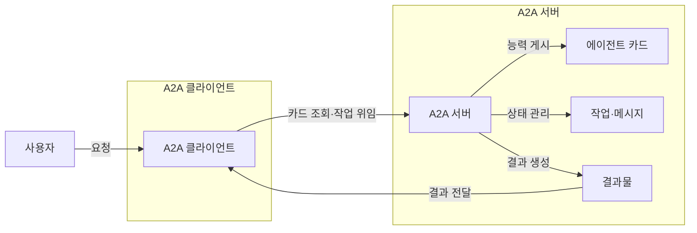
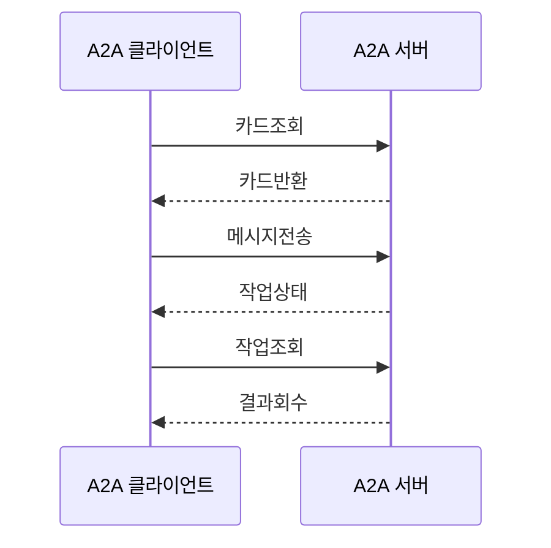

---
sidebar:
  order: 12
  label: "012. Agent to Agent Protocol (에이전트 간 통신 프로토콜)"
  badge:
    text: "미출제 · 70%"
    variant: note
title: "Agent to Agent Protocol (에이전트 간 통신 프로토콜)"
date: "2026-07-25T01:25:00+09:00"
tags:
  - "notes-latest_tech"
weight: 12
extra:
  question_no: "012"
  source_status: "미출제"
  source_history: ""
  priority: 70
  priority_note: "에이전트 간 상호운용 표준이 최신 쟁점"
---

## 미리 알고가기

- **에이전트 간 프로토콜(Agent2Agent Protocol, A2A)**: 에이전트의 능력 발견·작업 교환 표준
- **에이전트 카드(Agent Card)**: 능력·기술·종단점·보안 요구 메타데이터
- **메시지(Message)**: 역할과 콘텐츠를 담은 통신 단위
- **작업(Task)**: 식별자와 상태를 가진 장기 작업
- **결과물(Artifact)**: 작업이 생성한 문서·데이터
- **파트(Part)**: 메시지·결과물의 콘텐츠 단위
- **푸시 알림(Push Notification)**: 작업 상태를 웹훅으로 통지

## Ⅰ. 개요

- 정의/개념: 원격 에이전트 발견·작업 위임 규약
- **배경/필요성**: 이기종 에이전트 간 작업 교환 표준 필요

### 쉽게 이해하기 (학습용)

- 서로 다른 회사의 전문가도 명함과 업무 양식이 같으면 일을 주고받을 수 있음

## Ⅱ. 특징

- 내부 모델·메모리·도구 구현을 감춘다
- 에이전트 카드로 능력·인증 요구를 공개한다
- 즉시 메시지와 상태형 작업을 구분한다
- 폴링·스트리밍·푸시 알림을 지원한다

### 쉽게 이해하기 (학습용)

- 상대의 내부 사정을 몰라도 공개된 능력과 접수 규칙으로 일을 맡길 수 있음

## Ⅲ. 아키텍처 및 구성요소

| 설계 요소 | 설명 |
|:---|:---|
| A2A 클라이언트 | 원격 에이전트에 작업 요청 |
| A2A 서버 | 메시지·작업·결과 처리 |
| 에이전트 카드 | 능력·기술·인증 요구 게시 |
| 작업·메시지 | 상태형 작업과 단발 통신 |
| 결과물 | 작업 산출물 식별·전달 |

### 쉽게 이해하기 (학습용)

- 의뢰자가 전문가 명함을 보고 업무번호로 진행 상태와 결과물을 받음

## Ⅳ. 원리 및 절차 흐름도

| 절차 | 설명 |
|:---|:---|
| 카드조회 | 원격 에이전트 메타데이터 요청 |
| 카드반환 | 능력·종단점·인증 요구 반환 |
| 메시지전송 | 요청 메시지나 작업 전달 |
| 작업상태 | 진행·입력 필요·완료 상태 통지 |
| 작업조회 | 폴링·스트리밍으로 상태 추적 |
| 결과회수 | 결과물 검증 후 완료 기록 |

### 쉽게 이해하기 (학습용)

- 상대 능력을 확인해 일을 맡기고 업무번호로 완료까지 추적함

## Ⅴ. 종류 및 비교

| 판단 기준 | A2A | MCP |
|:---|:---|:---|
| 연결 대상 | 클라이언트·원격 에이전트 | 앱·컨텍스트 서버 |
| 노출 단위 | 능력·메시지·작업·결과물 | 도구·리소스·프롬프트 |
| 적용 기준 | 원격 에이전트에 작업 위임 | 모델에 기능·데이터 연결 |

> 요약: A2A는 원격 에이전트 작업 위임

### 쉽게 이해하기 (학습용)

- A2A는 다른 전문가에게 일을 맡기고 MCP는 모델에 도구를 연결함

## Ⅵ. 실무 사례

1. 조달 에이전트가 공급업체 탐색 작업 위임
2. 장기 문서 생성은 작업 상태·결과물 검증

### 쉽게 이해하기 (학습용)

- 조달 담당 에이전트는 전문 검색 에이전트에 공급업체 찾기를 맡길 수 있음
- 오래 걸리는 문서 생성은 업무번호로 진행 상태와 최종 파일을 확인함

## Ⅶ. 결론

- 능력·상태·신뢰 조건으로 원격 위임 결정

### 쉽게 이해하기 (학습용)

- 공통 업무 양식이 있어도 상대 신뢰성과 결과 안전성은 따로 확인해야 함
