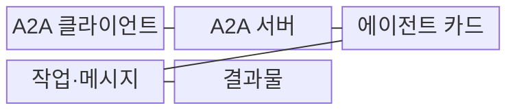
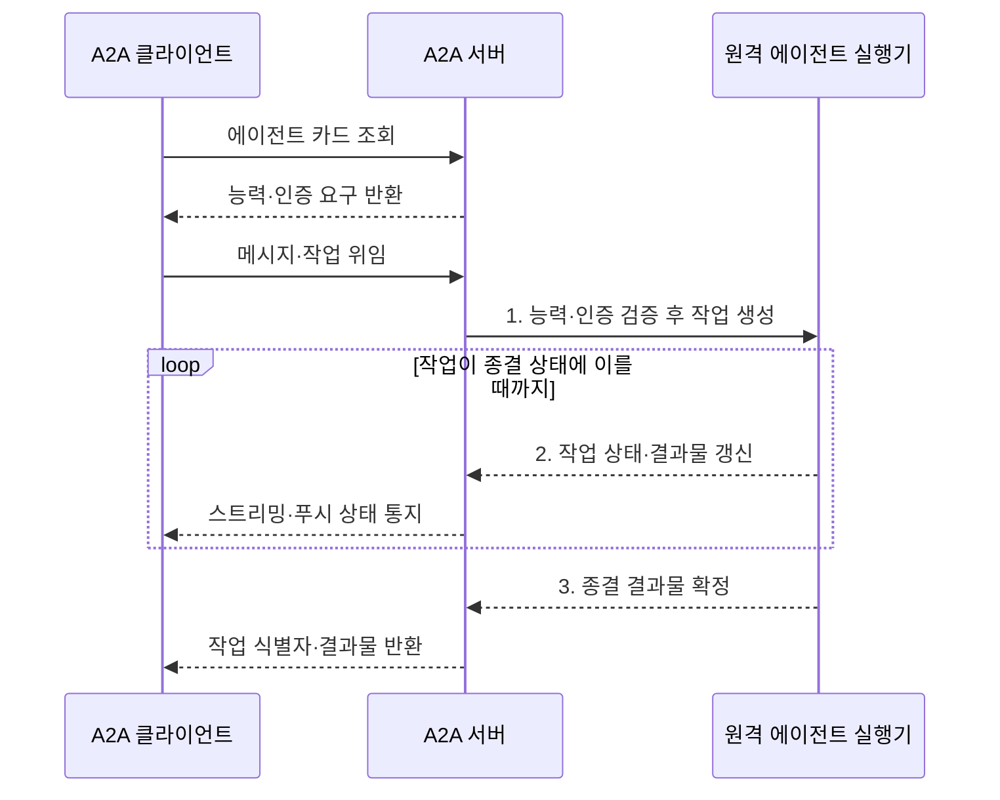

---
sidebar:
  order: 12
  label: "012. Agent to Agent Protocol (에이전트 간 통신 프로토콜)"
  badge:
    text: "미출 · 70%"
    variant: note
title: "Agent to Agent Protocol (에이전트 간 통신 프로토콜)"
date: "2026-08-02T08:46:00+09:00"
tags:
  - "notes-latest_tech"
weight: 12
extra:
  question_no: "012"
  source_status: "미출"
  source_history: ""
  priority: 70
  priority_note: "에이전트 간 상호운용 표준이 최신 쟁점"
---

## Ⅰ. 개요

핵심 용어

- **에이전트 간 프로토콜(Agent2Agent Protocol, A2A)**: 서로 다른 에이전트가 능력을 발견하고 메시지·작업·결과물을 교환하는 상호운용 프로토콜
- **이기종 협업**: 구현 방식이나 제공자가 다른 에이전트들이 표준 계약으로 함께 작업하는 방식

- 정의/개념: **A2A**는 원격 에이전트의 능력과 인증 요구를 발견하고, 상태를 가진 작업과 결과물을 표준 형식으로 교환하는 프로토콜이다.
- 배경/필요성: 에이전트별 **능력 공개·작업 상태** 차이로 이기종 협업마다 개별 연동 필요

### 쉽게 이해하기 (학습용)

- 서로 다른 회사의 전문가도 명함과 업무 양식이 같으면 일을 주고받을 수 있음

## Ⅱ. 특징

핵심 용어

- **캡슐화**: 에이전트 내부 모델·메모리·도구를 숨기고 외부 계약만 공개하는 설계 원칙
- **에이전트 카드(Agent Card)**: 능력·기술·종단점·보안 요구를 공개하는 메타데이터
- **푸시 알림(Push Notification)**: 장기 작업의 상태 변화를 등록된 웹훅으로 통지하는 방식

- **캡슐화 축**: 내부 모델·메모리·도구 비공개
- **에이전트 카드**로 능력·인증 요구 공개
- **작업·메시지**와 스트리밍·**푸시 알림** 지원

### 쉽게 이해하기 (학습용)

- 상대의 내부 사정을 몰라도 공개된 능력과 접수 규칙으로 일을 맡길 수 있음

## Ⅲ. 구조 및 구성요소

핵심 용어

- **메시지(Message)**: 역할과 콘텐츠를 담은 단발 통신 단위
- **작업(Task)**: 식별자와 진행 상태를 가진 장기 업무 단위
- **결과물(Artifact)**: 작업이 생성한 문서·데이터 등의 산출물
- **파트(Part)**: 메시지와 결과물을 이루는 텍스트·파일·데이터 콘텐츠 단위

| 구성요소 | 책임 |
|:---|:---|
| A2A 클라이언트 | 원격 에이전트의 **능력 발견·작업 위임** |
| A2A 서버 | **메시지·작업·결과물** 처리 |
| 에이전트 카드 | 능력·기술·종단점·**인증 요구** 게시 |
| 작업·메시지 | 단발 통신과 **상태형 작업** 구분 |
| 결과물 | 작업 산출물을 **Artifact·Part**로 전달 |

### 쉽게 이해하기 (학습용)

- 의뢰자가 전문가 명함을 보고 업무번호로 진행 상태와 결과물을 받음

## Ⅳ. 흐름도

핵심 용어

- **상태형 작업**: 생성·진행·완료·실패 같은 상태를 식별자로 추적하는 장기 작업
- **스트리밍**: 작업 상태나 결과 일부를 완료 전부터 연속적으로 전달하는 방식
- **종결 상태**: 작업이 완료·실패·취소되어 더 이상 진행되지 않는 상태

1. **능력·인증 검증 후 작업 생성**: 요청 적합성 확인·상태형 작업 생성
2. **작업 상태·결과물 갱신**: 상태 전이·Artifact 증분 기록
3. **종결 결과물 확정**: 작업 ID에 최종 산출물 연결

### 쉽게 이해하기 (학습용)

- 상대 능력을 확인해 일을 맡기고 업무번호로 완료까지 추적함

## Ⅴ. 종류 및 비교

핵심 용어

- **A2A**: 원격 에이전트의 능력을 발견하고 상태형 작업을 위임하는 프로토콜
- **모델 컨텍스트 프로토콜(Model Context Protocol, MCP)**: 모델에 외부 도구·리소스·프롬프트를 연결하는 프로토콜
- **작업 위임**: 다른 에이전트에 목표를 전달하고 진행 상태와 결과를 받는 협업 방식

| 프로토콜 | A2A | MCP |
|:---|:---|:---|
| 적용 기준 | 원격 에이전트에 **작업 위임** | 모델에 **기능·데이터** 연결 |
| 핵심 특징 | 능력·메시지·**상태형 작업** | 도구·리소스·**프롬프트** |
| 한계 | 상대 신뢰·작업 상태 관리 | 서버별 권한·컨텍스트 통제 |

> 요약: **A2A**는 에이전트 작업 위임, **MCP**는 모델 기능 연결

### 쉽게 이해하기 (학습용)

- A2A는 다른 전문가에게 일을 맡기고 MCP는 모델에 도구를 연결함

## Ⅵ. 실무 고려사항 및 대책

핵심 용어

- **전송 계층 보안(Transport Layer Security, TLS)**: 통신 상대 인증과 전송 구간 암호화를 제공하는 프로토콜
- **멱등키**: 같은 요청이 반복돼도 작업을 한 번만 처리하도록 중복을 식별하는 키
- **무결성**: 결과물이 생성 후 허가 없이 변경되지 않았음을 보장하는 성질

| 고려사항 | 대책 | 효과 |
|:---|:---|:---|
| 위조 카드로 **악성 에이전트 선택** | **카드 서명·TLS·발급 주체** 검증 | 신원·능력 신뢰 확보 |
| 장기 작업으로 **상태 불일치** | **작업 ID·버전·멱등키**로 전이 관리 | 중복 실행·결과 혼선 방지 |
| 결과물 변조로 **출처·무결성 상실** | **해시·생성 주체·근거** 검증 | 추적성·책임성 확보 |

### 쉽게 이해하기 (학습용)

- 조달 담당 에이전트는 전문 검색 에이전트에 공급업체 찾기를 맡길 수 있음

## Ⅶ. 결론

핵심 용어

- **A2A**: 원격 에이전트에 상태형 작업을 위임하고 결과물을 받는 프로토콜
- **MCP**: 모델에 외부 기능과 컨텍스트를 연결하는 프로토콜

- 원격 에이전트 작업 위임은 **A2A**, 모델 기능 연결은 **MCP** 선택

### 쉽게 이해하기 (학습용)

- 공통 업무 양식이 있어도 상대 신뢰성과 결과 안전성은 따로 확인해야 함
