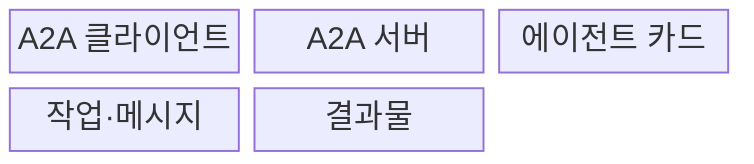
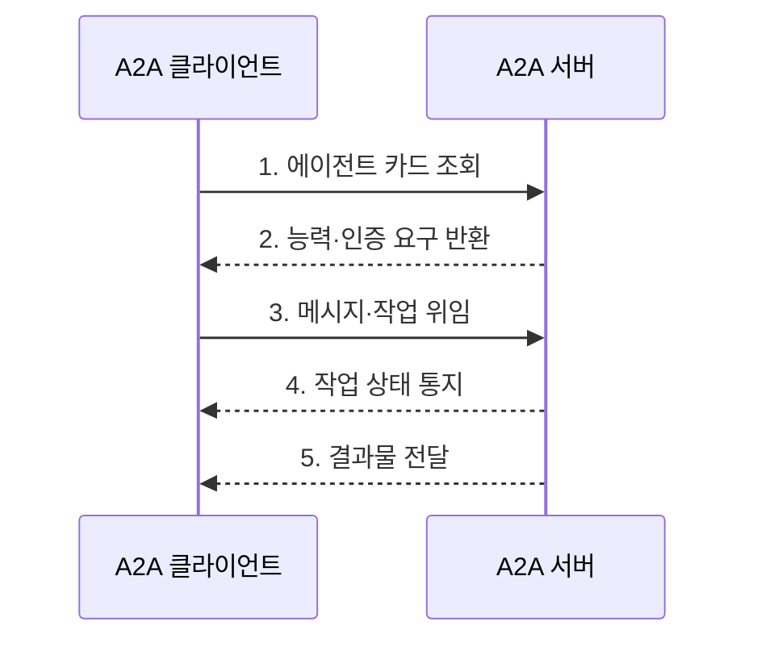

---
sidebar:
  order: 12
  label: "012. Agent to Agent Protocol (에이전트 간 통신 프로토콜)"
  badge:
    text: "미출제 · 70%"
    variant: note
title: "Agent to Agent Protocol (에이전트 간 통신 프로토콜)"
date: "2026-07-30T11:04:43+09:00"
tags:
  - "notes-latest_tech"
weight: 12
extra:
  question_no: "012"
  source_status: "미출제"
  source_history: ""
  priority: 70
  priority_note: "에이전트 간 상호운용 표준이 최신 쟁점"
---

## 미리 알고가기

- **에이전트 간 프로토콜(Agent2Agent Protocol, A2A)**: 서로 다른 에이전트가 능력을 발견하고 메시지·작업·결과물을 교환하는 상호운용 프로토콜이다.
- **에이전트 카드(Agent Card)**: 능력·기술·종단점·보안 요구 메타데이터
- **메시지(Message)**: 역할과 콘텐츠를 담은 통신 단위
- **작업(Task)**: 식별자와 상태를 가진 장기 작업
- **결과물(Artifact)**: 작업이 생성한 문서·데이터
- **파트(Part)**: 메시지·결과물의 콘텐츠 단위
- **푸시 알림(Push Notification)**: 작업 상태를 웹훅으로 통지

## Ⅰ. 개요

- 정의/개념: **A2A**는 원격 에이전트의 능력과 인증 요구를 발견하고, 상태를 가진 작업과 결과물을 표준 형식으로 교환하는 프로토콜이다.
- 배경/필요성: 에이전트별 **능력 공개·작업 상태** 차이로 이기종 협업마다 개별 연동 필요

### 쉽게 이해하기 (학습용)

- 서로 다른 회사의 전문가도 명함과 업무 양식이 같으면 일을 주고받을 수 있음

## Ⅱ. 특징

- 내부 모델·메모리·도구 구현을 감춘다
- 에이전트 카드로 능력·인증 요구를 공개한다
- 즉시 메시지와 상태형 작업을 구분한다
- 폴링·스트리밍·푸시 알림을 지원한다

### 쉽게 이해하기 (학습용)

- 상대의 내부 사정을 몰라도 공개된 능력과 접수 규칙으로 일을 맡길 수 있음

## Ⅲ. 구조 및 구성요소

| 구성요소 | 책임 |
|:---|:---|
| A2A 클라이언트 | 원격 에이전트의 **능력 발견·작업 위임** |
| A2A 서버 | **메시지·작업·결과물** 처리 |
| 에이전트 카드 | 능력·기술·종단점·**인증 요구** 게시 |
| 작업·메시지 | 단발 통신과 **상태형 작업** 구분 |
| 결과물 | 작업 산출물의 **식별·전달** |

### 쉽게 이해하기 (학습용)

- 의뢰자가 전문가 명함을 보고 업무번호로 진행 상태와 결과물을 받음

## Ⅳ. 흐름도

### 동작 원리

1. **에이전트 카드 조회**: 원격 에이전트의 **공개 메타데이터** 탐색
2. **능력·인증 요구 반환**: 기술·종단점과 **접근 조건** 확인
3. **메시지·작업 위임**: 즉시 응답 또는 **상태형 작업** 생성
4. **작업 상태 통지**: 폴링·스트리밍·푸시로 **상태 전이** 추적
5. **결과물 전달**: 작업 식별자와 연결된 **산출물 검증·회수**

### 쉽게 이해하기 (학습용)

- 상대 능력을 확인해 일을 맡기고 업무번호로 완료까지 추적함

## Ⅴ. 종류 및 비교

| 프로토콜 | A2A | MCP |
|:---|:---|:---|
| 적용 기준 | 원격 에이전트에 **작업 위임** | 모델에 **기능·데이터** 연결 |
| 핵심 특징 | 능력·메시지·**상태형 작업** | 도구·리소스·**프롬프트** |
| 한계 | 상대 신뢰·작업 상태 관리 | 서버별 권한·컨텍스트 통제 |

### 쉽게 이해하기 (학습용)

- A2A는 다른 전문가에게 일을 맡기고 MCP는 모델에 도구를 연결함

## Ⅵ. 실무 고려사항 및 대책

| 고려사항 | 대책 | 효과 |
|:---|:---|:---|
| 위조 카드에 따른 **악성 에이전트 선택** | 카드 서명·TLS·발급 주체와 인증 요구 검증 | 원격 에이전트의 **신원·능력 신뢰** 확보 |
| 장기 작업의 **상태 불일치** | 작업 식별자·버전·멱등키로 상태 전이 관리 | 재시도 중 **중복 실행·결과 혼선** 방지 |
| 결과물의 **출처·무결성** 상실 | 산출물 해시·생성 주체·근거 메타데이터 검증 | 협업 결과의 **추적성·책임성** 확보 |

### 쉽게 이해하기 (학습용)

- 조달 담당 에이전트는 전문 검색 에이전트에 공급업체 찾기를 맡길 수 있음

## Ⅶ. 결론

- 원격 에이전트에 상태형 작업을 맡길 때 **A2A**를 선택하고 카드 신뢰·상태 전이·결과물 출처를 통제

### 쉽게 이해하기 (학습용)

- 공통 업무 양식이 있어도 상대 신뢰성과 결과 안전성은 따로 확인해야 함
