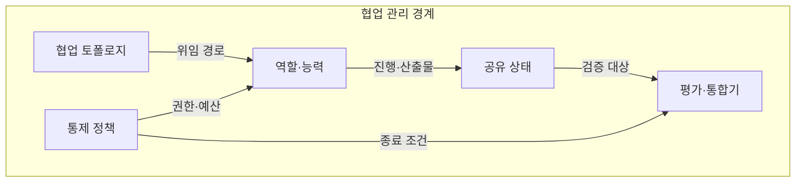
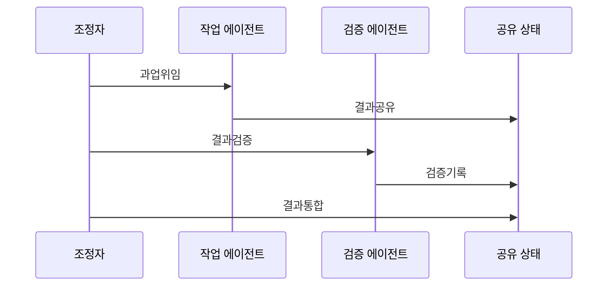

---
sidebar:
  order: 13
  label: "013. 멀티 에이전트 협업 (Multi-Agent Collaboration)"
  badge:
    text: "기출 · 70%"
    variant: note
title: "멀티 에이전트 협업 (Multi-Agent Collaboration)"
date: "2026-07-27T23:59:59+09:00"
tags:
  - "notes-latest_tech"
weight: 13
extra:
  question_no: "013"
  source_status: "기출"
  source_history: "138회"
  priority: 70
  priority_note: "역할 분담·협업 통제가 복합 문제에 적합"
---

## 미리 알고가기

- **멀티 에이전트 시스템(Multi-Agent System, MAS)**: 복수 에이전트가 목표·상태를 조정하는 체계
- **역할 특화(Role Specialization)**: 계획·검색·실행·검증 책임 분리
- **위임(Delegation)**: 하위 목표와 완료 조건을 담당자에게 이양
- **공유 상태(Shared State)**: 진행 정보와 산출물의 공동 저장
- **조정(Coordination)**: 순서·자원·의존성·충돌 통제
- **합의(Consensus)**: 복수 제안에서 공동 결과 결정
- **종료 조건(Termination Condition)**: 목표·예산·반복 한계
- **약어 읽기·표기**: MAS는 ‘엠에이에스’로 읽고 Multi-Agent System의 머리글자로 복수 에이전트 협업 체계를 뜻함

## Ⅰ. 개요

- **정의/개념**: 복수 에이전트가 역할·정보를 조정해 공동 목표 수행
- **기존 한계**: 단일 에이전트는 전문성·문맥·독립 검증에 한계

### 쉽게 이해하기 (학습용)

- 전문가들이 공동 목표와 마감 기준에 맞춰 역할을 나누는 팀 작업임

## Ⅱ. 특징

- **역할 특화**: 목표를 분해해 전문 역할에 위임한다
- **정보 공유**: 메시지·공유 상태로 진행과 근거를 교환한다
- **결과 조정**: 충돌·합의·검증을 거쳐 산출물을 통합한다

### 쉽게 이해하기 (학습용)

- 역할과 작업 규칙이 없으면 사람이 많아져도 중복 작업과 충돌만 늘어남

## Ⅲ. 아키텍처 및 구성요소

| 설계 요소 | 설명 |
|:---|:---|
| 협업 토폴로지 | 중앙·계층·분산 관계 정의 |
| 공유 상태 | 근거·진행·산출물 버전 관리 |
| 통제 정책 | 권한·예산·종료 조건 강제 |
| 역할·능력 | 책임·도구·입출력 계약 |
| 평가·통합기 | 품질 판정·충돌 해결·병합 |

### 쉽게 이해하기 (학습용)

- 팀장은 역할과 공용 작업판을 관리하고 검토자는 결과를 하나로 합침

## Ⅳ. 원리 및 절차 흐름도

| 절차 | 설명 |
|:---|:---|
| 과업위임 | 능력·의존성으로 역할 배정 |
| 결과공유 | 버전과 근거를 공유 상태에 기록 |
| 결과검증 | 독립 기준으로 결과 품질 판정 |
| 검증기록 | 결함·승인 결과를 상태에 반영 |
| 결과통합 | 충돌 해결 후 종료 여부 판정 |

### 쉽게 이해하기 (학습용)

- 담당자가 결과를 작업판에 올리면 검토자가 확인하고 조정자가 최종본을 합침

## Ⅴ. 멀티 에이전트 협업 구조 비교

| 비교 기준 | 중앙형 | 계층형 | 분산형 |
|:---|:---|:---|:---|
| 적용 기준 | 단일 조정자가 통합할 때 | 하위 목표를 단계 위임할 때 | 동등 주체가 공동 결정할 때 |
| 핵심 특징 | 중앙 계획·결과 병합 | 상하 위임·부분 통합 | 직접 통신·합의 |
| 한계 | 조정자 병목 | 오류 전파·관리 복잡 | 합의 비용·상태 충돌 |

> 요약: 의존성과 통제 수준으로 협업 구조 선택

### 쉽게 이해하기 (학습용)

- 팀은 전문성을 얻지만 의사소통과 결과 통합 비용도 함께 늘어남

## Ⅵ. 실무 사례

1. 코드 변경: **구현·검증 역할**로 독립 검토
2. 보안 진단: **탐색·판정 역할**로 오류 상호강화 차단

### 쉽게 이해하기 (학습용)

- 구현 담당이 코드를 바꾸면 별도 검증 담당이 테스트 결과를 확인함
- 공격 경로 탐색과 사실 검증을 나누면 같은 오류의 상호 강화를 줄임

## Ⅶ. 결론

- 독립 과업이면 **병렬 협업**, 의존 과업은 계층 조정

### 쉽게 이해하기 (학습용)

- 사람이 많다고 좋은 팀이 되는 것이 아니라 과업 관계와 검토 비용에 맞춰 팀을 꾸려야 함
