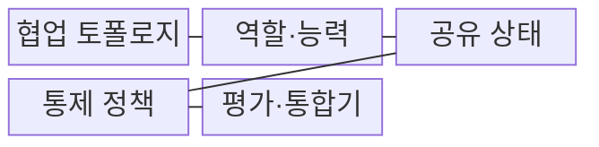
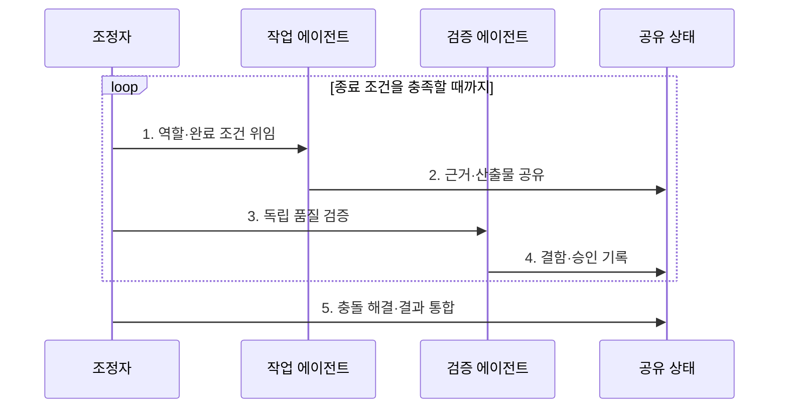

---
sidebar:
  order: 13
  label: "013. 멀티 에이전트 협업 (Multi-Agent Collaboration)"
  badge:
    text: "기출 · 70%"
    variant: note
title: "멀티 에이전트 협업 (Multi-Agent Collaboration)"
date: "2026-08-02T08:46:00+09:00"
tags:
  - "notes-latest_tech"
weight: 13
extra:
  question_no: "013"
  source_status: "기출"
  source_history: "138회"
  priority: 70
  priority_note: "역할 분담·협업 통제가 복합 문제에 적합"
---

## Ⅰ. 개요

핵심 용어

- **멀티 에이전트 시스템(Multi-Agent System, MAS)**: 복수의 자율 에이전트가 역할·정보·상태를 조정하여 공동 목표를 수행하는 체계다.
- **역할 특화(Role Specialization)**: 계획·검색·실행·검증 책임을 각 에이전트의 전문 능력에 맞게 분리하는 방식이다.

- 정의/개념: **다중 에이전트 협업**은 복수의 자율 에이전트가 역할·작업·상태·결과를 조정하여 공동 목표를 수행하는 MAS 협업 방식
- 배경/필요성: 단일 에이전트로는 복합 과업의 **동시 전문 수행·독립 검증 불가**

### 쉽게 이해하기 (학습용)

- 전문가들이 공동 목표와 마감 기준에 맞춰 역할을 나누는 팀 작업임

## Ⅱ. 특징

핵심 용어

- **위임(Delegation)**: 하위 목표와 완료 조건을 적합한 담당 에이전트에게 이양하는 행위다.
- **공유 상태(Shared State)**: 여러 에이전트가 진행 정보와 산출물을 함께 조회하고 갱신하는 저장 공간이다.
- **조정(Coordination)**: 작업 순서·자원·의존성·충돌을 통제하여 협업을 일관되게 만드는 과정이다.

- **역할 특화**: 목표를 분해해 전문 역할에 위임
- **공유 축**: 메시지·공유 상태로 진행·근거 교환
- **조정 축**: 충돌·합의·검증 후 산출물 통합

### 쉽게 이해하기 (학습용)

- 역할과 작업 규칙이 없으면 사람이 많아져도 중복 작업과 충돌만 늘어남

## Ⅲ. 구조 및 구성요소

핵심 용어

- **협업 토폴로지**: 에이전트 사이의 지휘·위임·통신 관계를 중앙형·계층형·분산형 등으로 구성한 구조다.
- **종료 조건(Termination Condition)**: 목표 달성, 예산 소진, 반복 한계처럼 협업을 끝낼 기준이다.

| 구성요소 | 책임 |
|:---|:---|
| 협업 토폴로지 | 중앙·계층·분산의 **조정 관계** 정의 |
| 역할·능력 | 책임·도구·**입출력 계약** 명시 |
| 공유 상태 | 근거·진행·산출물의 **버전 관리** |
| 통제 정책 | 권한·예산·**종료 조건** 강제 |
| 평가·통합기 | 품질 판정·**충돌 해결·병합** |

### 쉽게 이해하기 (학습용)

- 팀장은 역할과 공용 작업판을 관리하고 검토자는 결과를 하나로 합침

## Ⅳ. 흐름도

핵심 용어

- **책임 경계**: 각 에이전트가 소유하는 작업·입출력·완료 조건의 범위다.
- **독립 검증**: 산출물을 만든 에이전트와 분리된 주체가 별도 기준으로 품질을 판정하는 절차다.

1. **역할·완료 조건 위임**: 과업 의존성과 능력으로 **책임 경계** 결정
2. **근거·산출물 공유**: 버전이 있는 **공유 상태**에 결과 기록
3. **독립 품질 검증**: 작성 역할과 분리한 **검증 기준** 적용
4. **결함·승인 기록**: 재작업 여부와 **상태 전이** 반영
5. **충돌 해결·결과 통합**: 병합 후 **종료 조건** 충족 여부 판정

### 쉽게 이해하기 (학습용)

- 담당자가 결과를 작업판에 올리면 검토자가 확인하고 조정자가 최종본을 합침

## Ⅴ. 종류 및 비교

핵심 용어

- **중앙형 협업**: 단일 조정자가 작업을 배분하고 결과를 통합하는 구조다.
- **계층형 협업**: 상위 에이전트가 하위 목표를 단계적으로 위임하고 부분 결과를 모으는 구조다.
- **분산형 협업**: 동등한 에이전트들이 직접 통신하고 합의하여 결과를 결정하는 구조다.

| 협업 구조 | 중앙형 | 계층형 | 분산형 |
|:---|:---|:---|:---|
| 적용 기준 | **단일 조정자 통합** | **하위 목표 단계 위임** | **동등 주체 공동 결정** |
| 핵심 특징 | **중앙 계획·결과 병합** | **상하 위임·부분 통합** | **직접 통신·합의** |
| 한계 | **조정자 병목** | **오류 전파·관리 복잡** | **합의 비용·상태 충돌** |

> 요약: **중앙형**은 통합, **계층형**은 위임, **분산형**은 합의 중심

### 쉽게 이해하기 (학습용)

- 팀은 전문성을 얻지만 의사소통과 결과 통합 비용도 함께 늘어남

## Ⅵ. 실무 고려사항 및 대책

핵심 용어

- **버전 충돌**: 여러 에이전트가 같은 공유 상태나 산출물을 동시에 변경하여 갱신 내용이 충돌하는 현상이다.
- **동일 편향**: 작성자와 검증자가 같은 문맥·가정에 의존해 동일한 오류를 놓치는 문제다.
- **종료 조건**: 예산·깊이·재시도 횟수를 제한하여 무한 위임과 자원 낭비를 막는 기준이다.

| 문제 | 대책 | 효과 |
|:---|:---|:---|
| 역할 중첩에 따른 **중복·누락** | 책임·입출력·완료 조건을 역할 계약으로 명시 | 에이전트별 **책임 경계** 확보 |
| 공유 상태의 **버전 충돌** | 단일 변경 소유자와 낙관적 잠금·병합 규칙 적용 | 병렬 작업의 **산출물 일관성** 유지 |
| 검증 에이전트의 **동일 편향** | 작성·검증 문맥과 평가 기준을 분리 | 오류의 **독립 탐지력** 향상 |
| 반복 위임에 따른 **비용 폭증** | 예산·깊이·재시도·종료 조건 강제 | 무한 협업과 **자원 낭비** 차단 |

### 쉽게 이해하기 (학습용)

- 구현 담당이 코드를 바꾸면 별도 검증 담당이 테스트 결과를 확인함

## Ⅶ. 결론

핵심 용어

- **MAS 선택 기준**: 독립적으로 분리할 전문 과업과 검증 필요성이 협업 비용보다 클 때 멀티 에이전트 방식을 선택한다.
- **단일 에이전트**: 역할 분리 이득이 작은 단순 과업을 하나의 에이전트가 일관된 문맥으로 처리하는 방식이다.

- 독립 전문 과업은 **MAS**, 역할 분리가 어려운 단순 과업은 **단일 에이전트** 선택

### 쉽게 이해하기 (학습용)

- 사람이 많다고 좋은 팀이 되는 것이 아니라 과업 관계와 검토 비용에 맞춰 팀을 꾸려야 함
