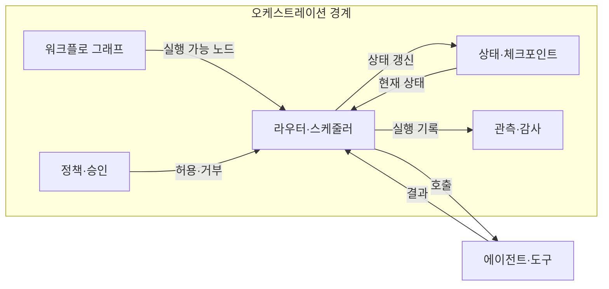
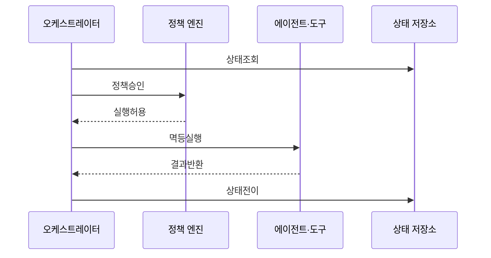

---
sidebar:
  order: 14
  label: "014. Agent Orchestration (에이전트 오케스트레이션)"
  badge:
    text: "기출 · 70%"
    variant: note
title: "Agent Orchestration (에이전트 오케스트레이션)"
date: "2026-07-27T23:59:59+09:00"
tags:
  - "notes-latest_tech"
weight: 14
extra:
  question_no: "014"
  source_status: "기출"
  source_history: "138회"
  priority: 70
  priority_note: "작업 분해·조정·복구 설계가 핵심"
---

## 미리 알고가기

- **에이전트 오케스트레이션(Agent Orchestration)**: 에이전트·도구·상태의 실행 조정
- **워크플로 그래프(Workflow Graph)**: 작업 노드와 조건 전이 구조
- **라우터(Router)**: 상태·정책으로 다음 경로 선택
- **체크포인트(Checkpoint)**: 중단 단계의 상태 저장점
- **인간 개입(Human-in-the-Loop, HITL)**: 고위험 단계의 사람 승인
- **멱등성(Idempotency)**: 재실행해도 부작용이 중복되지 않는 성질
- **관측성(Observability)**: 추적·로그로 상태 변화를 파악하는 능력
- **추적 식별자(Trace Identifier, Trace ID)**: 단계별 호출을 연결하는 식별자
- **명칭 의미**: Orchestration은 ‘오케스트레이션’으로 읽고 지휘자가 연주 순서를 맞추듯 여러 실행 주체를 조정한다는 뜻임
- **약어 읽기·표기**: HITL은 ‘에이치아이티엘’, Trace ID는 ‘트레이스 아이디’로 읽고 영문 머리글자·식별자 명칭으로 사람 승인과 실행 추적을 구분함

## Ⅰ. 개요

- 정의/개념: 에이전트·도구·상태의 실행 순서를 통제하는 계층
- 기존 한계: 임의 호출 연결은 분기·재시도·복구 통제가 어려움

### 쉽게 이해하기 (학습용)

- 여러 작업자의 순서와 인수인계, 실패 복구와 승인을 관리하는 관제 기능임

## Ⅱ. 특징

- **경로 제어**: 순차·병렬·조건·반복 실행을 조정한다
- **상태 복구**: 체크포인트로 실패 지점부터 재개한다
- **정책 관측**: 권한·승인·비용·오류를 단계별 통제한다

### 쉽게 이해하기 (학습용)

- 일의 경로와 실패 시 돌아갈 지점, 승인 담당자를 미리 정함

## Ⅲ. 아키텍처 및 구성요소

| 설계 요소 | 설명 |
|:---|:---|
| 워크플로 그래프 | 노드·조건 전이 정의 |
| 라우터·스케줄러 | 상태·의존성으로 실행 결정 |
| 상태·체크포인트 | 단계 상태 저장·복구 |
| 정책·승인 | 행동 허용·거부 강제 |
| 관측·감사 | 호출·비용·상태 변화 추적 |

### 쉽게 이해하기 (학습용)

- 관제기가 작업판과 규칙을 보고 다음 담당자를 부르고 실행 결과를 기록함

## Ⅳ. 원리 및 절차 흐름도

| 절차 | 설명 |
|:---|:---|
| 상태조회 | 체크포인트에서 현재 상태 복원 |
| 정책승인 | 권한·예산·인간 승인 판정 |
| 실행허용 | 정책 통과 시 노드 실행 허가 |
| 멱등실행 | 멱등키로 작업 중복 방지 |
| 결과반환 | 실행 결과와 오류 상태 반환 |
| 상태전이 | 결과 저장 후 다음 경로 결정 |

### 쉽게 이해하기 (학습용)

- 저장된 진행 상황을 불러와 허가된 일만 실행하고 결과 지점에서 다시 기록함

## Ⅴ. 에이전트 실행 조정 방식 비교

| 비교 기준 | 워크플로형 | 자율 라우팅형 | 혼합형 |
|:---|:---|:---|:---|
| 적용 기준 | 절차·승인이 고정된 업무 | 경로가 사전 정의되기 어려운 업무 | 통제·유연성이 모두 필요할 때 |
| 핵심 특징 | 명시적 그래프·상태 전이 | 모델이 다음 역할·도구 선택 | 고정 경계 안에서 자율 선택 |
| 한계 | 변화 대응 경직 | 목표 이탈·재현성 저하 | 설계·관측 복잡 |

> 요약: 경로·상태·정책으로 실행 통제

### 쉽게 이해하기 (학습용)

- 복잡한 자동화는 공정표와 관제 기록이 있어야 실패 지점부터 안전하게 재개함

## Ⅵ. 실무 사례

1. 환불 처리: **HITL 분기**로 금액 변경 승인

### 쉽게 이해하기 (학습용)

- 고객 응답은 자동 처리해도 환불 금액 변경은 담당자 승인을 받게 함

## Ⅶ. 결론

- 다단계 실행 조정을 위해 경로 불확실성·승인을 검토하여 **에이전트 오케스트레이션** 활용

### 쉽게 이해하기 (학습용)

- 단계가 많고 되돌리기 어려울수록 진행 기록과 승인 규칙을 더 명확히 둬야 함
