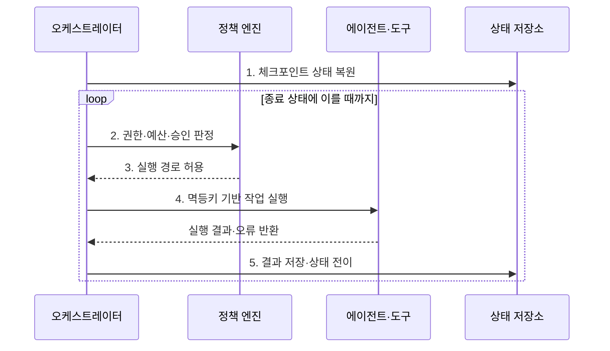

---
sidebar:
  order: 14
  label: "014. Agent Orchestration (에이전트 오케스트레이션)"
  badge:
    text: "기출 · 70%"
    variant: note
title: "Agent Orchestration (에이전트 오케스트레이션)"
date: "2026-07-31T08:44:52+09:00"
tags:
  - "notes-latest_tech"
weight: 14
extra:
  question_no: "014"
  source_status: "기출"
  source_history: "138회"
  priority: 70
  priority_note: "작업 분해·조정·복구 설계가 핵심"
---

## 미리 알고가기

- **에이전트 오케스트레이션(Agent Orchestration)**: 목표 달성을 위해 에이전트·도구의 실행 경로와 상태·정책·복구를 통합 조정하는 관리 계층이다.
- **워크플로 그래프(Workflow Graph)**: 작업 노드와 조건 전이 구조
- **라우터(Router)**: 상태·정책으로 다음 경로 선택
- **체크포인트(Checkpoint)**: 중단 단계의 상태 저장점
- **인간 개입(Human-in-the-Loop, HITL)**: 고위험 단계의 사람 승인
- **멱등성(Idempotency)**: 재실행해도 부작용이 중복되지 않는 성질
- **관측성(Observability)**: 추적·로그로 상태 변화를 파악하는 능력
- **추적 식별자(Trace Identifier, Trace ID)**: 단계별 호출을 연결하는 식별자

## Ⅰ. 개요

- 정의/개념: **에이전트 오케스트레이션**은 워크플로와 정책에 따라 에이전트·도구의 실행 순서를 조정하고 상태·승인·재시도·복구를 관리하는 계층이다.
- 배경/필요성: 임의 호출 연결로는 실패 후 **분기 재현·상태 복구 불가**

### 쉽게 이해하기 (학습용)

- 여러 작업자의 순서와 인수인계, 실패 복구와 승인을 관리하는 관제 기능임

## Ⅱ. 특징

- **경로 축**: 순차·병렬·조건·반복 실행 조정
- **복구 축**: 체크포인트로 실패 지점부터 재개
- **통제 축**: 권한·승인·비용·오류 단계별 관리

### 쉽게 이해하기 (학습용)

- 일의 경로와 실패 시 돌아갈 지점, 승인 담당자를 미리 정함

## Ⅲ. 구조 및 구성요소

| 구성요소 | 책임 |
|:---|:---|
| 워크플로 그래프 | 작업 노드와 **조건 전이** 정의 |
| 라우터·스케줄러 | 상태·의존성으로 **다음 실행** 결정 |
| 상태·체크포인트 | 단계 상태의 **저장·복구** |
| 정책·승인 | **HITL·권한·예산** 강제 |
| 관측·감사 | **관측성·Trace ID** 기반 상태 추적 |

### 쉽게 이해하기 (학습용)

- 관제기가 작업판과 규칙을 보고 다음 담당자를 부르고 실행 결과를 기록함

## Ⅳ. 흐름도

1. **체크포인트 상태 복원**: 중단 지점의 입력·결과·**실행 상태** 재구성
2. **권한·예산·승인 판정**: 현재 노드의 **정책 조건** 평가
3. **실행 경로 허용**: 상태와 조건에 맞는 **다음 노드** 선택
4. **멱등키 기반 작업 실행**: 재시도 시 **중복 부작용** 방지
5. **결과 저장·상태 전이**: 실행 기록을 남기고 **후속 경로** 결정

### 쉽게 이해하기 (학습용)

- 저장된 진행 상황을 불러와 허가된 일만 실행하고 결과 지점에서 다시 기록함

## Ⅴ. 종류 및 비교

| 조정 방식 | 워크플로형 | 자율 라우팅형 | 혼합형 |
|:---|:---|:---|:---|
| 적용 기준 | **고정 절차·승인 업무** | **사전 정의가 어려운 경로** | **통제·유연성 동시 요구** |
| 핵심 특징 | **명시적 그래프·상태 전이** | 모델의 **역할·도구 선택** | **고정 경계 내 자율 선택** |
| 한계 | **변화 대응 경직** | **목표 이탈·재현성 저하** | **설계·관측 복잡** |

> 요약: **워크플로형**은 통제, **자율형**은 유연성, **혼합형**은 절충

### 쉽게 이해하기 (학습용)

- 복잡한 자동화는 공정표와 관제 기록이 있어야 실패 지점부터 안전하게 재개함

## Ⅵ. 실무 고려사항 및 대책

| 고려사항 | 대책 | 효과 |
|:---|:---|:---|
| 재시도에 따른 **중복 부작용** | 단계별 멱등키와 실행 결과를 체크포인트에 저장 | 결제·전송의 **중복 실행** 방지 |
| 자율 분기의 **목표 이탈** | 허용 경로·도구·예산과 최대 반복 수 강제 | 탐색 범위와 **실행 비용** 통제 |
| 승인 대기 중 **상태 변경** | 승인 직전 대상·금액·권한을 다시 검증 | 오래된 승인에 따른 **오실행** 차단 |
| 장애 시 **복구 지점** 불명확 | 입력·결과·정책 버전을 단계별 추적 | 실패 지점부터 **결정적 재개** |

### 쉽게 이해하기 (학습용)

- 고객 응답은 자동 처리해도 환불 금액 변경은 담당자 승인을 받게 함

## Ⅶ. 결론

- 고정 절차·승인은 **워크플로형**, 불확실 경로는 **혼합형** 선택

### 쉽게 이해하기 (학습용)

- 단계가 많고 되돌리기 어려울수록 진행 기록과 승인 규칙을 더 명확히 둬야 함
