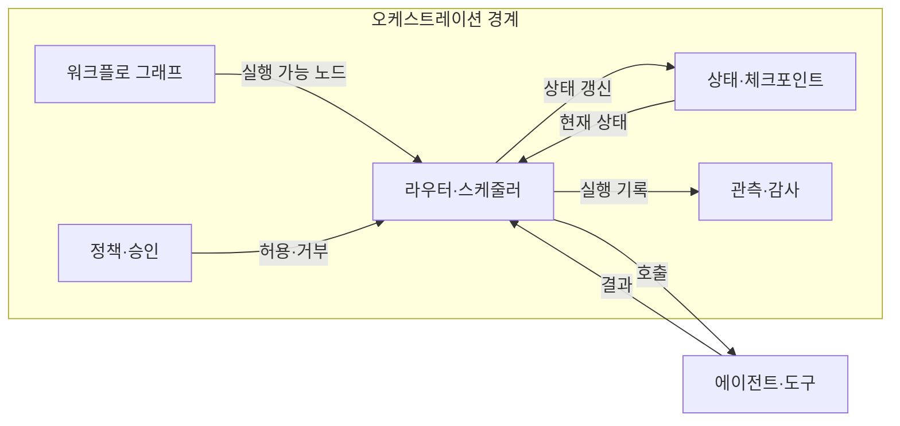
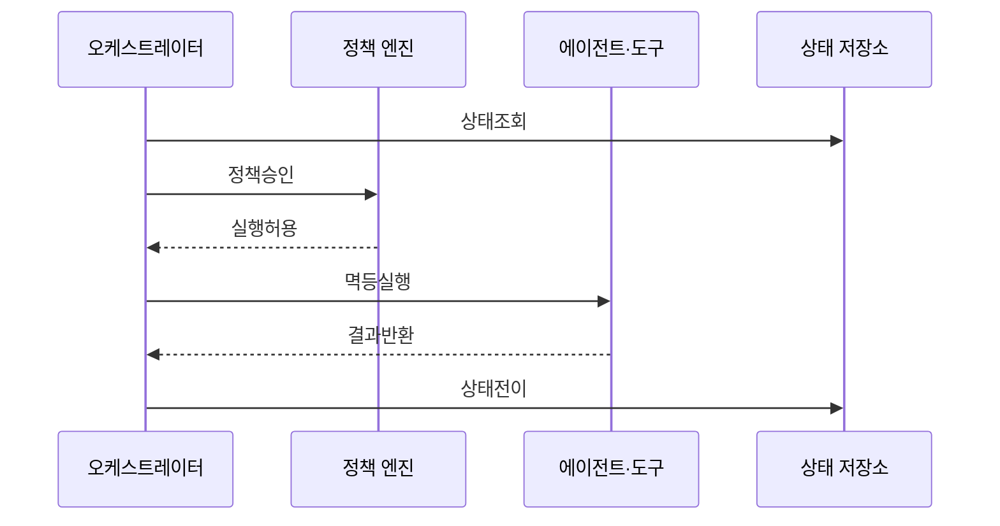

---
sidebar:
  order: 14
  label: "014. Agent Orchestration (에이전트 오케스트레이션)"
  badge:
    text: "기출 · 70%"
    variant: note
title: "Agent Orchestration (에이전트 오케스트레이션)"
date: "2026-07-25T01:25:00+09:00"
tags:
  - "notes-latest_tech"
weight: 14
extra:
  question_no: "014"
  source_status: "기출"
  source_history: "138회"
  priority: 70
  priority_note: "작업 분해·조정·복구 설계가 핵심"
---

## 미리 알고가기

- **에이전트 오케스트레이션(Agent Orchestration)**: 에이전트·도구·상태의 실행 조정
- **워크플로 그래프(Workflow Graph)**: 작업 노드와 조건 전이 구조
- **라우터(Router)**: 상태·정책으로 다음 경로 선택
- **체크포인트(Checkpoint)**: 중단 단계의 상태 저장점
- **인간 개입(Human-in-the-Loop, HITL)**: 고위험 단계의 사람 승인
- **멱등성(Idempotency)**: 재실행해도 부작용이 중복되지 않는 성질
- **관측성(Observability)**: 추적·로그로 상태 변화를 파악하는 능력
- **추적 식별자(Trace Identifier, Trace ID)**: 단계별 호출을 연결하는 식별자

## Ⅰ. 개요

- **정의/개념**: 목표·상태·정책 기반 실행 조정 계층
- **배경/필요성**: 다단계 분기·승인·복구의 일관된 통제

### 쉽게 이해하기 (학습용)

- 여러 작업자의 순서와 인수인계, 실패 복구와 승인을 관리하는 관제 기능임

## Ⅱ. 특징

- 순차·병렬·조건·반복 경로를 표현한다
- 명시적 상태·체크포인트로 작업을 재개한다
- 권한·예산·시간·종료 정책을 적용한다
- 단계별 입출력·비용·오류를 추적한다

### 쉽게 이해하기 (학습용)

- 일의 경로와 실패 시 돌아갈 지점, 승인 담당자를 미리 정함

## Ⅲ. 아키텍처 및 구성요소

| 설계 요소 | 설명 |
|:---|:---|
| 워크플로 그래프 | 노드·조건 전이 정의 |
| 라우터·스케줄러 | 상태·의존성으로 실행 결정 |
| 상태·체크포인트 | 단계 상태 저장·복구 |
| 정책·승인 | 행동 허용·거부 강제 |
| 관측·감사 | 호출·비용·상태 변화 추적 |

### 쉽게 이해하기 (학습용)

- 관제기가 작업판과 규칙을 보고 다음 담당자를 부르고 실행 결과를 기록함

## Ⅳ. 원리 및 절차 흐름도

| 절차 | 설명 |
|:---|:---|
| 상태조회 | 체크포인트에서 현재 상태 복원 |
| 정책승인 | 권한·예산·인간 승인 판정 |
| 실행허용 | 정책 통과 시 노드 실행 허가 |
| 멱등실행 | 멱등키로 작업 중복 방지 |
| 결과반환 | 실행 결과와 오류 상태 반환 |
| 상태전이 | 결과 저장 후 다음 경로 결정 |

### 쉽게 이해하기 (학습용)

- 저장된 진행 상황을 불러와 허가된 일만 실행하고 결과 지점에서 다시 기록함

## Ⅴ. 종류 및 비교

| 판단 기준 | 오케스트레이션 | 단일 에이전트 |
|:---|:---|:---|
| 실행 구조 | 그래프·정책 기반 경로 제어 | 모델이 다음 행동 선택 |
| 적용 기준 | 다단계 분기·승인·복구 | 짧은 단일 책임 작업 |
| 주요 위험 | 상태 불일치·중복 실행 | 목표 이탈·문맥 손실 |

> 요약: 경로·상태·정책으로 실행 통제

### 쉽게 이해하기 (학습용)

- 복잡한 자동화는 공정표와 관제 기록이 있어야 실패 지점부터 안전하게 재개함

## Ⅵ. 실무 사례

1. 환불 변경 단계는 인간 승인으로 분기
2. 외부 결제 재시도는 멱등키로 중복 방지

### 쉽게 이해하기 (학습용)

- 고객 응답은 자동 처리해도 환불 금액 변경은 담당자 승인을 받게 함
- 결제 요청을 다시 보내도 같은 식별자는 한 번만 처리되게 함

## Ⅶ. 결론

- 분기·부작용 위험으로 상태·승인 정책 결정

### 쉽게 이해하기 (학습용)

- 단계가 많고 되돌리기 어려울수록 진행 기록과 승인 규칙을 더 명확히 둬야 함
