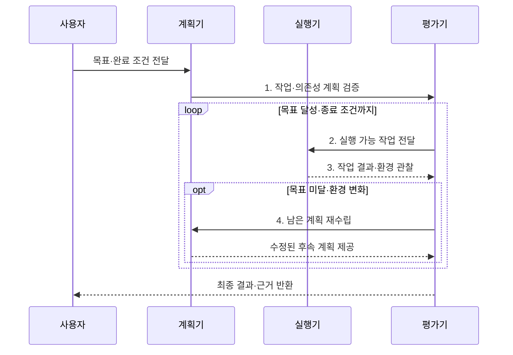

---
sidebar:
  order: 15
  label: "015. Agent Planning (에이전트 플래닝)"
  badge:
    text: "기출 · 60%"
    variant: note
title: "Agent Planning (에이전트 플래닝)"
date: "2026-08-02T08:46:00+09:00"
tags:
  - "notes-latest_tech"
weight: 15
extra:
  question_no: "015"
  source_status: "기출"
  source_history: "138회"
  priority: 60
  priority_note: "목표 분해와 실행 계획이 자율성의 기반"
---

## Ⅰ. 개요

핵심 용어

- **에이전트 플래닝(Agent Planning)**: 목표를 실행 가능한 작업과 의존성·완료 조건으로 분해하고 수행 결과에 따라 계획을 수정하는 과정이다.
- **과업 분해(Task Decomposition)**: 복합 목표를 독립적으로 실행하고 검증할 수 있는 하위 작업으로 나누는 과정이다.

- 정의/개념: **에이전트 플래닝**은 장기 목표를 실행·검증 가능한 작업으로 분해하고 의존성·완료 조건·제약을 포함한 실행 계획으로 변환하는 과정이다.
- 배경/필요성: 단일 행동 선택은 장기 과업의 **누락·순서 오류·목표 이탈** 유발

#### 한줄 요약

- 목적지까지 경유지를 정하고 길이 막히면 남은 경로를 다시 잡는 과정임

## Ⅱ. 특징

핵심 용어

- **의존성(Dependency)**: 어떤 작업의 시작이나 완료가 다른 작업의 결과에 좌우되는 선후 관계다.
- **재계획(Re-planning)**: 오류나 환경 변화가 발생했을 때 완료 결과는 보존하고 남은 계획을 수정하는 과정이다.

- **과업 분해**: 목표를 실행·검증 가능한 작업으로 분할
- **의존성**: 선후·병렬 관계와 완료 조건 정의
- **재계획**: 관찰·실패·환경 변화로 남은 계획 수정

#### 한줄 요약

- 계획이 너무 크면 실행이 막히고 너무 잘게 나누면 관리할 일이 늘어남

## Ⅲ. 구조 및 구성요소

핵심 용어

- **계획 표현**: 작업 순서·의존성·완료 조건을 실행기가 해석할 수 있는 형태로 기록한 구조다.
- **휴리스틱(Heuristic)**: 비용·성공 가능성 같은 기준으로 유망한 계획 후보를 우선 탐색하게 하는 평가 기준이다.

| 구성요소 | 책임 |
|:---|:---|
| 목표·제약 | 성공·기한·예산·**권한 경계** 정의 |
| 과업 분해기 | 목표를 실행·검증 가능한 **하위 작업**으로 분할 |
| 계획 표현 | 순서·의존성·**완료 조건** 기록 |
| 실행기 | 도구 호출과 **관찰 결과** 저장 |
| 평가·재계획기 | **휴리스틱**으로 후보 평가·후속 계획 수정 |

#### 한줄 요약

- 계획표에는 할 일의 순서와 필요한 도구, 완료를 확인할 증거까지 적음

## Ⅳ. 흐름도

핵심 용어

- **종료 조건(Termination Condition)**: 목표 달성도·품질·비용·반복 횟수로 계획 실행을 끝낼 시점을 정한 기준이다.
- **부분 재계획**: 완료된 작업은 유지하고 변화의 영향을 받은 후속 경로만 다시 수립하는 방식이다.

1. **작업·의존성 계획 검증**: 선후관계와 실행 가능성 확인
2. **실행 가능 작업 전달**: 충족된 의존성으로 다음 작업 선택
3. **작업 결과·환경 관찰**: 실제 결과와 계획 편차 평가
4. **남은 계획 재수립**: 완료 결과를 보존하고 후속 경로 수정

#### 한줄 요약

- 실행 전 계획을 살피고 실행 후 실제 결과가 다르면 남은 부분만 다시 짬

## Ⅴ. 종류 및 비교

핵심 용어

- **계획 후 실행(Plan-and-Execute)**: 전체 계획을 먼저 수립한 뒤 각 단계를 실행하는 방식이다.
- **추론-행동(Reasoning and Acting, ReAct)**: 매 관찰마다 추론과 행동을 반복하여 다음 단계를 정하는 방식이다.

| 계획 방식 | Plan-and-Execute | ReAct |
|:---|:---|:---|
| 적용 기준 | **장기·복합·병렬 과업** | **짧고 변화가 잦은 과업** |
| 핵심 특징 | **전체 계획 후 단계 실행** | **추론·행동·관찰 반복** |
| 한계 | **계획 비용·환경 변화 취약** | **근시안적 반복·목표 이탈** |

> 요약: **Plan-and-Execute**는 장기 계획, **ReAct**는 즉시 적응 중심

#### 한줄 요약

- 긴 여행은 전체 경로를 세우고 짧고 변수가 많은 길은 한 걸음씩 찾는 편이 맞음

## Ⅵ. 실무 고려사항 및 대책

핵심 용어

- **작업 입도**: 계획을 구성하는 하위 작업 하나의 크기로, 실행 가능성과 관리 비용 사이의 균형을 좌우한다.
- **의존성 그래프**: 작업의 선후·병렬 관계를 연결하여 실행 가능한 순서를 판정하는 구조다.
- **목표 이탈**: 반복 실행이나 재계획 중 처음의 성공 조건과 다른 방향으로 계획이 변하는 현상이다.

| 문제 | 대책 | 효과 |
|:---|:---|:---|
| 과도한 분해에 따른 **계획 비용** | 독립 검증 가능한 산출물 단위로 작업 크기 제한 | 실행과 관리의 **균형 확보** |
| 선행 결과 누락에 따른 **순서 오류** | 의존성 그래프와 입력·완료 조건 검증 | 실행 가능한 **작업 순서** 보장 |
| 환경 변화에 따른 **계획 무효화** | 완료 작업은 보존하고 영향받은 후속 경로만 재계획 | 재작업 없는 **부분 복구** |
| 반복 재계획의 **목표 이탈** | 예산·반복 수·품질·종료 조건 강제 | 무한 탐색과 **비용 폭증** 차단 |

#### 한줄 요약

- 데이터 분석은 원자료를 모으기 전에 분석부터 시작할 수 없으므로 작업 순서를 먼저 잡음

## Ⅶ. 결론

핵심 용어

- **Plan-and-Execute 선택 기준**: 장기적이고 작업 의존성이 큰 과업에 전체 계획 중심 방식을 적용한다.
- **ReAct 선택 기준**: 짧고 환경 변화가 잦아 즉시 관찰·적응해야 하는 과업에 반복 방식을 적용한다.

- 장기·의존 과업은 **Plan-and-Execute**, 짧은 변동 과업은 **ReAct** 선택

#### 한줄 요약

- 오래 걸리고 순서가 중요한 일일수록 계획을 세우되 실제 결과에 맞춰 필요한 부분만 고쳐야 함
