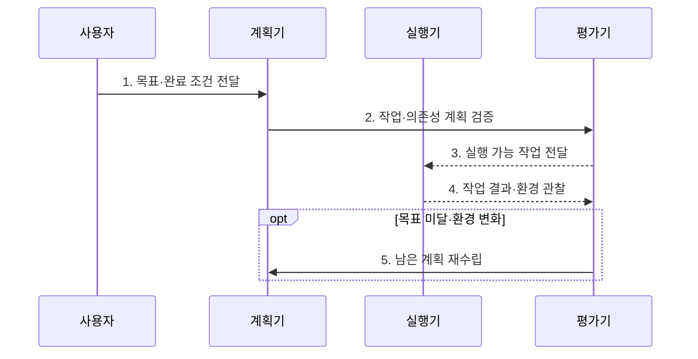

---
sidebar:
  order: 15
  label: "015. Agent Planning (에이전트 플래닝)"
  badge:
    text: "기출 · 60%"
    variant: note
title: "Agent Planning (에이전트 플래닝)"
date: "2026-07-27T23:59:59+09:00"
tags:
  - "notes-latest_tech"
weight: 15
extra:
  question_no: "015"
  source_status: "기출"
  source_history: "138회"
  priority: 60
  priority_note: "목표 분해와 실행 계획이 자율성의 기반"
---

## 미리 알고가기

- **에이전트 플래닝(Agent Planning)**: 목표를 실행 가능한 작업과 의존성·완료 조건으로 분해하고 수행 결과에 따라 계획을 수정하는 과정이다.
- **과업 분해(Task Decomposition)**: 복합 목표를 검증 가능한 작업으로 분할
- **의존성(Dependency)**: 작업 간 선후 관계
- **계획 후 실행(Plan-and-Execute)**: 계획 수립과 실행을 분리하는 방식
- **재계획(Re-planning)**: 오류·환경 변화에 따라 계획 수정
- **휴리스틱(Heuristic)**: 유망한 계획을 우선하는 평가 기준
- **종료 조건(Termination Condition)**: 목표·품질·비용 한계
- **추론-행동(Reasoning and Acting, ReAct)**: 관찰마다 추론 후 행동하는 방식

## Ⅰ. 개요

- 정의/개념: **에이전트 플래닝**은 장기 목표를 실행·검증 가능한 작업으로 분해하고 의존성·완료 조건·제약을 포함한 실행 계획으로 변환하는 과정이다.
- 배경/필요성: 단일 행동 선택은 장기 과업의 **누락·순서 오류·목표 이탈** 유발

### 쉽게 이해하기 (학습용)

- 목적지까지 경유지를 정하고 길이 막히면 남은 경로를 다시 잡는 과정임

## Ⅱ. 특징

- **과업 분해**: 목표를 실행·검증 가능한 작업으로 나눈다
- **의존성 계획**: 선후·병렬 관계와 완료 조건을 정한다
- **재계획**: 관찰·실패·환경 변화로 남은 계획을 수정한다

### 쉽게 이해하기 (학습용)

- 계획이 너무 크면 실행이 막히고 너무 잘게 나누면 관리할 일이 늘어남

## Ⅲ. 구조 및 구성요소

| 구성요소 | 책임 |
|:---|:---|
| 목표·제약 | 성공·기한·예산·**권한 경계** 정의 |
| 과업 분해기 | 목표를 실행·검증 가능한 **하위 작업**으로 분할 |
| 계획 표현 | 순서·의존성·**완료 조건** 기록 |
| 실행기 | 도구 호출과 **관찰 결과** 저장 |
| 평가·재계획기 | 계획 편차·실패에 따른 **후속 계획** 수정 |

### 쉽게 이해하기 (학습용)

- 계획표에는 할 일의 순서와 필요한 도구, 완료를 확인할 증거까지 적음

## Ⅳ. 흐름도

### 동작 원리

1. **목표·완료 조건 전달**: 성공 증거와 **예산·권한 제약** 고정
2. **작업·의존성 계획 검증**: 하위 작업의 선후관계와 **실행 가능성** 확인
3. **실행 가능 작업 전달**: 충족된 의존성에 따라 **다음 작업** 선택
4. **작업 결과·환경 관찰**: 실제 결과와 계획의 **편차 평가**
5. **남은 계획 재수립**: 완료 결과를 보존하고 실패 이후 **후속 경로** 수정

### 쉽게 이해하기 (학습용)

- 실행 전 계획을 살피고 실행 후 실제 결과가 다르면 남은 부분만 다시 짬

## Ⅴ. 종류 및 비교

| 계획 방식 | Plan-and-Execute | ReAct |
|:---|:---|:---|
| 적용 기준 | 장기·복합·병렬 과업 | 짧고 변화가 잦은 과업 |
| 핵심 특징 | 전체 계획 후 단계 실행 | 추론·행동·관찰 반복 |
| 한계 | 계획 비용·환경 변화 취약 | 근시안적 반복·목표 이탈 |

### 쉽게 이해하기 (학습용)

- 긴 여행은 전체 경로를 세우고 짧고 변수가 많은 길은 한 걸음씩 찾는 편이 맞음

## Ⅵ. 실무 고려사항 및 대책

| 고려사항 | 대책 | 효과 |
|:---|:---|:---|
| 과도한 분해에 따른 **계획 비용** | 독립 검증 가능한 산출물 단위로 작업 크기 제한 | 실행과 관리의 **균형 확보** |
| 선행 결과 누락에 따른 **순서 오류** | 의존성 그래프와 입력·완료 조건 검증 | 실행 가능한 **작업 순서** 보장 |
| 환경 변화에 따른 **계획 무효화** | 완료 작업은 보존하고 영향받은 후속 경로만 재계획 | 재작업 없는 **부분 복구** |
| 반복 재계획의 **목표 이탈** | 예산·반복 수·품질·종료 조건 강제 | 무한 탐색과 **비용 폭증** 차단 |

### 쉽게 이해하기 (학습용)

- 데이터 분석은 원자료를 모으기 전에 분석부터 시작할 수 없으므로 작업 순서를 먼저 잡음

## Ⅶ. 결론

- 장기 과업에 의존성과 완료 조건이 있으면 **에이전트 플래닝**을 선택하고 계획 비용·부분 재계획·종료 조건을 통제

### 쉽게 이해하기 (학습용)

- 오래 걸리고 순서가 중요한 일일수록 계획을 세우되 실제 결과에 맞춰 필요한 부분만 고쳐야 함
