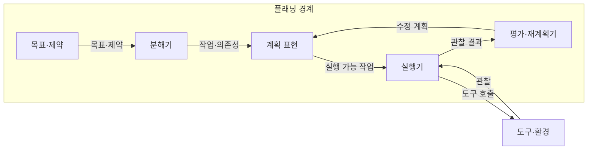
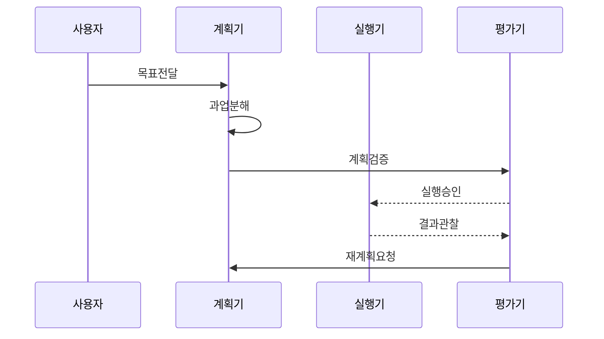

---
sidebar:
  order: 15
  label: "015. Agent Planning (에이전트 플래닝)"
  badge:
    text: "기출 · 60%"
    variant: note
title: "Agent Planning (에이전트 플래닝)"
date: "2026-07-25T01:25:00+09:00"
tags:
  - "notes-latest_tech"
weight: 15
extra:
  question_no: "015"
  source_status: "기출"
  source_history: "138회"
  priority: 60
  priority_note: "목표 분해와 실행 계획이 자율성의 기반"
---

## 미리 알고가기

- **에이전트 플래닝(Agent Planning)**: 목표를 작업·순서·조건으로 구체화
- **과업 분해(Task Decomposition)**: 복합 목표를 검증 가능한 작업으로 분할
- **의존성(Dependency)**: 작업 간 선후 관계
- **계획 후 실행(Plan-and-Execute)**: 계획 수립과 실행을 분리하는 방식
- **재계획(Re-planning)**: 오류·환경 변화에 따라 계획 수정
- **휴리스틱(Heuristic)**: 유망한 계획을 우선하는 평가 기준
- **종료 조건(Termination Condition)**: 목표·품질·비용 한계
- **추론-행동(Reasoning and Acting, ReAct)**: 관찰마다 추론 후 행동하는 방식

## Ⅰ. 개요

- **정의/개념**: 목표를 작업·의존성·완료 조건으로 변환
- **배경/필요성**: 장기 과업의 누락·순서 오류·경로 변화 대응

### 쉽게 이해하기 (학습용)

- 목적지까지 경유지를 정하고 길이 막히면 남은 경로를 다시 잡는 과정임

## Ⅱ. 특징

- 목표·제약·도구를 기준으로 과업을 분해한다
- 선후 관계·병렬성·완료 조건을 명시한다
- 실행 결과로 다음 작업·재계획을 결정한다
- 깊이·작업 수·탐색 시간에 한도를 둔다

### 쉽게 이해하기 (학습용)

- 계획이 너무 크면 실행이 막히고 너무 잘게 나누면 관리할 일이 늘어남

## Ⅲ. 아키텍처 및 구성요소

| 설계 요소 | 설명 |
|:---|:---|
| 목표·제약 | 성공·기한·예산·권한 정의 |
| 분해기 | 목표를 실행·검증 작업으로 분할 |
| 계획 표현 | 순서·의존성·완료 조건 기록 |
| 실행기 | 도구 호출과 관찰 결과 저장 |
| 평가·재계획기 | 편차·실패로 계획 수정 |

### 쉽게 이해하기 (학습용)

- 계획표에는 할 일의 순서와 필요한 도구, 완료를 확인할 증거까지 적음

## Ⅳ. 원리 및 절차 흐름도

| 절차 | 설명 |
|:---|:---|
| 목표전달 | 목표·완료 조건·제약 전달 |
| 과업분해 | 작업·의존성·도구 정의 |
| 계획검증 | 실행 가능성·권한 판정 |
| 실행승인 | 검증 통과 작업 실행 허가 |
| 결과관찰 | 실행 결과와 환경 변화 수집 |
| 재계획요청 | 편차 발생 시 후속 계획 수정 |

### 쉽게 이해하기 (학습용)

- 실행 전 계획을 살피고 실행 후 실제 결과가 다르면 남은 부분만 다시 짬

## Ⅴ. 종류 및 비교

| 판단 기준 | 에이전트 플래닝 | ReAct |
|:---|:---|:---|
| 실행 구조 | 작업·의존성 구성 후 실행 | 관찰마다 다음 행동 결정 |
| 적용 기준 | 장기·복합·병렬 과업 | 짧고 변화가 잦은 과업 |
| 주요 위험 | 계획 비용·낡은 계획 고수 | 근시안적 반복·목표 이탈 |

> 요약: 과업 길이·변화 빈도로 계획 방식 선택

### 쉽게 이해하기 (학습용)

- 긴 여행은 전체 경로를 세우고 짧고 변수가 많은 길은 한 걸음씩 찾는 편이 맞음

## Ⅵ. 실무 사례

1. 데이터 분석은 수집·정제·검증 의존성 계획
2. 코드 수정 실패 시 영향받는 후속 작업만 재계획

### 쉽게 이해하기 (학습용)

- 데이터 분석은 원자료를 모으기 전에 분석부터 시작할 수 없으므로 작업 순서를 먼저 잡음
- 코드 수정이 실패하면 이미 끝난 일까지 반복하지 않고 영향을 받은 뒤 작업만 다시 정함

## Ⅶ. 결론

- 과업 길이·환경 변화로 계획 깊이·재계획 결정

### 쉽게 이해하기 (학습용)

- 오래 걸리고 순서가 중요한 일일수록 계획을 세우되 실제 결과에 맞춰 필요한 부분만 고쳐야 함
