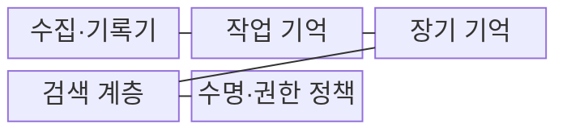
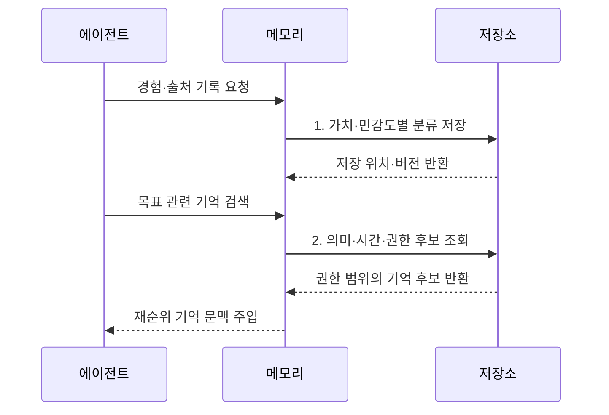

---
sidebar:
  order: 16
  label: "016. Agent Memory (에이전트 메모리)"
  badge:
    text: "기출 · 70%"
    variant: note
title: "Agent Memory (에이전트 메모리)"
date: "2026-08-02T08:46:00+09:00"
tags:
  - "notes-latest_tech"
weight: 16
extra:
  question_no: "016"
  source_status: "기출"
  source_history: "138회"
  priority: 70
  priority_note: "기억 계층·회수가 장기 작업 품질을 좌우"
---

## Ⅰ. 개요

핵심 용어

- **에이전트 메모리(Agent Memory)**: 에이전트가 과거의 상태·지식·경험을 저장하고 현재 목표에 맞게 검색·갱신하는 계층이다.
- **문맥창(Context Window)**: 모델이 한 번의 추론에서 직접 참조할 수 있는 입력 토큰 범위다.

- 정의/개념: **에이전트 메모리**는 과거의 작업 상태·지식·경험을 목적별로 저장하고 관련성·최신성·권한에 따라 검색·갱신하는 계층이다.
- 배경/필요성: 문맥창만으로 **장기 연속성·세션 간 경험 재사용** 확보가 곤란

### 쉽게 이해하기 (학습용)
- 정보를 적절히 저장·활용하고 정리하는 체계

## Ⅱ. 특징

핵심 용어

- **작업 기억(Working Memory)**: 현재 대화·계획·도구 결과처럼 진행 중인 과업의 단기 상태를 유지한다.
- **기억 검색(Retrieval)**: 의미·시간·중요도와 현재 목표를 비교하여 관련 기억을 선택하는 과정이다.
- **기억 통합(Consolidation)**: 반복되는 경험을 요약·정정하여 장기 기억에 반영하는 과정이다.

- **분리 축**: 작업·의미·일화 기억을 목적별 저장
- **기억 검색**: 의미·시간·중요도로 관련 기억 선택
- **기억 통합**: 경험 요약·정정·만료·삭제로 오염 통제

### 쉽게 이해하기 (학습용)
- 정확한 정보를 찾고 불필요한 기억을 지우는 능력

## Ⅲ. 구조 및 구성요소

핵심 용어

- **장기 기억(Long-term Memory)**: 세션이 끝난 뒤에도 재사용할 지식·경험·선호를 지속해서 저장한다.
- **출처 메타데이터**: 기억의 생성 주체·시각·근거·버전을 기록하여 신뢰성과 최신성을 판정하게 하는 정보다.
- **재순위(Re-ranking)**: 검색 후보를 관련성·최신성·권한 기준으로 다시 정렬하는 과정이다.

| 구성요소 | 책임 |
|:---|:---|
| 수집·기록기 | 사건과 **출처 메타데이터** 생성 |
| 작업 기억 | 현재 메시지·계획·**중간 결과** 유지 |
| 장기 기억 | 사실·일화·절차·**선호 정보** 저장 |
| 검색 계층 | 의미·시간·권한 기반 **후보 탐색·재순위** |
| 수명·권한 정책 | 기억의 **정정·만료·삭제** 수행 |

### 쉽게 이해하기 (학습용)
- 정보 분류 담당과 검색 담당을 분리하여 운용

## Ⅳ. 흐름도

핵심 용어

- **민감도 분류**: 기억에 포함된 개인정보나 기밀 수준을 판정하여 접근 권한과 보존 기간을 정하는 과정이다.
- **권한 필터**: 검색 후보 가운데 현재 주체와 목적이 접근할 수 있는 기억만 통과시키는 통제다.

1. **가치·민감도별 분류 저장**: 기억 유형·권한·보존 기간 결정
2. **의미·시간·권한 후보 조회**: 접근 권한 후 관련성·최신성 평가

### 쉽게 이해하기 (학습용)
- 유효기간을 붙여야 올바른 사람이 최신 내용을 찾음

## Ⅴ. 종류 및 비교

핵심 용어

- **일화 기억(Episodic Memory)**: 특정 시점의 사건·행동·결과와 그 맥락을 경험 단위로 저장한다.
- **의미 기억(Semantic Memory)**: 개별 사건에서 일반화한 사실과 개념 사이의 관계를 저장한다.
- **작업 기억**: 현재 과업을 수행하는 동안 필요한 단기 문맥과 중간 결과를 유지한다.

| 기억 유형 | 작업 기억 | 일화 기억 | 의미 기억 |
|:---|:---|:---|:---|
| 적용 기준 | **현재 과업 상태 유지** | **과거 사건·행동 재사용** | **사실·개념 지식 재사용** |
| 핵심 특징 | **단기 문맥·중간 결과** | **시간·상황 기반 경험** | **일반화된 사실·관계** |
| 한계 | **문맥 용량·수명 제한** | **경험의 과잉 일반화** | **노후 사실·출처 손실** |

> 요약: **작업 기억**은 현재 상태, **일화·의미 기억**은 장기 경험·지식

### 쉽게 이해하기 (학습용)
- 단기 기억은 작업판, 장기 기억은 보관소임

## Ⅵ. 실무 고려사항 및 대책

핵심 용어

- **사실 오염**: 오래되거나 잘못된 기억이 검색되어 현재 판단의 사실 기반을 왜곡하는 문제다.
- **기억 간섭**: 표현은 비슷하지만 목표와 무관한 기억이 관련 기억의 검색과 활용을 방해하는 현상이다.
- **가치 기반 만료**: 기억의 중요도·최신성·재사용성을 평가하여 요약하거나 삭제하는 수명 관리 방식이다.

| 문제 | 대책 | 효과 |
|:---|:---|:---|
| 오래된 기억의 **사실 오염** | 출처·생성 시각·유효기간과 정정 이력 저장 | 최신 사실의 **우선 검색** |
| 민감 기억의 **과다 노출** | 주체·목적별 접근통제와 검색 전 권한 필터 적용 | 기억 검색의 **최소 권한** 보장 |
| 유사하지만 무관한 **기억 간섭** | 관련성·최신성·신뢰도로 재순위 후 상위 후보만 주입 | 문맥의 **정확도·집중도** 향상 |
| 무제한 축적에 따른 **비용 증가** | 가치 기반 통합·요약·만료·삭제 정책 운영 | 저장·검색 비용과 **기억 품질** 통제 |

### 쉽게 이해하기 (학습용)
- 문의 상태와 해결 이력을 따로 둬 과거 사례를 빠르게 찾음

## Ⅶ. 결론

핵심 용어

- **작업 기억 선택 기준**: 현재 과업의 대화·계획·중간 결과처럼 짧게 유지할 상태에 사용한다.
- **장기 기억 선택 기준**: 세션을 넘어 재사용할 경험과 사실을 출처·권한·수명 정책과 함께 저장할 때 사용한다.

- 현재 상태는 **작업 기억**, 세션 간 경험·사실은 **장기 기억** 선택

### 쉽게 이해하기 (학습용)
- 필요한 기억을 신뢰할 수 있게 검색하고 오래되거나 잘못된 정보는 정정·만료·삭제할 수 있어야 한다.
