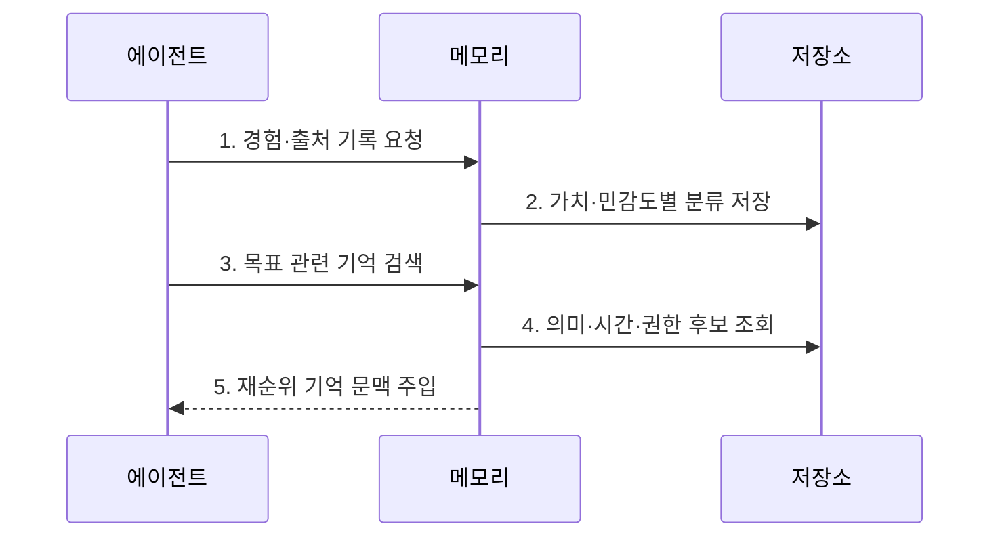

---
sidebar:
  order: 16
  label: "016. Agent Memory (에이전트 메모리)"
  badge:
    text: "기출 · 70%"
    variant: note
title: "Agent Memory (에이전트 메모리)"
date: "2026-07-27T23:59:59+09:00"
tags:
  - "notes-latest_tech"
weight: 16
extra:
  question_no: "016"
  source_status: "기출"
  source_history: "138회"
  priority: 70
  priority_note: "기억 계층·회수가 장기 작업 품질을 좌우"
---

## 미리 알고가기

- **에이전트 메모리(Agent Memory)**: 에이전트가 과거의 상태·지식·경험을 저장하고 현재 목표에 맞게 검색·갱신하는 계층이다.
- **작업 기억(Working Memory)**: 현재 대화·도구 결과를 유지함
- **장기 기억(Long-term Memory)**: 지식·경험을 지속 저장함
- **의미 기억(Semantic Memory)**: 사실·개념 관계를 저장함
- **일화 기억(Episodic Memory)**: 사건·행동 맥락을 저장함
- **기억 검색(Retrieval)**: 목표 관련 기억을 선택함
- **기억 통합(Consolidation)**: 경험을 요약해 장기 반영함

## Ⅰ. 개요

- 정의/개념: **에이전트 메모리**는 과거의 작업 상태·지식·경험을 목적별로 저장하고 관련성·최신성·권한에 따라 검색·갱신하는 계층이다.
- 배경/필요성: 문맥창만으로 **장기 연속성·세션 간 경험 재사용** 확보가 곤란

### 쉽게 이해하기 (학습용)
- 정보를 적절히 저장·활용하고 정리하는 체계

## Ⅱ. 특징
- **기억 분리**: 작업·의미·일화 기억을 목적별 저장한다
- **관련성 검색**: 의미·시간·중요도로 기억을 선택한다
- **수명주기**: 통합·정정·만료·삭제로 오염을 통제한다

### 쉽게 이해하기 (학습용)
- 정확한 정보를 찾고 불필요한 기억을 지우는 능력

## Ⅲ. 구조 및 구성요소

| 구성요소 | 책임 |
|:---|:---|
| 수집·기록기 | 사건과 **출처 메타데이터** 생성 |
| 작업 기억 | 현재 메시지·계획·**중간 결과** 유지 |
| 장기 기억 | 사실·일화·절차·**선호 정보** 저장 |
| 검색 계층 | 의미·시간·권한 기반 **후보 탐색·재순위** |
| 수명·권한 정책 | 기억의 **정정·만료·삭제** 수행 |

### 쉽게 이해하기 (학습용)
- 정보 분류 담당과 검색 담당을 분리하여 운용

## Ⅳ. 흐름도

### 동작 원리

1. **경험·출처 기록 요청**: 대화·행동·도구 결과에 **생성 맥락** 연결
2. **가치·민감도별 분류 저장**: 기억 유형·권한·**보존 기간** 결정
3. **목표 관련 기억 검색**: 현재 과업으로 **검색 의도** 구성
4. **의미·시간·권한 후보 조회**: 관련성과 최신성에 앞서 **접근 권한** 필터링
5. **재순위 기억 문맥 주입**: 상위 기억만 문맥에 반영하고 **사용 이력** 기록

### 쉽게 이해하기 (학습용)
- 유효기간을 붙여야 올바른 사람이 최신 내용을 찾음

## Ⅴ. 종류 및 비교

| 기억 유형 | 작업 기억 | 일화 기억 | 의미 기억 |
|:---|:---|:---|:---|
| 적용 기준 | 현재 과업 상태 유지 시 | 과거 사건·행동 재사용 시 | 사실·개념 지식 재사용 시 |
| 핵심 특징 | 단기 문맥·중간 결과 | 시간·상황이 있는 경험 | 일반화된 사실·관계 |
| 한계 | 문맥 용량·수명 제한 | 잘못된 경험 과잉 일반화 | 노후 사실·출처 손실 |

### 쉽게 이해하기 (학습용)
- 단기 기억은 작업판, 장기 기억은 보관소임

## Ⅵ. 실무 고려사항 및 대책

| 고려사항 | 대책 | 효과 |
|:---|:---|:---|
| 오래된 기억의 **사실 오염** | 출처·생성 시각·유효기간과 정정 이력 저장 | 최신 사실의 **우선 검색** |
| 민감 기억의 **과다 노출** | 주체·목적별 접근통제와 검색 전 권한 필터 적용 | 기억 검색의 **최소 권한** 보장 |
| 유사하지만 무관한 **기억 간섭** | 관련성·최신성·신뢰도로 재순위 후 상위 후보만 주입 | 문맥의 **정확도·집중도** 향상 |
| 무제한 축적에 따른 **비용 증가** | 가치 기반 통합·요약·만료·삭제 정책 운영 | 저장·검색 비용과 **기억 품질** 통제 |

### 쉽게 이해하기 (학습용)
- 문의 상태와 해결 이력을 따로 둬 과거 사례를 빠르게 찾음

## Ⅶ. 결론
- 장기 연속성과 경험 재사용이 필요하면 **에이전트 메모리**를 선택하고 출처·관련성·권한·정정·만료를 수명주기로 통제

### 쉽게 이해하기 (학습용)
- 필요한 기억을 신뢰할 수 있게 검색하고 오래되거나 잘못된 정보는 정정·만료·삭제할 수 있어야 한다.
