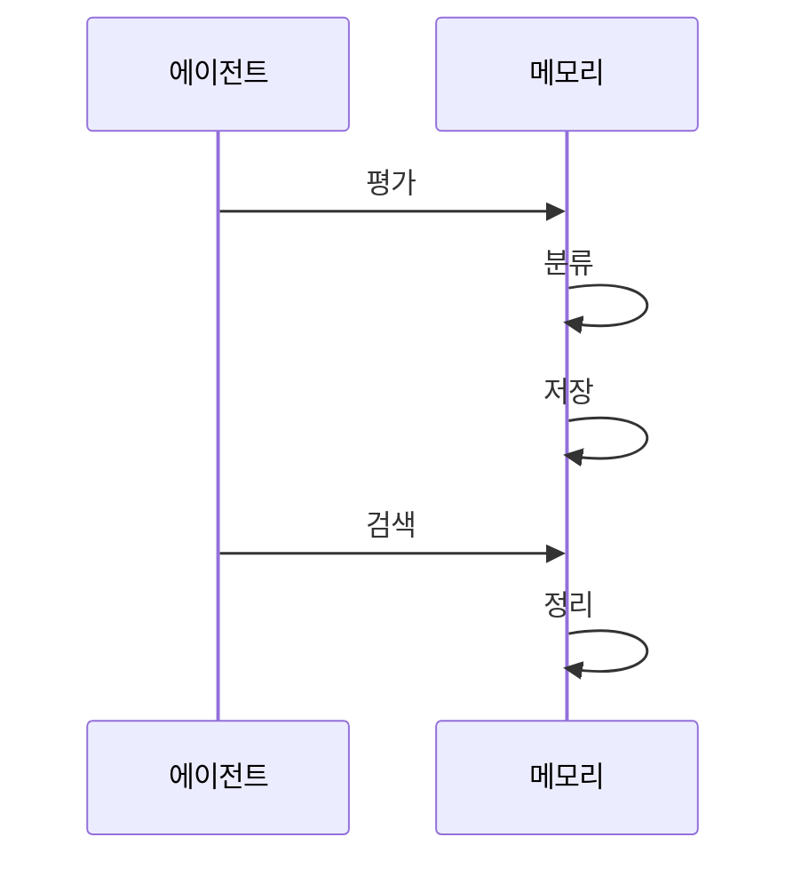

---
sidebar:
  order: 16
  label: "016. Agent Memory (에이전트 메모리)"
  badge:
    text: "기출 · 70%"
    variant: note
title: "Agent Memory (에이전트 메모리)"
date: "2026-07-25T01:25:00+09:00"
tags:
  - "notes-latest_tech"
weight: 16
extra:
  question_no: "016"
  source_status: "기출"
  source_history: "138회"
  priority: 70
  priority_note: "기억 계층·회수가 장기 작업 품질을 좌우"
---

## 미리 알고가기

- **에이전트 메모리(Agent Memory)**: 과거 정보를 저장·검색함
- **작업 기억(Working Memory)**: 현재 대화·도구 결과를 유지함
- **장기 기억(Long-term Memory)**: 지식·경험을 지속 저장함
- **의미 기억(Semantic Memory)**: 사실·개념 관계를 저장함
- **일화 기억(Episodic Memory)**: 사건·행동 맥락을 저장함
- **기억 검색(Retrieval)**: 목표 관련 기억을 선택함
- **기억 통합(Consolidation)**: 경험을 요약해 장기 반영함

## Ⅰ. 개요

- **정의/개념**: 실행 상태·과거 정보를 저장·검색하는 계층
- **배경/필요성**: 장기 작업 연속성·기억 오염 통제

### 쉽게 이해하기 (학습용)
- 정보를 적절히 저장·활용하고 정리하는 체계

## Ⅱ. 특징
- 단기 상태와 장기 지식을 수명별로 분리한다
- 저장소·인덱스를 데이터 유형에 맞춘다
- 출처·권한·최신성으로 검색 결과를 재순위한다
- 정정·만료·삭제로 잘못된 기억을 제어한다

### 쉽게 이해하기 (학습용)
- 정확한 정보를 찾고 불필요한 기억을 지우는 능력

## Ⅲ. 구성요소 및 구조

| 설계 요소 | 설명 |
|:---|:---|
| 수집·기록기 | 사건·출처 메타데이터 생성 |
| 단기 저장소 | 메시지·계획·도구 결과 유지 |
| 장기 저장소 | 사실·일화·절차·선호 저장 |
| 검색 계층 | 의미·시간·권한 후보 탐색 |
| 정책 계층 | 정정·만료·삭제 정책 수행 |

### 쉽게 이해하기 (학습용)
- 정보 분류 담당과 검색 담당을 분리하여 운용

## Ⅳ. 원리 및 절차 흐름도

| 절차 | 설명 |
|:---|:---|
| 평가 | 저장 목적·민감도 판단 |
| 분류 | 단기·장기 유형 결정 |
| 저장 | 출처·권한과 함께 저장 |
| 검색 | 권한 필터로 정보 선택 |
| 정리 | 정정·통합·삭제 수행 |

### 쉽게 이해하기 (학습용)
- 유효기간을 붙여야 올바른 사람이 최신 내용을 찾음

## Ⅴ. 종류 및 비교

| 판단 기준 | 단기 기억 | 장기 기억 |
|:---|:---|:---|
| 유지 범위 | 현재 스레드 중심 | 세션·작업 넘어서 지속 |
| 적용 기준 | 즉시 실행에 필요 | 경험 재사용에 필요 |
| 주요 위험 | 컨텍스트 초과 발생 | 정보 노후화·유출 위험 |

> 요약: 작업판과 기록 보관소 비교 체계

### 쉽게 이해하기 (학습용)
- 단기 기억은 작업판, 장기 기억은 보관소임

## Ⅵ. 실무 사례

1. 문의 상태와 과거 해결 이력을 분리해 검색함
2. 개인정보 유출 방지를 위한 기억 수명 관리함

### 쉽게 이해하기 (학습용)
- 문의 상태와 해결 이력을 따로 둬 과거 사례를 빠르게 찾음
- 기억 수명을 정해 개인정보가 오래 남지 않게 함

## Ⅶ. 결론
- 출처·권한·수명 통제로 기억의 연속성과 안전성 확보

### 쉽게 이해하기 (학습용)
- 믿고 버릴 수 있는 기억 관리 시스템 구축 필요
