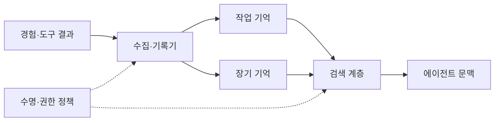
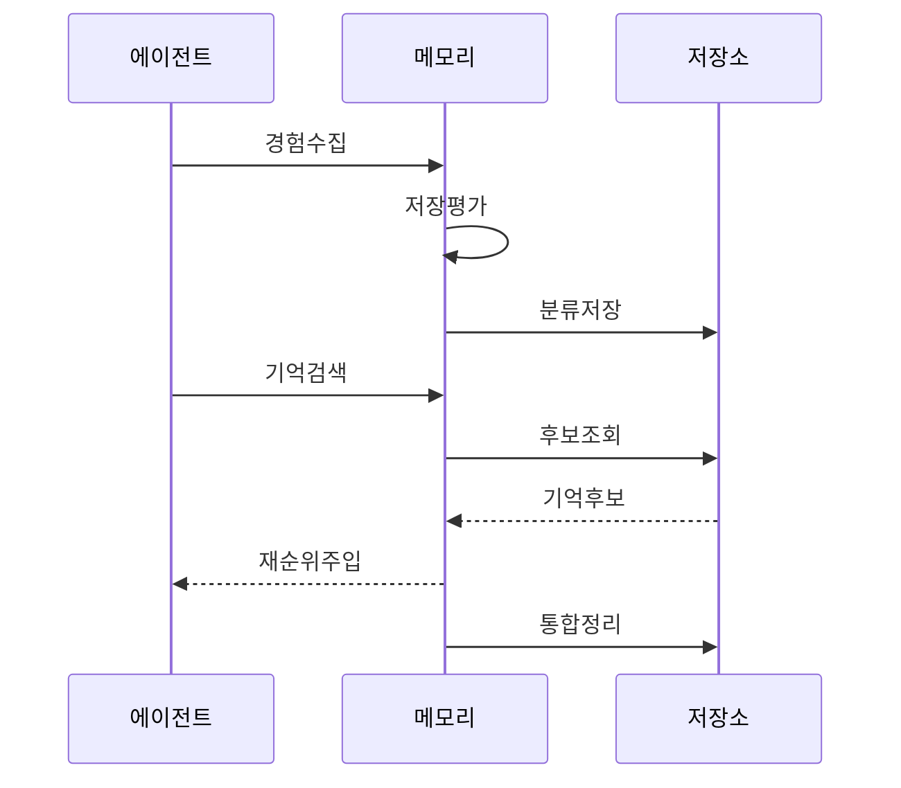

---
sidebar:
  order: 16
  label: "016. Agent Memory (에이전트 메모리)"
  badge:
    text: "기출 · 70%"
    variant: note
title: "Agent Memory (에이전트 메모리)"
date: "2026-07-27T23:59:59+09:00"
tags:
  - "notes-latest_tech"
weight: 16
extra:
  question_no: "016"
  source_status: "기출"
  source_history: "138회"
  priority: 70
  priority_note: "기억 계층·회수가 장기 작업 품질을 좌우"
---

## 미리 알고가기

- **에이전트 메모리(Agent Memory)**: 에이전트가 과거의 상태·지식·경험을 저장하고 현재 목표에 맞게 검색·갱신하는 계층이다.
- **작업 기억(Working Memory)**: 현재 대화·도구 결과를 유지함
- **장기 기억(Long-term Memory)**: 지식·경험을 지속 저장함
- **의미 기억(Semantic Memory)**: 사실·개념 관계를 저장함
- **일화 기억(Episodic Memory)**: 사건·행동 맥락을 저장함
- **기억 검색(Retrieval)**: 목표 관련 기억을 선택함
- **기억 통합(Consolidation)**: 경험을 요약해 장기 반영함

## Ⅰ. 개요

- 정의/개념: **에이전트 메모리**는 과거의 작업 상태·지식·경험을 목적별로 저장하고 관련성·최신성·권한에 따라 검색·갱신하는 계층이다.
- 기존 한계: 문맥창만으로 장기 연속성·세션 간 재사용이 어려움

### 쉽게 이해하기 (학습용)
- 정보를 적절히 저장·활용하고 정리하는 체계

## Ⅱ. 특징
- **기억 분리**: 작업·의미·일화 기억을 목적별 저장한다
- **관련성 검색**: 의미·시간·중요도로 기억을 선택한다
- **수명주기**: 통합·정정·만료·삭제로 오염을 통제한다

### 쉽게 이해하기 (학습용)
- 정확한 정보를 찾고 불필요한 기억을 지우는 능력

## Ⅲ. 구성요소 및 구조

| 설계 요소 | 설명 |
|:---|:---|
| 수집·기록기 | 사건·출처 메타데이터 생성 |
| 단기 저장소 | 메시지·계획·도구 결과 유지 |
| 장기 저장소 | 사실·일화·절차·선호 저장 |
| 검색 계층 | 의미·시간·권한 후보 탐색 |
| 정책 계층 | 정정·만료·삭제 정책 수행 |

### 쉽게 이해하기 (학습용)
- 정보 분류 담당과 검색 담당을 분리하여 운용

## Ⅳ. 원리 및 절차 흐름도

| 절차 | 설명 |
|:---|:---|
| 경험수집 | 대화·행동·도구 결과 수집 |
| 저장평가 | 가치·민감도·수명 판단 |
| 분류저장 | 유형·출처·권한과 함께 저장 |
| 기억검색 | 목표에 맞는 기억 검색 요청 |
| 후보조회 | 의미·시간·권한으로 후보 탐색 |
| 기억후보 | 관련 기억과 메타데이터 반환 |
| 재순위주입 | 관련성·최신성으로 문맥 반영 |
| 통합정리 | 요약·정정·만료·삭제 수행 |

### 쉽게 이해하기 (학습용)
- 유효기간을 붙여야 올바른 사람이 최신 내용을 찾음

## Ⅴ. 에이전트 기억 유형 비교

| 비교 기준 | 작업 기억 | 일화 기억 | 의미 기억 |
|:---|:---|:---|:---|
| 적용 기준 | 현재 과업 상태 유지 시 | 과거 사건·행동 재사용 시 | 사실·개념 지식 재사용 시 |
| 핵심 특징 | 단기 문맥·중간 결과 | 시간·상황이 있는 경험 | 일반화된 사실·관계 |
| 한계 | 문맥 용량·수명 제한 | 잘못된 경험 과잉 일반화 | 노후 사실·출처 손실 |

> 요약: 현재 상태·경험·지식을 목적별로 분리

### 쉽게 이해하기 (학습용)
- 단기 기억은 작업판, 장기 기억은 보관소임

## Ⅵ. 실무 사례

1. 고객 지원 에이전트가 현재 문의 상태는 작업 기억에, 과거 해결 이력은 일화 기억에 분리하여 저장하고 유사 문의에 활용한다.

### 쉽게 이해하기 (학습용)
- 문의 상태와 해결 이력을 따로 둬 과거 사례를 빠르게 찾음

## Ⅶ. 결론
- 장기 작업의 연속성과 과거 경험의 재사용을 위해 기억의 출처·관련성·권한·보존 기간과 정정·삭제 정책을 검토하여 **에이전트 메모리**를 활용해야 한다.

### 쉽게 이해하기 (학습용)
- 필요한 기억을 신뢰할 수 있게 검색하고 오래되거나 잘못된 정보는 정정·만료·삭제할 수 있어야 한다.
