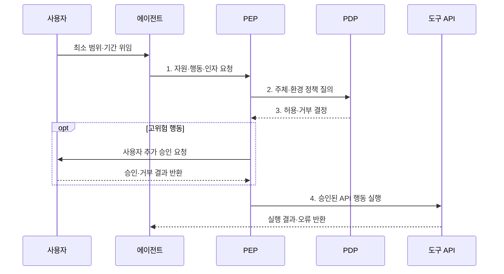

---
sidebar:
  order: 17
  label: "017. Agent Authorization & Control (에이전트 권한 제어)"
  badge:
    text: "기출 · 70%"
    variant: note
title: "Agent Authorization & Control (에이전트 권한 제어)"
date: "2026-08-02T08:46:00+09:00"
tags:
  - "notes-latest_tech"
weight: 17
extra:
  question_no: "017"
  source_status: "기출"
  source_history: "138회"
  priority: 70
  priority_note: "최소 권한과 승인 경계가 안전 실행의 핵심"
---

## Ⅰ. 개요

핵심 용어

- **인증(Authentication)**: 접근을 요청하는 사용자·에이전트·도구의 신원을 확인하는 절차다.
- **인가(Authorization)**: 인증된 주체가 특정 자원에 어떤 행동을 할 수 있는지 결정하는 절차다.
- **최소 권한(Least Privilege)**: 업무 수행에 필요한 최소 범위와 시간으로 권한을 제한하여 부여하는 원칙이다.

- 정의/개념: **에이전트 권한 제어**는 사용자가 위임한 범위 안에서 에이전트의 자원 접근과 도구 행동을 인증·인가·승인 정책으로 제한하는 통제 체계다.
- 배경/필요성: 광범위한 고정 권한은 **의도 밖 행동·권한 남용·피해 확산** 유발

#### 한줄 요약
- 비서에게 업무별로 제한된 권한을 주는 방식

## Ⅱ. 특징

핵심 용어

- **권한 위임(Delegation)**: 사용자가 에이전트에게 수행할 행동의 범위와 기간을 정해 권한을 넘기는 행위다.
- **정책 결정점(Policy Decision Point, PDP)**: 정책과 주체·자원·환경 속성을 평가하여 접근 허용 여부를 판단한다.
- **정책 집행점(Policy Enforcement Point, PEP)**: PDP의 결정을 도구 호출 직전에 허용이나 거부로 강제한다.

- **인증·권한 위임**: 사용자·에이전트·도구 신원과 대리 범위 분리
- **정책 결정점(Policy Decision Point, PDP)·정책 집행점(Policy Enforcement Point, PEP)**: 정책 판단을 도구 호출 전에 강제
- **최소 권한·인간 개입(Human-in-the-Loop, HITL)**: 고위험 행동의 권한과 피해 범위 제한

#### 한줄 요약
- 문서 열람·삭제 권한 분리와 작업 재확인

## Ⅲ. 구조 및 구성요소

핵심 용어

- **정책 관리**: 역할·속성·금지 규칙과 정책 버전을 정의하고 변경하는 기능이다.
- **인간 개입(Human-in-the-Loop, HITL)**: 고위험 행동의 대상과 영향을 사람이 재확인하고 승인하는 통제다.
- **응용 프로그래밍 인터페이스(Application Programming Interface, API)**: 에이전트가 외부 기능을 요청하는 호출 경계로, PEP가 정책을 집행하는 지점이 된다.

| 구성요소 | 책임 |
|:---|:---|
| 인증·위임 | 사용자·에이전트의 **신원·대리 범위** 확인 |
| 정책 관리 | 역할·속성·**금지 규칙** 정의 |
| 정책 결정점 | 주체·자원·환경으로 **허용 여부** 판단 |
| 정책 집행점 | **응용 프로그래밍 인터페이스(Application Programming Interface, API) 호출 전 허용·거부** 강제 |
| 승인·감사 | 고위험 행동의 **인간 승인·결과 기록** |

#### 한줄 요약
- 모델 제안을 정책과 승인 장치가 통제

## Ⅳ. 흐름도

핵심 용어

- **정책 질의**: PEP가 요청의 주체·자원·행동·환경 정보를 PDP에 전달하여 허용 여부를 묻는 과정이다.
- **추가 승인**: 정책상 고위험으로 분류된 행동을 실행하기 전에 사용자에게 최종 결정을 요청하는 절차다.

- **정책 집행점(Policy Enforcement Point, PEP)** 측에서 **정책 결정점(Policy Decision Point, PDP)** 판단을 받아 **응용 프로그래밍 인터페이스(Application Programming Interface, API)** 호출 직전에 허용·거부와 추가 승인을 강제한다.

1. **자원·행동·인자 요청**: PEP에 실행 의도 전달
2. **주체·환경 정책 질의**: PDP가 역할·속성·상황 조건 평가
3. **허용·거부 결정**: 호출 직전 최소 권한 강제
4. **승인된 API 행동 실행**: 허용 범위의 도구만 호출

#### 한줄 요약
- 위험 시 범위를 줄이고 사람의 승인 후 실행

## Ⅴ. 종류 및 비교

핵심 용어

- **역할 기반 접근통제(Role-Based Access Control, RBAC)**: 직무 역할에 권한을 묶고 사용자나 에이전트에 역할을 할당하는 방식이다.
- **속성 기반 접근통제(Attribute-Based Access Control, ABAC)**: 주체·자원·행동·환경 속성을 정책으로 평가하여 접근을 결정하는 방식이다.

- **역할 기반 접근통제(Role-Based Access Control, RBAC)** 및 **속성 기반 접근통제(Attribute-Based Access Control, ABAC)** 사이를 안정적 직무 권한과 동적 상황 판단 기준으로 구분한다.

| 접근통제 | RBAC | ABAC |
|:---|:---|:---|
| 적용 기준 | **직무별 권한이 안정적** | **상황별 동적 판단 필요** |
| 핵심 특징 | **역할에 권한 결합** | **주체·자원·환경 속성 평가** |
| 한계 | **역할 폭증·세밀성 부족** | **정책 복잡·판단 추적 부담** |

> 요약: 안정적 역할에는 **RBAC**, 동적 속성 통제에는 **ABAC** 적용

#### 한줄 요약
- 에이전트는 도구 조합 효과까지 통제해야 함

## Ⅵ. 실무 고려사항 및 대책

핵심 용어

- **단기 자격증명**: 작업이 끝나거나 정해진 시간이 지나면 자동 만료되어 권한 잔존을 줄이는 인증 정보다.
- **권한 상승**: 허용된 여러 도구를 조합하여 본래 위임 범위를 넘는 행동이 가능해지는 현상이다.
- **책임 추적성**: 권한을 요청·판단·승인·실행한 주체와 결과를 연결하여 사후 책임을 확인하는 성질이다.

| 문제 | 대책 | 효과 |
|:---|:---|:---|
| 장기 토큰에 따른 **권한 잔존** | 작업별 단기 자격증명과 자동 만료 적용 | 위임 종료 후 **접근 차단** |
| 도구 조합에 따른 **권한 상승** | 단일 호출이 아닌 전체 행동 경로를 정책 평가 | 연쇄 호출의 **우회 실행** 방지 |
| 고위험 행동의 **자동 실행** | 금액·대상·외부 전송 기준으로 인간 승인 요구 | 되돌리기 어려운 **부작용 통제** |
| 정책 결정의 **책임 공백** | 주체·정책 버전·결정·실행 결과를 연결 기록 | 권한 사용의 **추적성** 확보 |

#### 한줄 요약
- 송신 권한과 수신처 도메인을 분리해 의도치 않은 전송 차단

## Ⅶ. 결론

핵심 용어

- **역할 기반 접근통제 선택 기준(Role-Based Access Control Selection Criteria, RBAC Selection Criteria)**: 직무와 권한 관계가 안정적이고 반복되는 환경에 역할 기반 통제를 적용한다.
- **속성 기반 접근통제 선택 기준(Attribute-Based Access Control Selection Criteria, ABAC Selection Criteria)**: 사용자·자원·시간·위험도 같은 동적 맥락을 세밀하게 평가해야 할 때 속성 기반 통제를 적용한다.

- 안정적 직무 권한에는 **역할 기반 접근통제(Role-Based Access Control, RBAC)**, 동적 맥락·도구 조합에는 **속성 기반 접근통제(Attribute-Based Access Control, ABAC)** 선택

#### 한줄 요약
- 비서에게 업무별 임시 열쇠만 주는 것이 안전함
