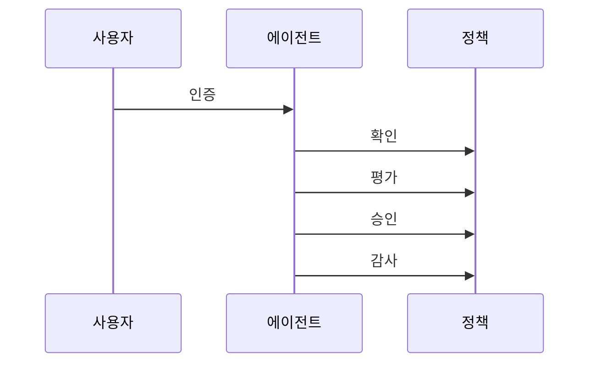

---
sidebar:
  order: 17
  label: "017. Agent Authorization & Control (에이전트 권한 제어)"
  badge:
    text: "기출 · 70%"
    variant: note
title: "Agent Authorization & Control (에이전트 권한 제어)"
date: "2026-07-25T01:25:00+09:00"
tags:
  - "notes-latest_tech"
weight: 17
extra:
  question_no: "017"
  source_status: "기출"
  source_history: "138회"
  priority: 70
  priority_note: "최소 권한과 승인 경계가 안전 실행의 핵심"
---

## 미리 알고가기

- **인증(Authentication)**: 주체의 신원을 확인함
- **인가(Authorization)**: 자원·행동 허용 여부를 결정함
- **최소 권한(Least Privilege)**: 범위·시간을 제한 부여함
- **역할 기반 접근통제(RBAC)**: 역할에 권한을 묶음
- **속성 기반 접근통제(ABAC)**: 속성으로 판정함
- **권한 위임(Delegation)**: 범위·기간을 정해 넘김
- **정책 집행점(PEP)**: 도구 실행 전 정책을 강제함
- **API(Application Programming Interface)**: 외부 기능 호출 경계

## Ⅰ. 개요

- **정의/개념**: 대리 행동의 주체·범위·승인 통제
- **배경/필요성**: 사용자 의도 밖 권한 사용 차단

### 쉽게 이해하기 (학습용)
- 비서에게 업무별로 제한된 권한을 주는 방식

## Ⅱ. 특징
- 행위 주체별 신원·자격 증명을 구분한다
- 도구·위험 수준별 최소 권한을 적용한다
- 고위험 행동은 역할 분리·승인을 요구한다
- 동적 정책·감사가 권한 노출을 줄인다
- 속성·버전을 포함해 정책을 강제한다

### 쉽게 이해하기 (학습용)
- 문서 열람·삭제 권한 분리와 작업 재확인

## Ⅲ. 구성요소 및 구조

| 설계 요소 | 설명 |
|:---|:---|
| 신원 계층 | 주체 인증 및 위임 자격 분리 |
| 결정 계층 | 자원·환경으로 허용 여부 판정 |
| 집행 계층 | 도구 접근 전에 정책 강제 |
| 승인 계층 | 고위험 행동 내용·영향 확인 |
| 감사 계층 | 결정·기록 및 자격 회수 |

### 쉽게 이해하기 (학습용)
- 모델 제안을 정책과 승인 장치가 통제

## Ⅳ. 원리 및 절차 흐름도

| 절차 | 설명 |
|:---|:---|
| 인증 | 주체 신원 확인 |
| 확인 | 자격 범위 확인 |
| 평가 | 위험·행동 검사 |
| 승인 | 격리 실행 승인 |
| 감사 | 결과 기록·회수 |

### 쉽게 이해하기 (학습용)
- 위험 시 범위를 줄이고 사람의 승인 후 실행

## Ⅴ. 종류 및 비교

| 판단 기준 | 자율 에이전트 | 사용자 앱 |
|:---|:---|:---|
| 행동 선택 | 모델이 행동 제안 | 화면 직접 지시 |
| 적용 기준 | 도구 조합 대리 행동 | 기능 직접 조작 시 |
| 핵심 통제 | 위임·인자·승인 통제 | 로그인·API 권한 |

> 요약: 에이전트는 동작 범위가 넓어 위임·승인 통제 강화 필요

### 쉽게 이해하기 (학습용)
- 에이전트는 도구 조합 효과까지 통제해야 함

## Ⅵ. 실무 사례

1. 전송 권한 분리 및 수신자 도메인 검사함
2. 외부 주입 방지를 위한 모델 밖 정책 수행함

### 쉽게 이해하기 (학습용)
- 송신 권한과 수신처 도메인을 분리해 의도치 않은 전송 차단
- 모델 출력을 그대로 믿지 않고 정책 단계에서 차단 여부 결정

## Ⅶ. 결론
- 사용자 의도·위험도 기반 최소 권한과 승인으로 오용 차단

### 쉽게 이해하기 (학습용)
- 비서에게 업무별 임시 열쇠만 주는 것이 안전함
