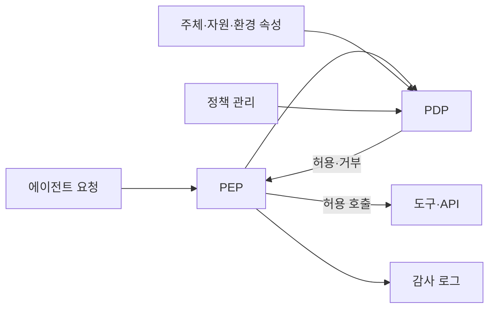
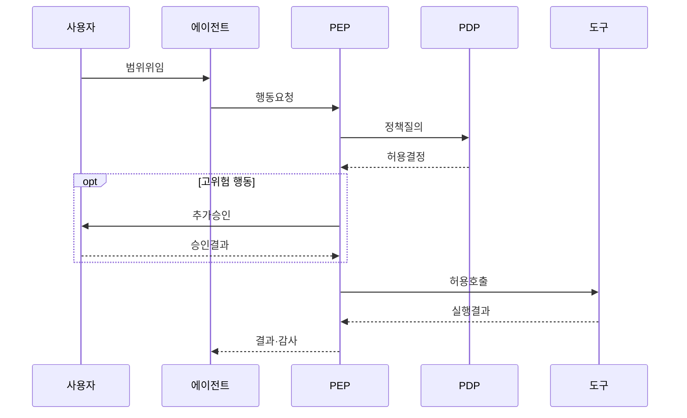

---
sidebar:
  order: 17
  label: "017. Agent Authorization & Control (에이전트 권한 제어)"
  badge:
    text: "기출 · 70%"
    variant: note
title: "Agent Authorization & Control (에이전트 권한 제어)"
date: "2026-07-27T23:59:59+09:00"
tags:
  - "notes-latest_tech"
weight: 17
extra:
  question_no: "017"
  source_status: "기출"
  source_history: "138회"
  priority: 70
  priority_note: "최소 권한과 승인 경계가 안전 실행의 핵심"
---

## 미리 알고가기

- **인증(Authentication)**: 주체의 신원을 확인함
- **인가(Authorization)**: 자원·행동 허용 여부를 결정함
- **최소 권한(Least Privilege)**: 범위·시간을 제한 부여함
- **역할 기반 접근통제(RBAC)**: 역할에 권한을 묶음
- **속성 기반 접근통제(ABAC)**: 속성으로 판정함
- **권한 위임(Delegation)**: 범위·기간을 정해 넘김
- **정책 집행점(PEP)**: 도구 실행 전 정책을 강제함
- **정책 결정점(Policy Decision Point, PDP)**: 정책·속성으로 접근 허용 여부를 판단함
- **인간 개입(Human-in-the-Loop, HITL)**: 고위험 행동을 사람이 재확인하는 통제
- **API(Application Programming Interface)**: 외부 기능 호출 경계
- **약어 읽기·표기**: RBAC·ABAC는 ‘알백·에이백’, PEP·PDP는 ‘피이피·피디피’, HITL·API는 ‘에이치아이티엘·에이피아이’로 읽고 접근 기준·정책·승인·호출 경계를 구분함

## Ⅰ. 개요

- 정의/개념: 에이전트의 대리 행동 범위와 허용 여부를 통제
- 기존 한계: 광범위한 고정 권한은 의도 밖 행동·권한 남용 유발

### 쉽게 이해하기 (학습용)
- 비서에게 업무별로 제한된 권한을 주는 방식

## Ⅱ. 특징
- **주체·위임 분리**: 사용자·에이전트·도구 신원을 구분한다
- **정책 결정·집행**: PDP 판단을 PEP가 호출 전에 강제한다
- **단계적 통제**: 최소 권한·HITL·감사로 위험을 제한한다

### 쉽게 이해하기 (학습용)
- 문서 열람·삭제 권한 분리와 작업 재확인

## Ⅲ. 구성요소 및 구조

| 설계 요소 | 설명 |
|:---|:---|
| 인증·위임 | 사용자·에이전트 신원과 범위 확인 |
| 정책 관리 | 역할·속성·금지 규칙 정의 |
| PDP | 주체·자원·환경으로 허용 판단 |
| PEP | 도구 호출 전 허용·거부 강제 |
| 승인·감사 | 고위험 승인·결정·결과 기록 |

### 쉽게 이해하기 (학습용)
- 모델 제안을 정책과 승인 장치가 통제

## Ⅳ. 원리 및 절차 흐름도

| 절차 | 설명 |
|:---|:---|
| 범위위임 | 사용자 신원·대리 범위 확인 |
| 행동요청 | 도구·자원·인자를 PEP에 전달 |
| 정책질의 | PDP에 주체·환경 속성 전달 |
| 허용결정 | 정책으로 허용·거부 반환 |
| 추가승인 | 고위험 행동의 사용자 재확인 |
| 허용호출 | 승인된 범위로 도구 실행 |
| 결과·감사 | 결정·행동·결과를 기록 |

### 쉽게 이해하기 (학습용)
- 위험 시 범위를 줄이고 사람의 승인 후 실행

## Ⅴ. 에이전트 접근통제 방식 비교

| 비교 기준 | RBAC | ABAC |
|:---|:---|:---|
| 적용 기준 | 직무별 권한이 안정적일 때 | 상황별 동적 판단이 필요할 때 |
| 핵심 특징 | 역할에 권한 묶음 | 주체·자원·환경 속성 평가 |
| 한계 | 역할 폭증·세밀성 부족 | 정책 복잡·판단 추적 부담 |

> 요약: 고정 직무는 RBAC, 동적 조건은 ABAC

### 쉽게 이해하기 (학습용)
- 에이전트는 도구 조합 효과까지 통제해야 함

## Ⅵ. 실무 사례

1. 메일 전송: **수신 도메인 정책**으로 외부 발송 차단
2. 결제 실행: **금액 한도·HITL**로 대리 권한 제한

### 쉽게 이해하기 (학습용)
- 송신 권한과 수신처 도메인을 분리해 의도치 않은 전송 차단
- 모델 출력을 그대로 믿지 않고 정책 단계에서 차단 여부 결정

## Ⅶ. 결론
- 저위험은 **최소 권한**, 고위험은 HITL 추가

### 쉽게 이해하기 (학습용)
- 비서에게 업무별 임시 열쇠만 주는 것이 안전함
