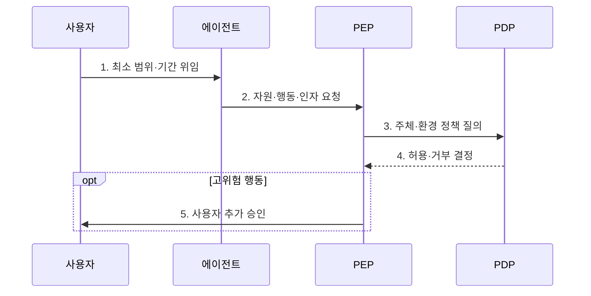

---
sidebar:
  order: 17
  label: "017. Agent Authorization & Control (에이전트 권한 제어)"
  badge:
    text: "기출 · 70%"
    variant: note
title: "Agent Authorization & Control (에이전트 권한 제어)"
date: "2026-07-30T11:04:43+09:00"
tags:
  - "notes-latest_tech"
weight: 17
extra:
  question_no: "017"
  source_status: "기출"
  source_history: "138회"
  priority: 70
  priority_note: "최소 권한과 승인 경계가 안전 실행의 핵심"
---

## 미리 알고가기

- **인증(Authentication)**: 주체의 신원을 확인함
- **인가(Authorization)**: 자원·행동 허용 여부를 결정함
- **최소 권한(Least Privilege)**: 업무 수행에 필요한 최소 범위와 시간으로 권한을 제한하여 부여하는 원칙이다.
- **역할 기반 접근통제(RBAC)**: 역할에 권한을 묶음
- **속성 기반 접근통제(ABAC)**: 속성으로 판정함
- **권한 위임(Delegation)**: 범위·기간을 정해 넘김
- **정책 집행점(PEP)**: 도구 실행 전 정책을 강제함
- **정책 결정점(Policy Decision Point, PDP)**: 정책·속성으로 접근 허용 여부를 판단함
- **인간 개입(Human-in-the-Loop, HITL)**: 고위험 행동을 사람이 재확인하는 통제
- **API(Application Programming Interface)**: 외부 기능 호출 경계

## Ⅰ. 개요

- 정의/개념: **에이전트 권한 제어**는 사용자가 위임한 범위 안에서 에이전트의 자원 접근과 도구 행동을 인증·인가·승인 정책으로 제한하는 통제 체계다.
- 배경/필요성: 광범위한 고정 권한은 **의도 밖 행동·권한 남용·피해 확산** 유발

### 쉽게 이해하기 (학습용)
- 비서에게 업무별로 제한된 권한을 주는 방식

## Ⅱ. 특징
- **주체·위임 분리**: 사용자·에이전트·도구 신원을 구분한다
- **정책 결정·집행**: PDP 판단을 PEP가 호출 전에 강제한다
- **단계적 통제**: 최소 권한·HITL·감사로 위험을 제한한다

### 쉽게 이해하기 (학습용)
- 문서 열람·삭제 권한 분리와 작업 재확인

## Ⅲ. 구조 및 구성요소

| 구성요소 | 책임 |
|:---|:---|
| 인증·위임 | 사용자·에이전트의 **신원·대리 범위** 확인 |
| 정책 관리 | 역할·속성·**금지 규칙** 정의 |
| 정책 결정점 | 주체·자원·환경으로 **허용 여부** 판단 |
| 정책 집행점 | 도구 호출 전 **허용·거부** 강제 |
| 승인·감사 | 고위험 행동의 **인간 승인·결과 기록** |

### 쉽게 이해하기 (학습용)
- 모델 제안을 정책과 승인 장치가 통제

## Ⅳ. 흐름도

### 동작 원리

1. **최소 범위·기간 위임**: 사용자 신원과 **대리 권한** 한정
2. **자원·행동·인자 요청**: 정책 집행점에 **실행 의도** 전달
3. **주체·환경 정책 질의**: 정책 결정점이 역할·속성·**상황 조건** 평가
4. **허용·거부 결정**: 호출 직전 정책으로 **최소 권한** 강제
5. **사용자 추가 승인**: 고위험 행동의 대상·영향을 재확인하고 **감사 기록** 생성

### 쉽게 이해하기 (학습용)
- 위험 시 범위를 줄이고 사람의 승인 후 실행

## Ⅴ. 종류 및 비교

| 접근통제 | RBAC | ABAC |
|:---|:---|:---|
| 적용 기준 | 직무별 권한이 안정적일 때 | 상황별 동적 판단이 필요할 때 |
| 핵심 특징 | 역할에 권한 묶음 | 주체·자원·환경 속성 평가 |
| 한계 | 역할 폭증·세밀성 부족 | 정책 복잡·판단 추적 부담 |

### 쉽게 이해하기 (학습용)
- 에이전트는 도구 조합 효과까지 통제해야 함

## Ⅵ. 실무 고려사항 및 대책

| 고려사항 | 대책 | 효과 |
|:---|:---|:---|
| 장기 토큰에 따른 **권한 잔존** | 작업별 단기 자격증명과 자동 만료 적용 | 위임 종료 후 **접근 차단** |
| 도구 조합에 따른 **권한 상승** | 단일 호출이 아닌 전체 행동 경로를 정책 평가 | 연쇄 호출의 **우회 실행** 방지 |
| 고위험 행동의 **자동 실행** | 금액·대상·외부 전송 기준으로 인간 승인 요구 | 되돌리기 어려운 **부작용 통제** |
| 정책 결정의 **책임 공백** | 주체·정책 버전·결정·실행 결과를 연결 기록 | 권한 사용의 **추적성** 확보 |

### 쉽게 이해하기 (학습용)
- 송신 권한과 수신처 도메인을 분리해 의도치 않은 전송 차단

## Ⅶ. 결론
- 자율 행동에는 **에이전트 권한 제어**를 적용하고 주체·자원·행동별 최소 권한과 위임 기간·인간 승인 경계를 강제

### 쉽게 이해하기 (학습용)
- 비서에게 업무별 임시 열쇠만 주는 것이 안전함
