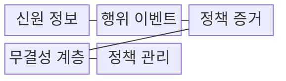
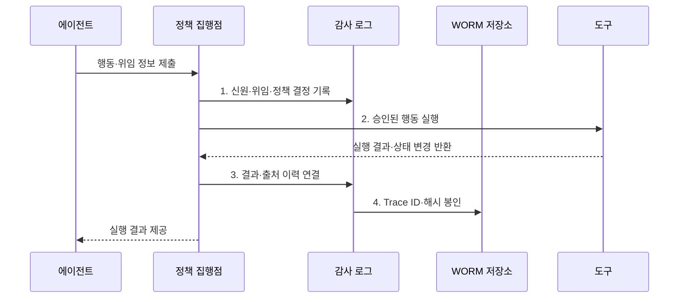

---
sidebar:
  order: 18
  label: "018. Agent Audit Log (에이전트 감사 로그)"
  badge:
    text: "기출 · 50%"
    variant: note
title: "Agent Audit Log (에이전트 감사 로그)"
date: "2026-08-02T08:46:00+09:00"
tags:
  - "notes-latest_tech"
weight: 18
extra:
  question_no: "018"
  source_status: "기출"
  source_history: "138회"
  priority: 50
  priority_note: "행위 추적성은 에이전트 책임성의 기반"
---

## Ⅰ. 개요

핵심 용어

- **감사 로그(Audit Log)**: 대리 행동의 주체·결정 근거·승인·실행 결과를 연결하여 책임 입증에 필요한 증거를 보존하는 기록이다.
- **책임 추적성**: 누가 어떤 권한과 근거로 행동했고 결과가 무엇인지 사건 단위로 재구성할 수 있는 성질이다.

- 정의/개념: **에이전트 감사 로그**는 대리 행동의 주체·위임 범위·판단 근거·승인·실행 결과를 연결하여 책임 추적이 가능하도록 보존하는 기록이다.
- 배경/필요성: 일반 진단 로그만으로 **결정 근거·승인 과정·상태 변경 책임** 입증이 곤란

### 쉽게 이해하기 (학습용)
- 비서의 업무 수행 권한과 승인 이력 장부

## Ⅱ. 특징

핵심 용어

- **추적 식별자(Trace ID)**: 분산된 정책 판단·도구 실행·결과 사건을 하나의 행동 경로로 연결하는 식별자다.
- **1회 기록 다회 판독(Write Once Read Many, WORM)**: 한 번 저장한 기록의 수정·덮어쓰기를 막고 반복 조회만 허용하는 저장 방식이다.
- **데이터 최소화(Minimization)**: 책임 입증 목적에 필요한 정보만 수집하고 나머지는 기록하지 않는 원칙이다.

- **신원 축**: 실행 주체와 위임 주체 분리 기록
- **Trace ID**로 결정·행동·결과 연결
- 최소 수집과 **WORM·전자서명**으로 변조 탐지

### 쉽게 이해하기 (학습용)
- 책임 판단에 필요한 증거와 위변조 흔적 관리

## Ⅲ. 구조 및 구성요소

핵심 용어

- **출처 이력(Provenance)**: 산출물이 어떤 입력·도구·변환 과정을 거쳐 만들어졌는지 기록한 계보이다.
- **변조 탐지 로그(Tamper-evident Log)**: 해시 체인이나 전자서명을 이용해 저장 이후의 변경 흔적을 탐지할 수 있는 로그다.
- **증거 관리 연속성(Chain of Custody)**: 증거의 수집·보관·열람·이관·폐기 주체와 시점을 끊김 없이 기록하는 절차다.

| 구성요소 | 책임 |
|:---|:---|
| 신원 정보 | 실행 주체와 **권한 출처** 기록 |
| 행위 이벤트 | 요청·결과·**출처 이력·상태 변경** 기록 |
| 정책 증거 | 정책 판정과 **승인 범위** 연결 |
| 무결성 계층 | 시각·해시·서명으로 **변조 탐지** |
| 정책 관리 | **증거 관리 연속성·폐기 정책** 수립 |

### 쉽게 이해하기 (학습용)
- 사건 번호로 행동 경로를 재구성

## Ⅳ. 흐름도

핵심 용어

- **정책 증거**: 실행 시 적용한 정책 버전과 허용·거부·승인 결정을 행동 결과에 연결한 기록이다.
- **해시 봉인**: 사건 기록의 해시값을 연결·서명하여 이후 변경 여부를 검증할 수 있게 만드는 과정이다.

1. **신원·위임·정책 결정 기록**: 권한 출처와 승인 근거 연결
2. **승인된 행동 실행**: 허용된 도구·인자만 전달
3. **결과·출처 이력 연결**: 요청과 상태 변경 결과 대조
4. **Trace ID·해시 봉인**: 관련 사건 연결·변조 흔적 보존

### 쉽게 이해하기 (학습용)
- 기록뿐 아니라 열람·폐기 이력도 관리

## Ⅴ. 종류 및 비교

핵심 용어

- **감사 로그**: 책임과 규정 준수를 입증하기 위해 주체·근거·승인·결과와 무결성을 보존한다.
- **관측 로그**: 시스템의 성능과 오류를 진단하기 위해 지표·이벤트·추적 정보를 수집한다.

| 로그 유형 | 감사 로그 | 관측 로그 |
|:---|:---|:---|
| 적용 기준 | **책임·규정 준수** 입증 | 성능·오류 **운영 진단** |
| 핵심 특징 | 주체·근거·승인·**결과 연결** | 지표·로그·추적의 **상태 관측** |
| 한계 | 민감정보·장기 보존 비용 | 책임·**무결성 입증** 부족 |

> 요약: **감사 로그**는 책임 입증, **관측 로그**는 운영 진단 중심

### 쉽게 이해하기 (학습용)
- 관측 로그는 계기판, 감사 로그는 장부

## Ⅵ. 실무 고려사항 및 대책

핵심 용어

- **토큰화(Tokenization)**: 민감한 원문 값을 대체 토큰으로 바꾸고 필요한 통제 하에서만 대응 관계를 조회하는 보호 방식이다.
- **해시 체인(Hash Chain)**: 각 기록에 이전 기록의 해시를 포함하여 중간 기록의 변경·삭제를 탐지하는 구조다.
- **보존 기간**: 증거 목적과 법적 근거에 따라 로그를 유지한 뒤 승인된 절차로 폐기할 때까지의 기간이다.

| 문제 | 대책 | 효과 |
|:---|:---|:---|
| 프롬프트·결과의 **민감정보 노출** | 목적별 최소 필드와 토큰화·마스킹 적용 | 입증력과 **데이터 최소화** 균형 |
| 로그 관리자에 의한 **사후 변조** | 해시 체인·서명·WORM 저장과 외부 시각 증명 | 기록의 **변조 탐지성** 확보 |
| 분산 사건의 **인과 단절** | 추적 식별자로 사용자·정책·도구·결과 연결 | 대리 행동의 **책임 경로** 재구성 |
| 무기한 보존에 따른 **법적 위험** | 목적·법적 근거별 보존 기간과 승인된 폐기 절차 운영 | 증거 보존과 **삭제 의무** 충족 |

### 쉽게 이해하기 (학습용)
- 승인 정보와 API 결과를 함께 남겨 책임 소재 추적

## Ⅶ. 결론

핵심 용어

- **감사 로그 선택 기준**: 책임 소재와 규정 준수를 증명해야 할 때 무결성이 보장된 증거 기록을 사용한다.
- **관측 로그 선택 기준**: 성능 저하와 오류 원인을 실시간으로 진단하고 운영 상태를 개선할 때 사용한다.

- 책임·규정 입증은 **감사 로그**, 성능·오류 진단은 **관측 로그** 선택

### 쉽게 이해하기 (학습용)
- 필요 이상의 정보 없이 책임 증명만 남기는 체계
