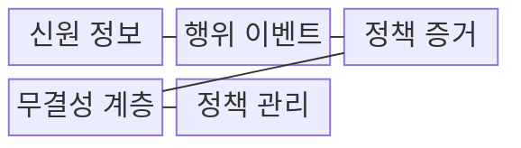
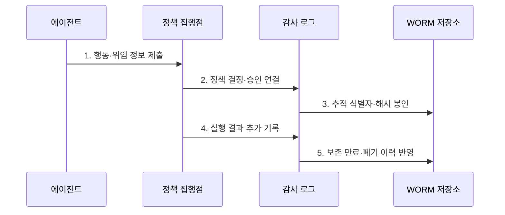

---
sidebar:
  order: 18
  label: "018. Agent Audit Log (에이전트 감사 로그)"
  badge:
    text: "기출 · 50%"
    variant: note
title: "Agent Audit Log (에이전트 감사 로그)"
date: "2026-07-27T23:59:59+09:00"
tags:
  - "notes-latest_tech"
weight: 18
extra:
  question_no: "018"
  source_status: "기출"
  source_history: "138회"
  priority: 50
  priority_note: "행위 추적성은 에이전트 책임성의 기반"
---

## 미리 알고가기

- **감사 로그(Audit Log)**: 주체·결정·행동 결과를 보존함
- **추적 식별자(Trace ID)**: 실행·정책 사건을 연결함
- **출처 이력(Provenance)**: 산출물의 변환 이력을 유지함
- **변조 탐지 로그(Tamper-evident)**: 해시·서명으로 변경 탐지
- **1회 기록 다회 판독(WORM)**: 기록 수정을 막는 저장방식
- **데이터 최소화(Minimization)**: 필요 정보만 보존함
- **증거 관리 연속성(Chain of Custody)**: 수집·이관 이력 유지

## Ⅰ. 개요

- 정의/개념: **에이전트 감사 로그**는 대리 행동의 주체·위임 범위·판단 근거·승인·실행 결과를 연결하여 책임 추적이 가능하도록 보존하는 기록이다.
- 배경/필요성: 일반 진단 로그만으로 **결정 근거·승인 과정·상태 변경 책임** 입증이 곤란

### 쉽게 이해하기 (학습용)
- 비서의 업무 수행 권한과 승인 이력 장부

## Ⅱ. 특징
- **실행 신원·위임 주체** 분리 기록
- **추적 식별자** 기반 결정·행동·결과 연결
- 최소 수집·마스킹과 **WORM·서명** 기반 변조 탐지

### 쉽게 이해하기 (학습용)
- 책임 판단에 필요한 증거와 위변조 흔적 관리

## Ⅲ. 구조 및 구성요소

| 구성요소 | 책임 |
|:---|:---|
| 신원 정보 | 실행 주체와 **권한 출처** 기록 |
| 행위 이벤트 | 요청·결과·**상태 변경** 기록 |
| 정책 증거 | 정책 판정과 **승인 범위** 연결 |
| 무결성 계층 | 시각·해시·서명으로 **변조 탐지** |
| 정책 관리 | 보존·접근·**폐기 정책** 수립 |

### 쉽게 이해하기 (학습용)
- 사건 번호로 행동 경로를 재구성

## Ⅳ. 흐름도

1. **행동·위임 정보 제출**: 실행 주체와 **권한 출처** 식별
2. **정책 결정·승인 연결**: 판단 근거와 인간 승인을 **행동 사건**에 결합
3. **추적 식별자·해시 봉인**: 관련 사건을 연결하고 **변조 흔적** 보존
4. **실행 결과 추가 기록**: 요청과 실제 **상태 변경 결과** 대조
5. **보존 만료·폐기 이력 반영**: 정책에 따른 접근·이관·폐기를 **연속 기록**

### 쉽게 이해하기 (학습용)
- 기록뿐 아니라 열람·폐기 이력도 관리

## Ⅴ. 종류 및 비교

| 로그 유형 | 감사 로그 | 관측 로그 |
|:---|:---|:---|
| 적용 기준 | **책임·규정 준수** 입증 | 성능·오류 **운영 진단** |
| 핵심 특징 | 주체·근거·승인·**결과 연결** | 지표·로그·추적의 **상태 관측** |
| 한계 | 민감정보·장기 보존 비용 | 책임·**무결성 입증** 부족 |

### 쉽게 이해하기 (학습용)
- 관측 로그는 계기판, 감사 로그는 장부

## Ⅵ. 실무 고려사항 및 대책

| 고려사항 | 대책 | 효과 |
|:---|:---|:---|
| 프롬프트·결과의 **민감정보 노출** | 목적별 최소 필드와 토큰화·마스킹 적용 | 입증력과 **데이터 최소화** 균형 |
| 로그 관리자에 의한 **사후 변조** | 해시 체인·서명·WORM 저장과 외부 시각 증명 | 기록의 **변조 탐지성** 확보 |
| 분산 사건의 **인과 단절** | 추적 식별자로 사용자·정책·도구·결과 연결 | 대리 행동의 **책임 경로** 재구성 |
| 무기한 보존에 따른 **법적 위험** | 목적·법적 근거별 보존 기간과 승인된 폐기 절차 운영 | 증거 보존과 **삭제 의무** 충족 |

### 쉽게 이해하기 (학습용)
- 승인 정보와 API 결과를 함께 남겨 책임 소재 추적

## Ⅶ. 결론
- 대리 행동의 책임 입증에는 **에이전트 감사 로그**를 적용하고 주체·근거·승인·결과를 변조 탐지 가능한 사건으로 연결

### 쉽게 이해하기 (학습용)
- 필요 이상의 정보 없이 책임 증명만 남기는 체계
