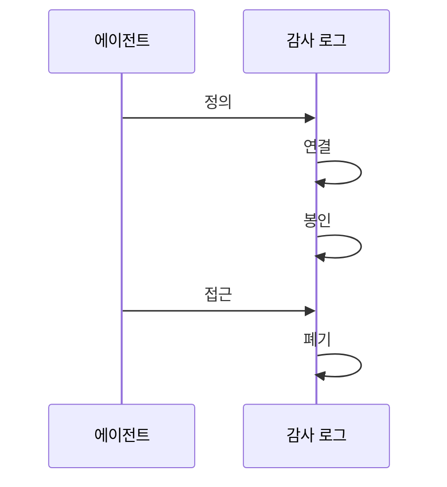

---
sidebar:
  order: 18
  label: "018. Agent Audit Log (에이전트 감사 로그)"
  badge:
    text: "기출 · 50%"
    variant: note
title: "Agent Audit Log (에이전트 감사 로그)"
date: "2026-07-25T01:25:00+09:00"
tags:
  - "notes-latest_tech"
weight: 18
extra:
  question_no: "018"
  source_status: "기출"
  source_history: "138회"
  priority: 50
  priority_note: "행위 추적성은 에이전트 책임성의 기반"
---

## 미리 알고가기

- **감사 로그(Audit Log)**: 주체·결정·행동 결과를 보존함
- **추적 식별자(Trace ID)**: 실행·정책 사건을 연결함
- **출처 이력(Provenance)**: 산출물의 변환 이력을 유지함
- **변조 탐지 로그(Tamper-evident)**: 해시·서명으로 변경 탐지
- **1회 기록 다회 판독(WORM)**: 기록 수정을 막는 저장방식
- **데이터 최소화(Minimization)**: 필요 정보만 보존함
- **증거 관리 연속성(Chain of Custody)**: 수집·이관 이력 유지

## Ⅰ. 개요

- **정의/개념**: 대리 행동의 주체·근거·결과 기록
- **배경/필요성**: 상태 변경 책임·규정 준수 입증

### 쉽게 이해하기 (학습용)
- 비서의 업무 수행 권한과 승인 이력 장부

## Ⅱ. 특징
- 실행 신원과 위임 주체를 분리 기록한다
- 추적 식별자로 행동 인과관계를 연결한다
- 민감정보 수집을 줄이고 값을 마스킹한다
- WORM·서명이 로그 변조를 탐지한다

### 쉽게 이해하기 (학습용)
- 책임 판단에 필요한 증거와 위변조 흔적 관리

## Ⅲ. 구성요소 및 구조

| 설계 요소 | 설명 |
|:---|:---|
| 신원 정보 | 주체와 권한 출처 기록 |
| 행위 이벤트 | 요청·결과·상태 변경 기록 |
| 정책 증거 | 정책 판정과 승인 범위 연결 |
| 무결성 계층 | 시각·해시·서명으로 봉인 |
| 정책 관리 | 보존·접근·폐기 정책 수립 |

### 쉽게 이해하기 (학습용)
- 사건 번호로 행동 경로를 재구성

## Ⅳ. 원리 및 절차 흐름도

| 절차 | 설명 |
|:---|:---|
| 정의 | 목적·필드 최소수집 정의 |
| 연결 | 주체·정책·행동 ID 연결 |
| 봉인 | 해시·서명으로 봉인 |
| 접근 | 권한·이력 관리 수행 |
| 폐기 | 법적 보존 종료 시 폐기 |

### 쉽게 이해하기 (학습용)
- 기록뿐 아니라 열람·폐기 이력도 관리

## Ⅴ. 종류 및 비교

| 판단 기준 | 감사 로그 | 관측 로그 |
|:---|:---|:---|
| 목적 | 책임·규정 입증 | 성능·오류 분석 |
| 적용 기준 | 책임 입증 필요 시 | 진단 필요 시 |
| 보존 통제 | 무결성 연결 중시 | 단기 보존 가능 |

> 요약: 책임 입증용과 성능 개선용 장부 비교

### 쉽게 이해하기 (학습용)
- 관측 로그는 계기판, 감사 로그는 장부

## Ⅵ. 실무 사례

1. 승인 정보와 API 결과를 함께 기록함
2. 모델 사고과정 대신 근거·결정 위주 기록

### 쉽게 이해하기 (학습용)
- 승인 정보와 API 결과를 함께 남겨 책임 소재 추적
- 사고 과정 전체가 아니라 근거·결정만 남겨 책임 증명

## Ⅶ. 결론
- 신원·근거·결과를 무결성 있게 연결해 책임성 입증

### 쉽게 이해하기 (학습용)
- 필요 이상의 정보 없이 책임 증명만 남기는 체계
