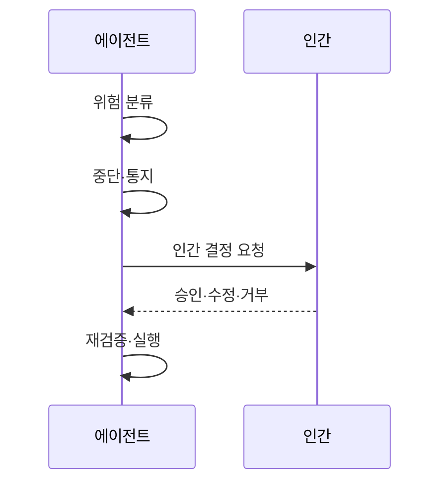

---
sidebar:
  order: 19
  label: "019. Human-in-the-Loop Agent (인간 개입 에이전트)"
  badge:
    text: "미출제 · 60%"
    variant: note
title: "Human-in-the-Loop Agent (인간 개입 에이전트)"
date: "2026-07-25T01:25:00+09:00"
tags:
  - "notes-latest_tech"
weight: 19
extra:
  question_no: "019"
  source_status: "미출제"
  source_history: ""
  priority: 60
  priority_note: "고위험 판단의 인간 승인 설계가 중요"
---

## 미리 알고가기

- **HITL (Human-in-the-Loop)**: 인간의 검토·수정·승인 포함
- **Human-on-the-Loop**: 자동 실행 감시 및 필요시 개입
- **Interrupt**: 실행을 안전하게 일시 정지함
- **Checkpoint**: 중단 시점 상태 저장 및 재개
- **Approval Gate**: 인간 결정을 요구하는 지점
- **Escalation**: 예외를 담당자에게 넘김
- **Automation Bias**: 자동화 결과를 맹신하는 편향

## Ⅰ. 개요

- 정의/개념: 실행 중 사람의 계속·수정·중단 결정
- **배경/필요성**: 불확실한 판단의 통제권 유지

### 쉽게 이해하기 (학습용)
- 비서의 제안을 담당자가 확인 후 처리

## Ⅱ. 특징
- 위험도에 따라 사람의 개입 지점을 정한다
- 근거·영향·대안을 승인자에게 제공한다
- 수정·거부 결정을 구조화해 수용한다
- 상태 저장이 승인 중 환경 변화에 대응한다

### 쉽게 이해하기 (학습용)
- 단순 승인보다 변경 이유와 영향 파악이 핵심

## Ⅲ. 구성요소 및 구조

| 설계 요소 | 설명 |
|:---|:---|
| 위험 평가기 | 개입 필요성 계산 |
| 중단 계층 | 상태 보존 및 부작용 방지 |
| 검토 계층 | 근거·영향 대안 표시 |
| 결정 라우터 | 승인·거부 등 상태 변환 |
| 정책 관리 | 시각·기록 관리 수행 |

### 쉽게 이해하기 (학습용)
- 자동화할 것과 중요한 담당 결정을 구분

## Ⅳ. 원리 및 절차 흐름도

| 절차 | 설명 |
|:---|:---|
| 위험 분류 | 개입 조건 평가 |
| 중단·통지 | 상태 보존 후 통지 |
| 인간 결정 | 승인·수정·거부 선택 |
| 재검증·실행 | 조건 확인 후 실행 |

### 쉽게 이해하기 (학습용)
- 승인 직후에도 실행 조건을 다시 확인

## Ⅴ. 종류 및 비교

| 판단 기준 | HITL 에이전트 | 자동 에이전트 |
|:---|:---|:---|
| 실행 결정 | 인간 결정 대기 | 즉시 실행 |
| 처리 특성 | 통제력 확보 가능 | 효율적이나 위험 큼 |
| 핵심 위험 | 승인 정체·형식화 | 권한 남용 가능성 |

> 요약: 통제력 확보와 자동화 효율의 교환 관계

### 쉽게 이해하기 (학습용)
- 검토 시간과 책임 설계가 중요함

## Ⅵ. 실무 사례

1. 외부 발송·결제는 위험도별 기한 설정함
2. 승인율 외 오류 발견·편향도 함께 측정함

### 쉽게 이해하기 (학습용)
- 외부 발송·결제는 위험 등급에 따라 사람 승인 기한을 다르게 정함
- 승인율만 보지 않고 오류 발견율과 편향 지표도 함께 측정

## Ⅶ. 결론
- 중단 후 맥락을 인간에 연결하고 품질 평가로 형식화 차단

### 쉽게 이해하기 (학습용)
- 가치는 승인이 아닌 잘못된 점 발견에 있음
