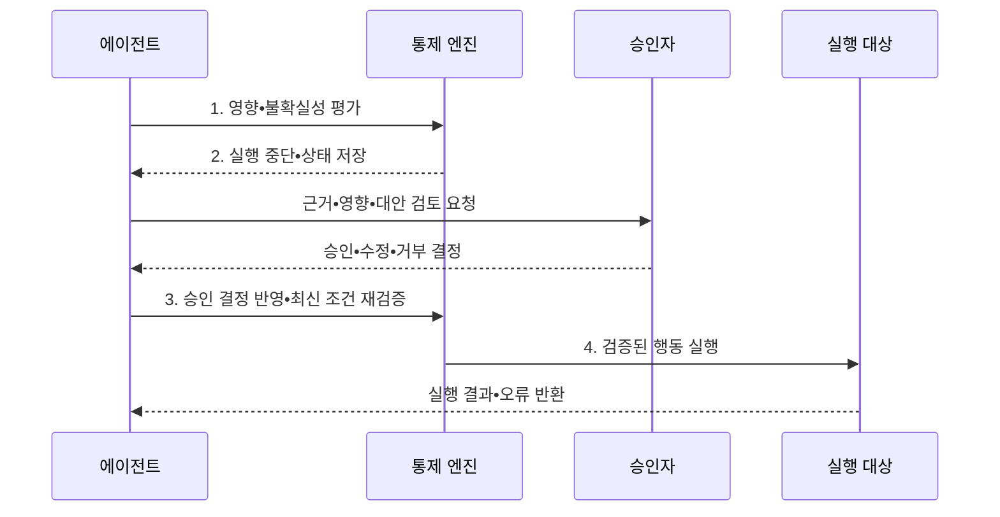

---
sidebar:
  order: 19
  label: "019. Human-in-the-Loop Agent (인간 개입 에이전트)"
  badge:
    text: "미출 • 60%"
    variant: note
title: "Human-in-the-Loop Agent (인간 개입 에이전트)"
date: "2026-08-03T08:48:47+09:00"
tags:
  - "notes-latest_tech"
weight: 19
extra:
  question_no: "019"
  source_status: "미출"
  source_history: ""
  priority: 60
  priority_note: "고위험 판단의 인간 승인 설계가 중요"
---

## Ⅰ. 개요

핵심 용어

- **인간 개입(Human-in-the-Loop, HITL)**: 에이전트 실행 과정에 사람의 검토•수정•승인 결정을 포함하는 통제 방식이다.
- **비가역 행동**: 실행 뒤 원상 복구가 어렵거나 피해를 완전히 회수할 수 없는 행동이다.

- 정의/개념: 에이전트 실행 과정에서 사람이 결과와 영향을 검토하고 계속•수정•거부•중단을 결정하는 **인간 개입(Human-in-the-Loop, HITL)**
- 배경/필요성: 고위험•불확실 판단의 자동 실행은 **오류 사전 차단•최종 통제권** 확보가 곤란

#### 한줄 요약
- 비서의 제안을 담당자가 확인 후 처리

## Ⅱ. 특징

핵심 용어

- **개입 조건**: 위험도•불확실성•가역성을 평가하여 사람의 검토가 필요한 시점을 정한 기준이다.
- **검토 문맥**: 승인자가 실질적으로 판단할 수 있도록 제시하는 근거•예상 영향•대안•불확실성 정보다.

- **개입 축**: 위험 등급으로 승인•검토 시점 결정
- **판단 축**: 근거•영향•대안으로 검토 문맥 제공
- **실행 축**: 구조화 결정•상태 재검증 후 실행

#### 한줄 요약
- 단순 승인보다 변경 이유와 영향 파악이 핵심

## Ⅲ. 구조 및 구성요소

핵심 용어

- **중단(Interrupt)**: 부작용이 발생하기 전에 에이전트 실행을 안전하게 일시 정지하는 기능이다.
- **체크포인트(Checkpoint)**: 승인이나 예외 처리 뒤 재개할 수 있도록 중단 시점의 상태를 저장한 지점이다.
- **승인 관문(Approval Gate)**: 고위험 단계에서 사람의 승인•수정•거부 결정을 요구하는 통제 지점이다.
- **에스컬레이션(Escalation)**: 정해진 시간이나 권한으로 처리할 수 없는 예외를 상위 담당자에게 넘기는 절차다.

| 구성요소 | 책임 |
|:---|:---|
| 위험 평가기 | 영향•불확실성으로 **개입 필요성** 판정 |
| 중단 계층 | **Interrupt•Checkpoint** 로 부작용 차단 |
| 검토 계층 | **Approval Gate** 에서 근거•대안 표시 |
| 결정 라우터 | 승인•수정•거부의 **상태 전이** |
| 정책 관리 | **Escalation•감사 기록** 관리 |

#### 한줄 요약
- 자동화할 것과 중요한 담당 결정을 구분

## Ⅳ. 흐름도

핵심 용어

- **상태 재검증**: 승인 대기 중 바뀔 수 있는 대상•금액•권한•정책을 실제 실행 직전에 다시 확인하는 절차다.
- **승인 범위**: 사람이 허용한 대상•행동•조건의 경계로, 에이전트는 그 안에서만 실행해야 한다.

1. **영향•불확실성 평가**: 피해 규모와 신뢰도로 **개입 조건** 판정
2. **실행 중단•상태 저장**: 승인 전 부작용을 막고 **재개 지점** 보존
3. **승인 결정 반영•최신 조건 재검증**: 대상•권한•정책 재확인
4. **검증된 행동 실행**: 승인 범위 안의 행동만 수행

#### 한줄 요약
- 승인 직후에도 실행 조건을 다시 확인

## Ⅴ. 종류 및 비교

핵심 용어

- **Human-on-the-Loop**: 정책에 따라 자동 실행하되 사람이 과정을 감시하고 필요할 때 중단•수정하는 통제 방식이다.
- **자동 실행**: 저위험 반복 행동을 정책 판정 뒤 별도 인간 승인 없이 즉시 수행하는 방식이다.
- **자동화 편향(Automation Bias)**: 사람이 자동화 시스템의 제안이나 결과를 충분히 검토하지 않고 옳다고 받아들이는 편향이다.

- **인간 개입(Human-in-the-Loop, HITL)**, **인간 감시(Human-on-the-Loop)**, **자동 실행** 사이를 개입 시점과 행동 위험도로 구분한다.

| 판단 기준 | HITL | Human-on-the-Loop | 자동 실행 |
|:---|:---|:---|:---|
| 적용 기준 | **고위험•비가역 행동** | **가역적 감시 가능 행동** | **저위험•반복 행동** |
| 핵심 특징 | 인간 결정 후 **조건부 실행** | 자동 실행 후 **인간 감시** | 정책 통과 후 **즉시 실행** |
| 한계 | **승인 병목•자동화 편향** | **개입 지연•감시 피로** | **권한 남용•피해 확산** |

> 요약: 사전 승인에는 **HITL**, 실행 중 감시에는 **Human-on-the-Loop** 적용

#### 한줄 요약
- 검토 시간과 책임 설계가 중요함

## Ⅵ. 실무 고려사항 및 대책

핵심 용어

- **위험 등급화**: 영향 규모•불확실성•가역성을 기준으로 행동을 분류하여 승인 수준과 응답 기한을 다르게 정하는 방식이다.
- **승인 병목**: 검토 요청이 승인자의 처리 능력을 넘어 자동화 전체가 지연되는 현상이다.
- **거부 기본값**: 승인 기한이 지나거나 담당자가 응답하지 않으면 행동을 자동으로 실행하지 않도록 정한 안전 상태다.

| 문제 | 대책 | 효과 |
|:---|:---|:---|
| 모든 작업 승인에 따른 **병목** | 영향•불확실성•가역성 기반 위험 등급화 | 고위험 지점에 **검토 역량 집중** |
| 근거 없는 승인에 따른 **자동화 편향** | 판단 근거•대안•예상 영향과 불확실성 표시 | 실질적인 **오류 발견** 지원 |
| 승인 대기 중 **대상 상태 변경** | 실행 직전 대상•금액•권한•정책 재검증 | 오래된 승인에 따른 **오실행** 방지 |
| 기한 초과 시 **책임 공백** | 승인자•대체자•응답 기한•거부 기본값 명시 | 예외 상황의 **결정 책임** 확보 |

#### 한줄 요약
- 외부 발송•결제는 위험 등급에 따라 사람 승인 기한을 다르게 정함

## Ⅶ. 결론

핵심 용어

- **인간 개입 선택 기준(Human-in-the-Loop Selection Criteria, HITL Selection Criteria)**: 비가역적이거나 피해가 큰 행동은 실행 전에 사람의 명시적 결정을 요구한다.
- **Human-on-the-Loop 선택 기준**: 되돌릴 수 있고 지속 감시가 가능한 행동은 자동 실행과 사후 개입을 결합한다.

- 비가역•고위험 행동에는 **인간 개입(Human-in-the-Loop, HITL)**, 가역•감시 가능 행동에는 **인간 감시(Human-on-the-Loop)** 선택

#### 한줄 요약
- 가치는 승인이 아닌 잘못된 점 발견에 있음
