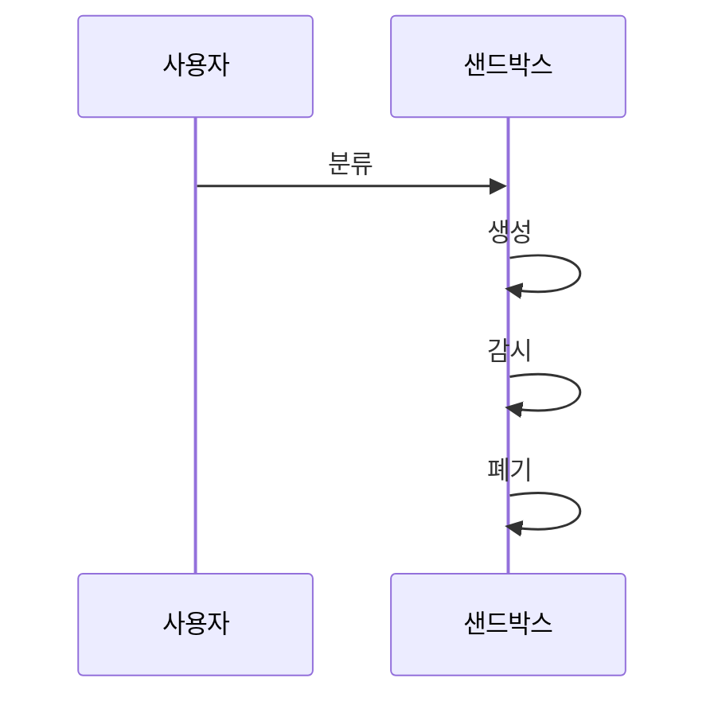

---
sidebar:
  order: 20
  label: "020. Agent Sandbox (에이전트 샌드박스)"
  badge:
    text: "미출제 · 60%"
    variant: note
title: "Agent Sandbox (에이전트 샌드박스)"
date: "2026-07-25T01:25:00+09:00"
tags:
  - "notes-latest_tech"
weight: 20
extra:
  question_no: "020"
  source_status: "미출제"
  source_history: ""
  priority: 60
  priority_note: "격리 실행이 도구 오용 피해를 제한"
---

## 미리 알고가기

- **Sandbox**: 불신 코드·도구를 환경에 격리함
- **Container**: 네임스페이스·cgroup 격리 방식
- **MicroVM**: 경량 가상머신 기반의 격리 방식
- **Seccomp**: 시스템 호출 필터링 기능
- **Egress Control**: 외부 통신 목적지·프로토콜 제한
- **Ephemeral Environment**: 일회성 실행 환경
- **Resource Quota**: 자원 사용량의 상한 설정

## Ⅰ. 개요

- **정의/개념**: 코드·도구의 권한·자원·통신 격리 환경
- **배경/필요성**: 불신 입력의 실행 피해 범위 제한

### 쉽게 이해하기 (학습용)
- 사고 방지를 위한 독립된 별도 작업실 사용

## Ⅱ. 특징
- 일회성 이미지·비특권 사용자 환경을 만든다
- 시스템 호출·네트워크·파일 접근을 제한한다
- 자원 사용 상한이 호스트 고갈을 막는다
- 결과 검사 후 작업 환경을 폐기한다

### 쉽게 이해하기 (학습용)
- 입출력·통신·자원 사용량 등 모든 환경 통제

## Ⅲ. 구성요소 및 구조

| 설계 요소 | 설명 |
|:---|:---|
| 의존성 관리 | 최소 이미지 및 버전 고정 |
| 실행 격리 | syscall·프로세스 접근 제한 |
| 데이터 경계 | 읽기 전용 입력 및 출력 분리 |
| 네트워크 통제 | Egress 허용목록 적용 |
| 자원 관리자 | 사용량 제한 및 폐기 관리 |

### 쉽게 이해하기 (학습용)
- 검증된 환경에서 실행하고 결과만 반출

## Ⅳ. 원리 및 절차 흐름도

| 절차 | 설명 |
|:---|:---|
| 분류 | 격리 수준 및 정책 선택 |
| 생성 | 일회용 최소 환경 구성 |
| 감시 | 자원·통신·syscall 확인 |
| 폐기 | 결과 확인 후 자원 삭제 |

### 쉽게 이해하기 (학습용)
- 실행 전 안전등급 결정 및 후처리 필수

## Ⅴ. 종류 및 비교

| 판단 기준 | 컨테이너 | MicroVM |
|:---|:---|:---|
| 격리 경계 | 호스트 커널 공유 | 게스트 커널 분리 |
| 시작·밀도 | 고속·고밀도 | 추가 비용 발생 |
| 적용 판단 | 낮은 위험 작업 | 강한 커널 격리 시 |

> 요약: 성능과 격리 강도에 따른 선택 필요

### 쉽게 이해하기 (학습용)
- 격리 강도와 비용 고려하여 선택

## Ⅵ. 실무 사례

1. 읽기 전용 입력 및 폐쇄 통신망 적용함
2. 탈출 대비 호스트 최소화 및 다중 보안 적용

### 쉽게 이해하기 (학습용)
- 입력은 읽기 전용으로 두고 외부 통신은 폐쇄망으로 제한
- 샌드박스 탈출 가능성에 대비해 호스트를 최소화하고 다중 방어

## Ⅶ. 결론
- 격리·자원 통제와 신속한 폐기로 피해 반경 최소화

### 쉽게 이해하기 (학습용)
- 목적은 성공이 아니라 실패 시 범위 최소화
