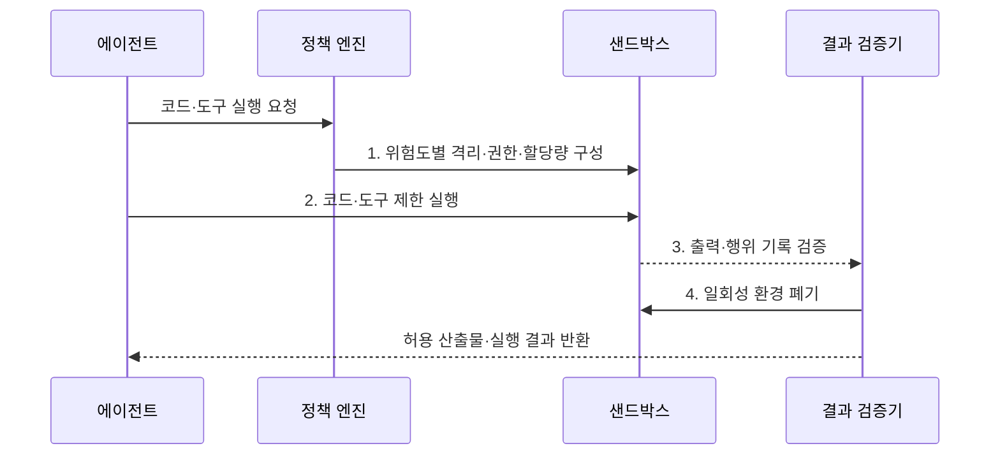

---
sidebar:
  order: 20
  label: "020. Agent Sandbox (에이전트 샌드박스)"
  badge:
    text: "미출 · 60%"
    variant: note
title: "Agent Sandbox (에이전트 샌드박스)"
date: "2026-07-31T12:04:16+09:00"
tags:
  - "notes-latest_tech"
weight: 20
extra:
  question_no: "020"
  source_status: "미출"
  source_history: ""
  priority: 60
  priority_note: "격리 실행이 도구 오용 피해를 제한"
---

## 미리 알고가기

- **Sandbox**: 불신 코드·도구를 환경에 격리함
- **Container**: 네임스페이스·cgroup 격리 방식
- **MicroVM**: 경량 가상머신 기반의 격리 방식
- **Seccomp**: 시스템 호출 필터링 기능
- **Egress Control**: 외부 통신 목적지·프로토콜 제한
- **Ephemeral Environment**: 일회성 실행 환경
- **Resource Quota**: 자원 사용량의 상한 설정

> **키워드:** Agent Sandbox (에이전트 샌드박스)

## Ⅰ. 개요

- 정의/개념: **에이전트 샌드박스**는 생성 코드와 외부 도구를 격리된 환경에서 최소 권한으로 실행하고 자원·파일·네트워크 접근을 제한하는 보안 통제다.
- 배경/필요성: 비신뢰 코드의 호스트 직접 실행은 **파일 변조·정보 유출·자원 고갈** 피해 확산

### 쉽게 이해하기 (학습용)
- 사고 방지를 위한 독립된 별도 작업실 사용

## Ⅱ. 특징
- **Ephemeral Environment**로 비특권 일회성 작업 경계 생성
- **제한 축**: 시스템 호출·네트워크·파일·자원 통제
- **반출 축**: 결과 검사·환경 폐기로 잔존 상태 제거

### 쉽게 이해하기 (학습용)
- 입출력·통신·자원 사용량 등 모든 환경 통제

## Ⅲ. 구조 및 구성요소

| 구성요소 | 책임 |
|:---|:---|
| 의존성 관리 | 최소 이미지와 **패키지 버전** 고정 |
| 실행 격리 | **Seccomp·비특권 프로세스**로 호스트 접근 제한 |
| 데이터 경계 | 읽기 전용 입력과 **검증 출력** 분리 |
| 네트워크 통제 | **Egress Control·목적지 허용 목록** 적용 |
| 자원 관리자 | **Resource Quota·환경 폐기** 관리 |

### 쉽게 이해하기 (학습용)
- 검증된 환경에서 실행하고 결과만 반출

## Ⅳ. 흐름도

1. **위험도별 격리·권한·할당량 구성**: 신뢰도·부작용별 경계 설정
2. **코드·도구 제한 실행**: 시스템 호출·자원 상한 강제
3. **출력·행위 기록 검증**: 악성 결과·비밀정보·정책 위반 검사
4. **일회성 환경 폐기**: 허용 산출물 외 잔존 상태 제거

### 쉽게 이해하기 (학습용)
- 실행 전 안전등급 결정 및 후처리 필수

## Ⅴ. 종류 및 비교

| 격리 방식 | 컨테이너 | MicroVM |
|:---|:---|:---|
| 적용 기준 | **낮은 위험·고빈도 실행** | **비신뢰 코드·강한 격리** |
| 핵심 특징 | **호스트 커널 공유**로 고밀도 | **게스트 커널 분리**로 경계 강화 |
| 한계 | **커널 취약점의 호스트 영향** | **시작 지연·자원 오버헤드** |

> 요약: **Container**는 고밀도, **MicroVM**은 강한 커널 격리 중심

### 쉽게 이해하기 (학습용)
- 격리 강도와 비용 고려하여 선택

## Ⅵ. 실무 고려사항 및 대책

| 고려사항 | 대책 | 효과 |
|:---|:---|:---|
| 공유 커널 취약점의 **격리 탈출** | 위험도에 따라 MicroVM과 비특권 사용자 적용 | 호스트까지의 **피해 반경** 축소 |
| 외부 통신을 통한 **정보 유출** | 기본 차단 후 목적지·프로토콜 허용 목록 운영 | 비밀정보의 **무단 반출** 방지 |
| 무한 실행에 따른 **자원 고갈** | CPU·메모리·저장공간·시간 할당량 강제 | 서비스의 **가용성 보호** |
| 악성 출력의 **후속 감염** | 파일 형식·내용·민감정보 검사 후 결과만 반출 | 샌드박스 밖 **공급망 확산** 차단 |

### 쉽게 이해하기 (학습용)
- 입력은 읽기 전용으로 두고 외부 통신은 폐쇄망으로 제한

## Ⅶ. 결론
- 낮은 위험·고빈도는 **Container**, 비신뢰 코드는 **MicroVM** 선택

### 쉽게 이해하기 (학습용)
- 목적은 성공이 아니라 실패 시 범위 최소화
