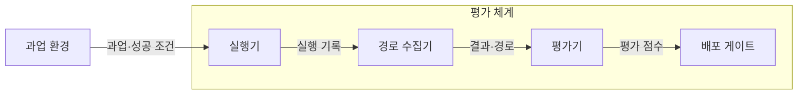
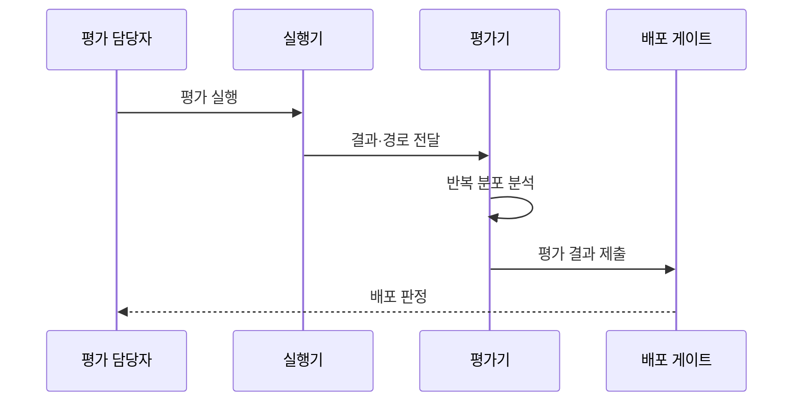

---
sidebar:
  order: 21
  label: "021. Agent Evaluation (에이전트 평가)"
  badge:
    text: "미출제 · 70%"
    variant: note
title: "Agent Evaluation (에이전트 평가)"
date: "2026-07-25T01:25:00+09:00"
tags:
  - "notes-latest_tech"
weight: 21
extra:
  question_no: "021"
  source_status: "미출제"
  source_history: ""
  priority: 70
  priority_note: "성공률·안전성 평가가 도입 판단의 핵심"
---

## 미리 알고가기

- **에이전트 평가(Agent Evaluation)**: 과업 결과와 실행 과정을 함께 검증하는 평가 체계
- **실행 경로(Trajectory)**: 메시지·도구 호출·상태 전이의 전체 기록
- **성공률(Success Rate)**: 완료 조건을 충족한 실행의 비율
- **거대 언어 모델 심판(LLM-as-a-Judge)**: 평가 기준에 따라 모델이 결과를 채점하는 방식
- **오프라인 평가(Offline Evaluation)**: 고정 데이터셋과 모의 환경의 회귀 평가
- **온라인 평가(Online Evaluation)**: 운영 환경의 품질·안전·비용 평가

## Ⅰ. 개요

- **정의/개념**: 과업 결과·실행 경로·위험을 검증하는 체계
- **배경/필요성**: 결과만으로 도구 오용·정책 위반 판별 곤란

### 쉽게 이해하기 (학습용)

- 목적지 도착 여부뿐 아니라 이동 경로와 교통법규 위반까지 함께 채점함

## Ⅱ. 특징

- 동일 과업도 실행 경로·결과가 달라질 수 있다
- 반복 실행 분포로 비결정성을 평가한다
- 성공률과 위험·비용·지연을 함께 측정한다

### 쉽게 이해하기 (학습용)

- 한 번의 성공보다 여러 실행에서 언제 어떻게 실패하는지를 살펴봄

## Ⅲ. 아키텍처 및 구성요소

| 설계 요소 | 설명 |
|:---|:---|
| 실행기 | 과업을 반복 수행해 결과 생성 |
| 경로 수집기 | 메시지·도구·상태·비용 기록 |
| 평가기 | 규칙·모델·사람으로 결과 채점 |
| 배포 게이트 | 기준선 대비 회귀로 배포 판정 |

### 쉽게 이해하기 (학습용)

- 같은 시험장에서 실행 기록을 모아 채점하고 기준 미달 변경은 배포하지 않음

## Ⅳ. 원리 및 절차 흐름도

| 절차 | 설명 |
|:---|:---|
| 평가 실행 | 정상·경계·공격 과업 반복 수행 |
| 결과·경로 전달 | 결과·도구 호출·부작용 수집 |
| 반복 분포 분석 | 성공률·신뢰구간·실패 유형 산출 |
| 평가 결과 제출 | 기준선 대비 회귀 결과 전달 |
| 배포 판정 | 임계치 충족 여부로 배포 결정 |

### 쉽게 이해하기 (학습용)

- 여러 조건에서 시험한 기록을 모아 이전 버전보다 나빠졌는지 판정함

## Ⅴ. 종류 및 비교

| 판단 기준 | 에이전트 평가 | 일반 생성 평가 |
|:---|:---|:---|
| 평가 대상 | 결과·도구·상태·경로 | 생성 결과 |
| 성공 판정 | 환경의 과업 완료 조건 | 참조 답·품질 기준 |
| 위험 평가 | 권한·부작용·비용·지연 | 유해성·사실성 |
| 적용 기준 | 외부 행동을 수행하는 시스템 | 결과만 생성하는 모델 |

> 요약: 외부 행동은 결과와 실행 경로를 함께 평가

### 쉽게 이해하기 (학습용)

- 글만 만드는 모델과 달리 에이전트는 실제로 한 행동과 영향까지 검사함

## Ⅵ. 실무 사례

1. 고객지원 에이전트는 해결률·오환불률 평가
2. 코드 에이전트는 테스트 통과·금지 명령 평가

### 쉽게 이해하기 (학습용)

- 고객 문의를 해결했어도 잘못 환불했다면 실패로 판정함
- 코드가 동작해도 금지된 명령을 실행했다면 배포하지 않음

## Ⅶ. 결론

- 과업 위험도에 따라 결과·경로 평가 비중 결정

### 쉽게 이해하기 (학습용)

- 실제 피해가 큰 업무일수록 정답뿐 아니라 도구 사용 과정도 엄격히 검사함
