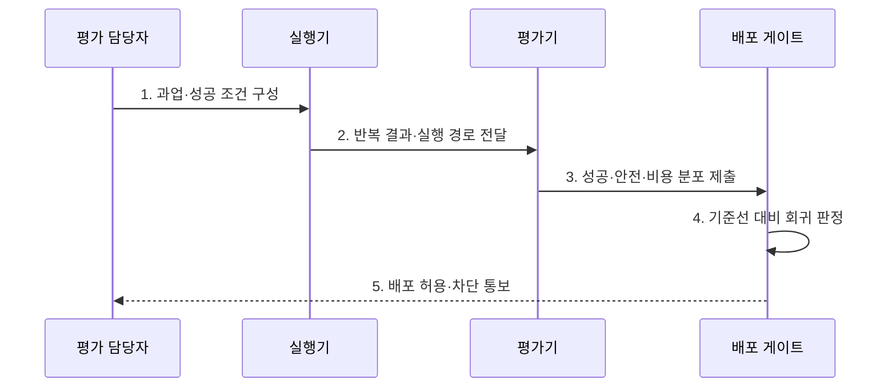

---
sidebar:
  order: 21
  label: "021. Agent Evaluation (에이전트 평가)"
  badge:
    text: "미출제 · 70%"
    variant: note
title: "Agent Evaluation (에이전트 평가)"
date: "2026-07-30T11:04:43+09:00"
tags:
  - "notes-latest_tech"
weight: 21
extra:
  question_no: "021"
  source_status: "미출제"
  source_history: ""
  priority: 70
  priority_note: "성공률·안전성 평가가 도입 판단의 핵심"
---

## 미리 알고가기

- **에이전트 평가(Agent Evaluation)**: 과업 결과와 실행 과정의 정확성·안전성·효율성을 함께 검증하는 평가 체계다.
- **실행 경로(Trajectory)**: 에이전트가 과업을 수행하며 생성한 메시지·도구 호출·상태 전이의 전체 기록이다.
- **성공률(Success Rate)**: 전체 실행 중 정의된 완료 조건을 충족한 실행의 비율이다.
- **거대 언어 모델 심판(LLM-as-a-Judge)**: 명시된 평가 기준에 따라 언어 모델이 결과의 품질을 채점하는 방식이다.
- **오프라인 평가(Offline Evaluation)**: 고정 데이터셋과 모의 환경에서 품질 회귀를 반복 검증하는 방식이다.
- **온라인 평가(Online Evaluation)**: 운영 환경에서 품질·안전·비용·지연을 지속 측정하는 방식이다.

## Ⅰ. 개요

- 정의/개념: **에이전트 평가**는 최종 결과뿐 아니라 실행 경로와 부작용을 측정하여 과업 성공 여부를 검증하는 체계다.
- 배경/필요성: 최종 결과 평가는 **도구 오용·정책 위반·과도한 비용**의 경로 결함 식별이 곤란

### 쉽게 이해하기 (학습용)

- 에이전트가 목표를 달성했는지와 그 과정에서 허용된 도구와 권한을 사용했는지를 함께 평가한다.

## Ⅱ. 특징

- **경로 평가**: 동일한 결과라도 도구 호출과 상태 전이 등 실행 경로의 적절성을 함께 검증한다.
- **반복 평가**: 동일 과업을 반복 실행하여 비결정적인 결과의 분포와 신뢰구간을 측정한다.
- **다차원 지표**: 성공률뿐 아니라 안전 위험·비용·지연을 함께 측정한다.

### 쉽게 이해하기 (학습용)

- 단일 실행의 성공 여부보다 반복 실행에서 나타나는 실패 유형과 발생 빈도를 분석한다.

## Ⅲ. 구조 및 구성요소

| 구성요소 | 책임 |
|:---|:---|
| 평가 실행기 | 정상·경계·공격 과업의 **반복 실행** |
| 경로 수집기 | 메시지·도구·상태·**비용 기록** |
| 결과·경로 평가기 | 규칙·모델·사람으로 **성공·안전 판정** |
| 배포 게이트 | 기준선 대비 **품질 회귀**로 배포 결정 |

### 쉽게 이해하기 (학습용)

- 실행 결과와 경로를 수집해 기준선과 비교하고, 품질이나 안전성이 저하된 변경은 배포하지 않는다.

## Ⅳ. 흐름도

### 동작 원리

1. **과업·성공 조건 구성**: 정상·경계·공격 조건과 **완료 증거** 명시
2. **반복 결과·실행 경로 전달**: 비결정성을 고려한 결과·도구·**부작용 수집**
3. **성공·안전·비용 분포 제출**: 성공률·신뢰구간과 **실패 유형** 산출
4. **기준선 대비 회귀 판정**: 모델·프롬프트·도구 변경의 **품질 저하** 비교
5. **배포 허용·차단 통보**: 위험별 임계치로 **릴리스 결정**

### 쉽게 이해하기 (학습용)

- 정상·경계·공격 조건에서 반복 실행한 결과를 기준선과 비교하여 배포 가능 여부를 결정한다.

## Ⅴ. 종류 및 비교

| 평가 유형 | 에이전트 평가 | 일반 생성 평가 |
|:---|:---|:---|
| 적용 기준 | 외부 행동·**상태 변경** 시스템 | 결과만 생성하는 모델 |
| 핵심 특징 | 결과·도구·상태의 **실행 경로 평가** | 참조 답·품질 기준의 **출력 평가** |
| 한계 | 환경 재현·반복 평가 비용 | 권한·부작용·경로 결함 누락 |

### 쉽게 이해하기 (학습용)

- 결과만 생성하는 모델과 달리 에이전트는 실제 도구 사용과 그 부작용까지 평가한다.

## Ⅵ. 실무 고려사항 및 대책

| 고려사항 | 대책 | 효과 |
|:---|:---|:---|
| 성공 조건이 모호한 **평가 오판** | 결과 상태·부작용·금지 행동을 검증 가능한 기준으로 명시 | 과업별 **성공 판정 일관성** 확보 |
| 단일 실행에 따른 **비결정성 은폐** | 동일 과업 반복과 신뢰구간·실패 분포 산출 | 우연한 성공이 아닌 **안정성 검증** |
| LLM 심판의 **편향·점수 변동** | 평가 루브릭·교정 표본·사람 검토로 심판 일치도 측정 | 자동 평가의 **신뢰도 통제** |
| 오프라인과 운영의 **환경 차이** | 온라인 지표·사고율을 오프라인 회귀 세트에 환류 | 실제 실패를 반영한 **지속 평가** |

### 쉽게 이해하기 (학습용)

- 문의를 해결했더라도 잘못된 환불처럼 부작용이 발생하면 실패로 판정한다.

## Ⅶ. 결론

- 외부 행동을 수행하는 에이전트는 **결과·실행 경로·부작용**을 반복 평가하고 위험별 **배포 임계치**로 출시 결정

### 쉽게 이해하기 (학습용)

- 실제 피해 가능성이 큰 업무일수록 최종 결과뿐 아니라 도구 사용 과정과 권한 준수 여부를 엄격히 검증해야 한다.
