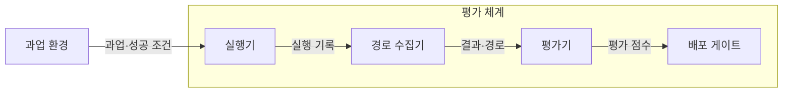
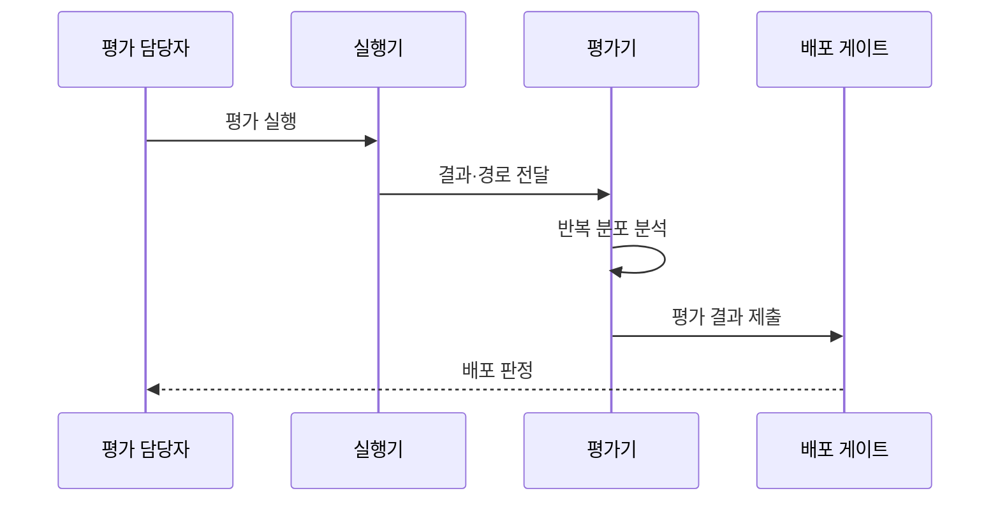

---
sidebar:
  order: 21
  label: "021. Agent Evaluation (에이전트 평가)"
  badge:
    text: "미출제 · 70%"
    variant: note
title: "Agent Evaluation (에이전트 평가)"
date: "2026-07-25T01:25:00+09:00"
tags:
  - "notes-latest_tech"
weight: 21
extra:
  question_no: "021"
  source_status: "미출제"
  source_history: ""
  priority: 70
  priority_note: "성공률·안전성 평가가 도입 판단의 핵심"
---

## 미리 알고가기

- **에이전트 평가(Agent Evaluation)**: 과업 결과와 실행 과정의 정확성·안전성·효율성을 함께 검증하는 평가 체계다.
- **실행 경로(Trajectory)**: 에이전트가 과업을 수행하며 생성한 메시지·도구 호출·상태 전이의 전체 기록이다.
- **성공률(Success Rate)**: 전체 실행 중 정의된 완료 조건을 충족한 실행의 비율이다.
- **거대 언어 모델 심판(LLM-as-a-Judge)**: 명시된 평가 기준에 따라 언어 모델이 결과의 품질을 채점하는 방식이다.
- **오프라인 평가(Offline Evaluation)**: 고정 데이터셋과 모의 환경에서 품질 회귀를 반복 검증하는 방식이다.
- **온라인 평가(Online Evaluation)**: 운영 환경에서 품질·안전·비용·지연을 지속 측정하는 방식이다.

## Ⅰ. 개요

- 정의/개념: **에이전트 평가**는 최종 결과뿐 아니라 실행 경로와 부작용을 측정하여 과업 성공 여부를 검증하는 체계다.
- 기존 한계: 최종 결과만 평가하면 도구 오용·정책 위반·과도한 비용처럼 실행 과정에서 발생한 문제를 판별하기 어렵다.

### 쉽게 이해하기 (학습용)

- 에이전트가 목표를 달성했는지와 그 과정에서 허용된 도구와 권한을 사용했는지를 함께 평가한다.

## Ⅱ. 특징

- **경로 평가**: 동일한 결과라도 도구 호출과 상태 전이 등 실행 경로의 적절성을 함께 검증한다.
- **반복 평가**: 동일 과업을 반복 실행하여 비결정적인 결과의 분포와 신뢰구간을 측정한다.
- **다차원 지표**: 성공률뿐 아니라 안전 위험·비용·지연을 함께 측정한다.

### 쉽게 이해하기 (학습용)

- 단일 실행의 성공 여부보다 반복 실행에서 나타나는 실패 유형과 발생 빈도를 분석한다.

## Ⅲ. 아키텍처 및 구성요소

| 설계 요소 | 설명 |
|:---|:---|
| 실행기 | 과업을 반복 수행해 결과 생성 |
| 경로 수집기 | 메시지·도구·상태·비용 기록 |
| 평가기 | 규칙·모델·사람으로 결과 채점 |
| 배포 게이트 | 기준선 대비 회귀로 배포 판정 |

### 쉽게 이해하기 (학습용)

- 실행 결과와 경로를 수집해 기준선과 비교하고, 품질이나 안전성이 저하된 변경은 배포하지 않는다.

## Ⅳ. 원리 및 절차 흐름도

| 절차 | 설명 |
|:---|:---|
| 평가 실행 | 정상·경계·공격 과업 반복 수행 |
| 결과·경로 전달 | 결과·도구 호출·부작용 수집 |
| 반복 분포 분석 | 성공률·신뢰구간·실패 유형 산출 |
| 평가 결과 제출 | 기준선 대비 회귀 결과 전달 |
| 배포 판정 | 임계치 충족 여부로 배포 결정 |

### 쉽게 이해하기 (학습용)

- 정상·경계·공격 조건에서 반복 실행한 결과를 기준선과 비교하여 배포 가능 여부를 결정한다.

## Ⅴ. 종류 및 비교

| 판단 기준 | 에이전트 평가 | 일반 생성 평가 |
|:---|:---|:---|
| 평가 대상 | 결과·도구·상태·경로 | 생성 결과 |
| 성공 판정 | 환경의 과업 완료 조건 | 참조 답·품질 기준 |
| 위험 평가 | 권한·부작용·비용·지연 | 유해성·사실성 |
| 적용 기준 | 외부 행동을 수행하는 시스템 | 결과만 생성하는 모델 |

> 요약: 외부 행동을 수행하는 에이전트는 최종 결과와 실행 경로를 함께 평가해야 한다.

### 쉽게 이해하기 (학습용)

- 결과만 생성하는 모델과 달리 에이전트는 실제 도구 사용과 그 부작용까지 평가한다.

## Ⅵ. 실무 사례

1. 고객 지원 에이전트의 문의 해결률과 함께 오환불률·처리 비용·응답 지연을 측정하여 배포 여부를 결정한다.

### 쉽게 이해하기 (학습용)

- 문의를 해결했더라도 잘못된 환불처럼 부작용이 발생하면 실패로 판정한다.

## Ⅶ. 결론

- 에이전트의 안정적인 운영을 위해 과업 위험도와 부작용 범위를 검토하여 결과·실행 경로·비용 지표의 평가 비중과 배포 임계치를 결정해야 한다.

### 쉽게 이해하기 (학습용)

- 실제 피해 가능성이 큰 업무일수록 최종 결과뿐 아니라 도구 사용 과정과 권한 준수 여부를 엄격히 검증해야 한다.
