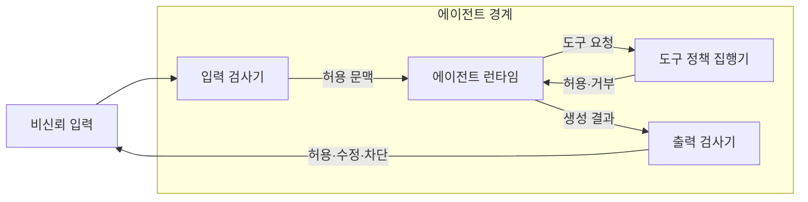
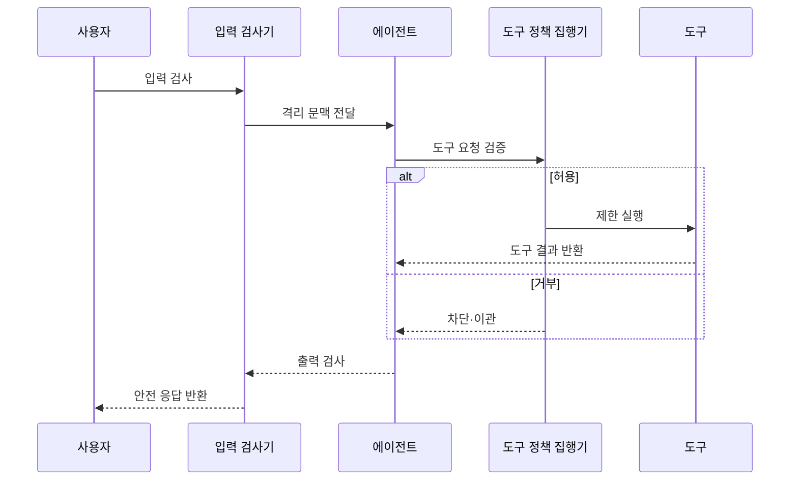

---
sidebar:
  order: 22
  label: "022. Agent Guardrail (에이전트 가드레일)"
  badge:
    text: "미출제 · 70%"
    variant: note
title: "Agent Guardrail (에이전트 가드레일)"
date: "2026-07-25T01:25:00+09:00"
tags:
  - "notes-latest_tech"
weight: 22
extra:
  question_no: "022"
  source_status: "미출제"
  source_history: ""
  priority: 70
  priority_note: "입력·출력·행동 제한이 안전성 핵심"
---

## 미리 알고가기

- **에이전트 가드레일(Agent Guardrail)**: 입력·출력·도구 행동의 위험을 제한하는 통제
- **프롬프트 주입(Prompt Injection)**: 비신뢰 데이터의 지시로 모델 통제를 우회하는 공격
- **트립와이어(Tripwire)**: 위반 검출 시 실행을 중단하는 조건
- **심층 방어(Defense in Depth)**: 독립 통제를 여러 계층에 배치하는 원칙
- **인간 개입(Human-in-the-Loop, HITL)**: 고위험 행동을 사람이 승인하는 통제

## Ⅰ. 개요

- 정의/개념: 입력·출력·도구 행동의 위험 제한 체계
- **배경/필요성**: 비신뢰 지시와 과도한 권한이 피해 유발

### 쉽게 이해하기 (학습용)

- 입구의 위험물 검사부터 작업 권한과 출구 반출 검사까지 겹쳐 둠

## Ⅱ. 특징

- 단일 필터는 모든 우회 공격을 막지 못한다
- 위험도에 따라 허용·수정·차단·이관한다
- 오탐률 감소는 우회율 증가와 상충한다

### 쉽게 이해하기 (학습용)

- 의심스럽다고 모두 막지 않고 위험 정도에 따라 제거하거나 사람에게 넘김

## Ⅲ. 아키텍처 및 구성요소

| 설계 요소 | 설명 |
|:---|:---|
| 입력 검사기 | 악성 지시·민감정보 사전 검출 |
| 에이전트 런타임 | 분리된 지시와 데이터로 행동 생성 |
| 도구 정책 집행기 | 인자·권한·부작용을 실행 전 판정 |
| 출력 검사기 | 유해성·민감정보·정책 위반 검출 |

### 쉽게 이해하기 (학습용)

- 외부 자료를 읽고 도구를 쓰고 결과를 내보내는 각 경계에서 따로 검사함

## Ⅳ. 원리 및 절차 흐름도

| 절차 | 설명 |
|:---|:---|
| 입력 검사 | 난독화·악성 지시·민감정보 검출 |
| 격리 문맥 전달 | 신뢰 지시와 비신뢰 데이터 분리 |
| 도구 요청 검증 | 인자·권한·부작용으로 허용 판정 |
| 제한 실행 | 최소 권한과 격리 환경에서 실행 |
| 도구 결과 반환 | 결과를 비신뢰 데이터로 재검사 |
| 차단·이관 | 고위험 요청 중단 후 사람에게 이관 |
| 출력 검사 | 유해성·민감정보·정책 위반 검출 |
| 안전 응답 반환 | 허용·마스킹된 결과만 제공 |

### 쉽게 이해하기 (학습용)

- 위험한 도구 요청은 실행 전에 멈추고 중요한 판단은 담당자에게 넘김

## Ⅴ. 종류 및 비교

| 판단 기준 | 에이전트 가드레일 | 정책 엔진 |
|:---|:---|:---|
| 통제 대상 | 생성·도구 행동의 위험 | 주체·자원의 접근 권한 |
| 판정 방식 | 규칙·분류기·사람 결합 | 선언 정책·속성 평가 |
| 주요 한계 | 오탐·우회 가능 | 정책 누락·속성 오류 |
| 적용 기준 | 의미 기반 동적 위험 통제 | 결정적 접근 권한 통제 |

> 요약: 권한은 정책 엔진, 행동 위험은 가드레일로 통제

### 쉽게 이해하기 (학습용)

- 정책 엔진은 가능한 일을 정하고 가드레일은 허용된 일의 위험한 방식도 검사함

## Ⅵ. 실무 사례

1. 메일 에이전트는 외부 전송 전 수신자·첨부 검사

### 쉽게 이해하기 (학습용)

- 메일 발송 전 받는 사람과 첨부 파일에 민감정보가 없는지 검사함

## Ⅶ. 결론

- 행동 위험도에 따라 권한·차단·인간 승인 결정

### 쉽게 이해하기 (학습용)

- 사고 피해가 클수록 권한을 줄이고 자동 실행 대신 사람의 승인을 받음
