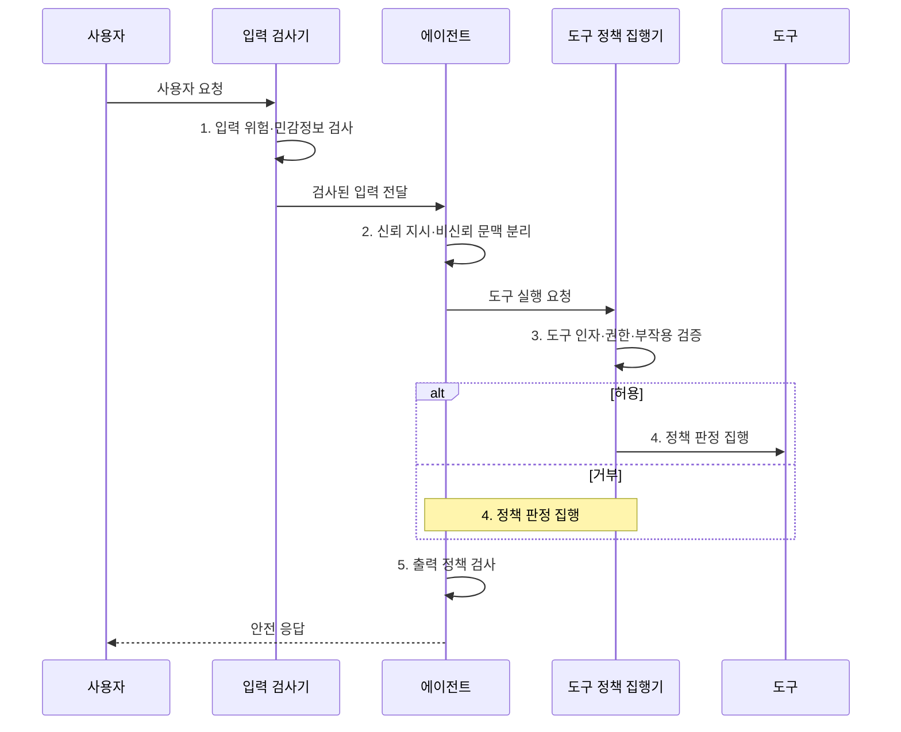

---
sidebar:
  order: 22
  label: "022. Agent Guardrail (에이전트 가드레일)"
  badge:
    text: "미출 · 70%"
    variant: note
title: "Agent Guardrail (에이전트 가드레일)"
date: "2026-07-31T11:51:06+09:00"
tags:
  - "notes-latest_tech"
weight: 22
extra:
  question_no: "022"
  source_status: "미출"
  source_history: ""
  priority: 70
  priority_note: "입력·출력·행동 제한이 안전성 핵심"
---

## 미리 알고가기

- **에이전트 가드레일(Agent Guardrail)**: 에이전트의 입력·출력·도구 행동에서 발생하는 위험을 탐지하고 제한하는 통제 체계다.
- **프롬프트 주입(Prompt Injection)**: 비신뢰 데이터의 지시로 모델 통제를 우회하는 공격
- **트립와이어(Tripwire)**: 위반 검출 시 실행을 중단하는 조건
- **심층 방어(Defense in Depth)**: 독립 통제를 여러 계층에 배치하는 원칙
- **인간 개입(Human-in-the-Loop, HITL)**: 고위험 행동을 사람이 승인하는 통제

## Ⅰ. 개요

- 정의/개념: 입력·출력·도구 행동을 제한하는 **에이전트 가드레일**
- 배경/필요성: 비신뢰 지시와 과도한 권한은 **모델 오판을 실제 시스템 피해**로 확산

### 쉽게 이해하기 (학습용)

- 입력 검사, 도구 권한 통제, 출력 검사를 여러 계층에 배치하여 위험이 실제 행동으로 이어지는 것을 방지한다.

## Ⅱ. 특징

- **심층 방어**: 단일 필터로 모든 우회 공격을 막기 어려우므로 독립된 통제를 여러 계층에 적용한다.
- **프롬프트 주입·트립와이어**: 비신뢰 지시를 탐지하고 위반 시 실행 중단
- **위험 기반 대응**: 탐지한 위험 수준에 따라 요청을 허용·수정·차단하거나 사람에게 이관한다.
- **HITL 승인**: 고위험 도구 행동을 사람이 검토한 뒤 실행
- **오탐·미탐 상충**: 기준을 완화해 오탐을 줄이면 우회 공격을 놓칠 가능성이 커진다.

### 쉽게 이해하기 (학습용)

- 의심스럽다고 모두 막지 않고 위험 정도에 따라 제거하거나 사람에게 넘김

## Ⅲ. 구조 및 구성요소

| 구성요소 | 책임 |
|:---|:---|
| 입력 검사기 | 악성 지시·**민감정보** 사전 검출 |
| 에이전트 런타임 | 신뢰 지시와 **비신뢰 데이터** 분리 |
| 도구 정책 집행기 | 인자·권한·**부작용** 실행 전 판정 |
| 출력 검사기 | 유해성·민감정보·**정책 위반** 검출 |

### 쉽게 이해하기 (학습용)

- 외부 자료를 읽고 도구를 쓰고 결과를 내보내는 각 경계에서 따로 검사함

## Ⅳ. 흐름도

1. **입력 위험·민감정보 검사**: 악성 지시·난독화·비밀정보 탐지
2. **신뢰 지시·비신뢰 문맥 분리**: 외부 콘텐츠의 **명령 권한** 제거
3. **도구 인자·권한·부작용 검증**: 정책으로 **실행 위험도** 판정
4. **정책 판정 집행**: 위험 수준에 따라 **격리·차단** 또는 사람 이관
5. **출력 정책 검사**: 유해성·민감정보를 재검사한 허용 결과 제공

### 쉽게 이해하기 (학습용)

- 위험한 도구 요청은 실행 전에 멈추고 중요한 판단은 담당자에게 넘김

## Ⅴ. 종류 및 비교

| 통제 체계 | 에이전트 가드레일 | 정책 엔진 |
|:---|:---|:---|
| 적용 기준 | 의미 기반 **동적 행동 위험** | 결정적 **접근 권한** |
| 핵심 특징 | 규칙·분류기·사람의 **다층 판정** | 선언 정책·속성의 **허용 판정** |
| 한계 | 오탐·**우회 공격 가능성** | 정책 누락·**속성 오류** |

### 쉽게 이해하기 (학습용)

- 정책 엔진은 가능한 일을 정하고 가드레일은 허용된 일의 위험한 방식도 검사함

## Ⅵ. 실무 고려사항 및 대책

| 고려사항 | 대책 | 효과 |
|:---|:---|:---|
| 단일 필터 우회에 따른 **통제 실패** | 입력·문맥·도구·출력에 독립 통제를 배치 | 우회 공격의 **다층 차단** |
| 과도한 차단에 따른 **업무 저해** | 위험 등급별 허용·수정·차단·사람 이관 정책 적용 | 안전성과 **업무 가용성** 균형 |
| 모델 판정만 신뢰한 **권한 오용** | 도구 서버가 주체·대상·인자를 결정적으로 재검증 | 생성 판단과 **권한 집행** 분리 |
| 정책 변경의 **검출 성능 저하** | 공격·정상 세트로 오탐·미탐과 우회율 지속 평가 | 가드레일의 **운영 임계치** 보정 |

### 쉽게 이해하기 (학습용)

- 메일 발송 전 받는 사람과 첨부 파일에 민감정보가 없는지 검사함

## Ⅶ. 결론

- 고위험 도구는 **최소 권한·트립와이어**와 **HITL 승인** 후 실행

### 쉽게 이해하기 (학습용)

- 사고 피해가 클수록 권한을 줄이고 자동 실행 대신 사람의 승인을 받음
