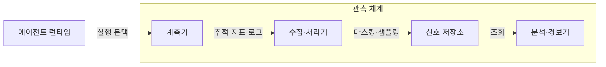
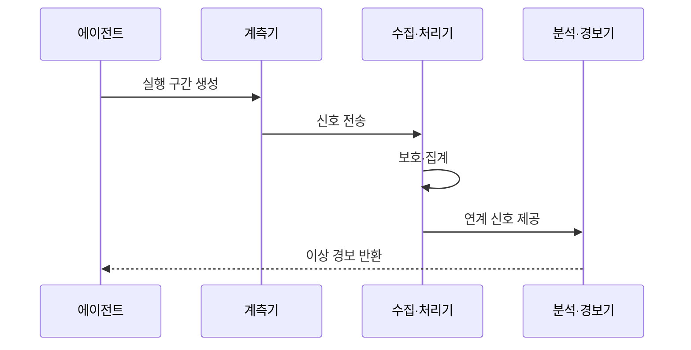

---
sidebar:
  order: 23
  label: "023. Agent Observability (에이전트 관측성)"
  badge:
    text: "미출제 · 70%"
    variant: note
title: "Agent Observability (에이전트 관측성)"
date: "2026-07-25T01:25:00+09:00"
tags:
  - "notes-latest_tech"
weight: 23
extra:
  question_no: "023"
  source_status: "미출제"
  source_history: ""
  priority: 70
  priority_note: "추적·비용·실패 관측이 운영 통제 기반"
---

## 미리 알고가기

- **에이전트 관측성(Agent Observability)**: 실행 신호로 내부 상태와 실패 원인을 추론하는 능력
- **추적(Trace)**: 사용자 목표 단위의 종단 간 실행 기록
- **구간(Span)**: 모델 호출·도구 실행 등 추적의 작업 단위
- **구조적 로그(Structured Log)**: 상관 식별자를 포함한 이벤트 기록
- **의미 규약(Semantic Convention)**: 관측 필드의 이름과 의미를 통일한 규약
- **서비스 수준 목표(Service Level Objective, SLO)**: 서비스 지표의 목표 수준

## Ⅰ. 개요

- **정의/개념**: 실행 신호로 품질·오류·비용 원인을 추론
- **배경/필요성**: 다단계 호출은 결과만으로 실패 원인 추적 곤란

### 쉽게 이해하기 (학습용)

- 여러 담당자와 도구를 거친 업무에서 어느 단계가 느리거나 틀렸는지 찾음

## Ⅱ. 특징

- 추적·지표·로그를 상관 식별자로 연결한다
- 모델·프롬프트·도구 버전으로 회귀를 찾는다
- 상세 수집은 비용·개인정보 위험을 높인다

### 쉽게 이해하기 (학습용)

- 같은 사건번호로 모델과 도구 기록을 이어 붙여 문제 지점을 찾음

## Ⅲ. 아키텍처 및 구성요소

| 설계 요소 | 설명 |
|:---|:---|
| 계측기 | 호출별 구간과 지표·로그 생성 |
| 수집·처리기 | 문맥 전파·마스킹·샘플링 수행 |
| 신호 저장소 | 추적·지표·로그를 연계 보존 |
| 분석·경보기 | 병목·오류·비용 이상 탐지 |

### 쉽게 이해하기 (학습용)

- 실행 기록을 같은 사건번호로 모아 저장하고 이상이 생기면 담당자에게 알림

## Ⅳ. 원리 및 절차 흐름도

| 절차 | 설명 |
|:---|:---|
| 실행 구간 생성 | 목표·모델·도구 호출에 식별자 부여 |
| 신호 전송 | 지연·오류·토큰·비용 신호 전달 |
| 보호·집계 | 민감정보 마스킹 후 표본·지표 집계 |
| 연계 신호 제공 | 부모·자식 구간과 버전 연결 |
| 이상 경보 반환 | 목표 임계치 초과 원인과 구간 통보 |

### 쉽게 이해하기 (학습용)

- 각 단계가 남긴 시간과 오류를 연결해 목표를 벗어난 지점을 알려 줌

## Ⅴ. 종류 및 비교

| 판단 기준 | 에이전트 관측성 | 감사 로그 |
|:---|:---|:---|
| 주요 목적 | 품질·성능·비용 원인 분석 | 책임·규정 준수 입증 |
| 데이터 운용 | 연계·집계·샘플링 | 무결성·보존 중심 |
| 핵심 산출물 | 추적·지표·경보 | 주체·행위·결과 증거 |
| 적용 기준 | 운영 개선·장애 분석 | 조사·감사·법적 증명 |

> 요약: 개선 신호와 증명 기록은 목적별로 분리

### 쉽게 이해하기 (학습용)

- 관측성은 고장을 고치는 계기판이고 감사 로그는 행동을 증명하는 장부임

## Ⅵ. 실무 사례

1. 고객지원은 검색·도구 구간과 해결률·비용 연계
2. 코드 에이전트는 모델 버전별 실패 테스트 추적

### 쉽게 이해하기 (학습용)

- 문의가 오래 걸린 원인을 검색과 도구 사용 기록에서 찾아냄
- 모델을 바꾼 뒤 어떤 테스트가 새로 실패했는지 이전 기록과 비교함

## Ⅶ. 결론

- 목표·위험도에 따라 계측 신호와 보존 수준 결정

### 쉽게 이해하기 (학습용)

- 문제 원인을 찾는 데 필요한 기록만 안전하게 연결하고 나머지는 덜 수집함
