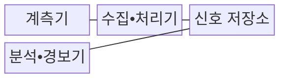
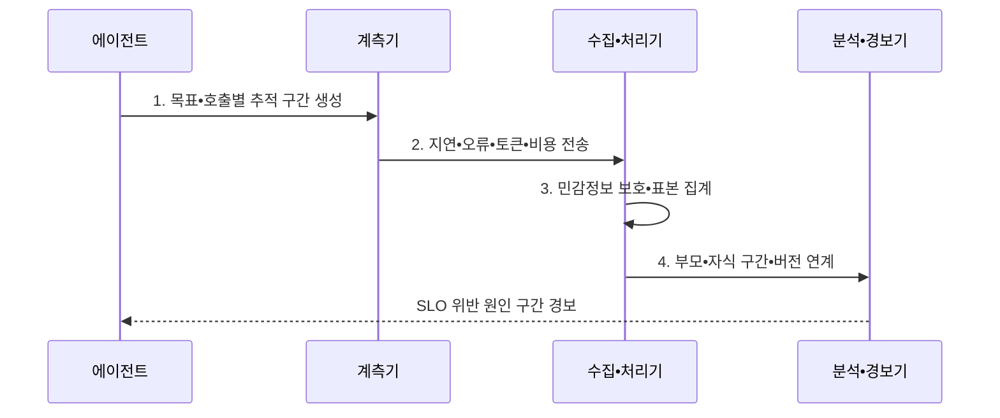

---
sidebar:
  order: 23
  label: "023. Agent Observability (에이전트 관측성)"
  badge:
    text: "미출 • 70%"
    variant: note
title: "Agent Observability (에이전트 관측성)"
date: "2026-08-04T13:20:00+09:00"
tags:
  - "notes-latest_tech"
weight: 23
extra:
  question_no: "023"
  source_status: "미출"
  source_history: ""
  priority: 70
  priority_note: "추적•비용•실패 관측이 운영 통제 기반"
---

## Ⅰ. 개요

핵심 용어

- **에이전트 관측성(Agent Observability)**: 추적•지표•로그를 연계하여 에이전트의 내부 상태와 실패 원인을 파악하는 능력이다.
- **종단 경로**: 사용자 목표의 시작부터 모델•도구 호출과 최종 결과까지 이어지는 전체 실행 흐름이다.

- 정의/개념: 계획•모델•도구•메모리 단계의 로그•추적•지표를 연계해 실행 상태와 실패 원인을 분석하는 **에이전트 관측성**
- 배경/필요성: 다단계 호출의 최종 결과만으로 **품질 저하•오류•비용 발생 구간** 추적이 곤란

#### 한줄 요약

- 하나의 목표를 처리한 모델과 도구의 기록을 연결하여 지연과 오류가 발생한 단계를 찾는다.

## Ⅱ. 특징

핵심 용어

- **추적(Trace)**: 하나의 사용자 목표를 처리한 종단 간 실행을 연결한 기록이다.
- **구간(Span)**: 모델 호출이나 도구 실행처럼 추적을 구성하는 개별 작업 단위다.
- **의미 규약(Semantic Convention)**: 서로 다른 구성요소가 생성한 관측 필드의 이름과 의미를 통일하는 규약이다.
- **서비스 수준 목표(Service Level Objective, SLO)**: 지연•오류•비용 같은 운영 지표가 달성해야 하는 목표 수준이다.

- **추적**: 사용자 목표의 종단 실행 기록 연결
- **구간**: 모델•도구의 개별 작업 단위 기록
- **의미 규약**: 관측 필드 이름과 의미 통일
- **SLO 경보**: 지연•오류•비용의 목표 위반 식별
- **버전 추적**: 품질 회귀와 변경 원인 연결
- **수집 통제**: 상세 신호의 저장 비용•개인정보 노출을 마스킹•샘플링으로 절충

#### 한줄 요약

- 같은 사건번호로 모델과 도구 기록을 이어 붙여 문제 지점을 찾음

## Ⅲ. 구조 및 구성요소

핵심 용어

- **계측기(Instrumentation)**: 각 호출의 지연•오류•토큰•비용과 추적 문맥을 관측 신호로 생성하는 기능이다.
- **수집•처리기**: 여러 단계의 관측 신호를 받아 상관 문맥을 전파하고 마스킹•샘플링•변환하는 구성요소이다.
- **신호 저장소**: 추적•지표•로그를 공통 식별자로 연결해 검색•집계할 수 있도록 보존하는 저장소이다.
- **분석•경보기**: 저장된 신호에서 품질 저하•오류•비용 이상과 원인 구간을 분석하여 알리는 구성요소이다.
- **구조적 로그(Structured Log)**: 사건의 필드를 정해진 형식과 상관 식별자로 기록하여 검색•집계를 가능하게 한 로그다.
- **샘플링(Sampling)**: 전체 실행 중 분석 가치가 높은 일부 기록을 선택해 수집 비용을 줄이는 방식이다.

| 구성요소 | 책임 |
|:---|:---|
| 계측기 | 호출별 **추적 구간•운영 지표** 와 로그 생성 |
| 수집•처리기 | 상관 문맥 전파•**마스킹•샘플링** |
| 신호 저장소 | 추적•지표•로그의 **연계 보존** |
| 분석•경보기 | 병목•오류•비용의 **이상 구간** 탐지 |

#### 한줄 요약

- 실행 기록을 같은 사건번호로 모아 저장하고 이상이 생기면 담당자에게 알림

## Ⅳ. 흐름도

핵심 용어

- **상관 문맥(Correlation Context)**: 부모•자식 구간과 분산 호출이 같은 실행에 속함을 식별하도록 함께 전달하는 정보다.
- **성능 회귀**: 모델•프롬프트•도구 변경 이후 품질•지연•비용 지표가 이전보다 나빠지는 현상이다.

1. **목표•호출별 추적 구간 생성**: 공통 추적 식별자로 **종단 경로** 구성
2. **지연•오류•토큰•비용 전송**: 모델•도구 단계의 **운영 신호** 수집
3. **민감정보 보호•표본 집계**: 마스킹•샘플링으로 **관측 비용•노출** 통제
4. **부모•자식 구간•버전 연계**: 모델•프롬프트•도구 변경과 **성능 회귀** 연결
- 판정 기준: **SLO** 위반 구간을 경보

#### 한줄 요약

- 각 단계가 남긴 시간과 오류를 연결해 목표를 벗어난 지점을 알려 줌

## Ⅴ. 종류 및 비교

핵심 용어

- **관측 로그**: 장애와 성능 원인을 분석하도록 추적•지표•이벤트를 연계하고 집계하는 운영 기록이다.
- **감사 로그**: 책임과 규정 준수를 입증하도록 주체•행위•결과를 변조하기 어렵게 보존하는 증거 기록이다.

| 기록 체계 | 에이전트 관측성 | 감사 로그 |
|:---|:---|:---|
| 적용 기준 | 운영 개선•**장애 원인 분석** | 조사•감사•**책임 입증** |
| 핵심 특징 | 추적•지표•로그의 **연계•집계** | 주체•행위•결과의 **무결성 보존** |
| 한계 | 샘플링 누락•**정보 노출•저장 비용** | **실시간 성능 분석** 부족 |

#### 한줄 요약

- 관측성은 장애와 품질 저하의 원인을 분석하고, 감사 로그는 누가 어떤 행동을 수행했는지 증명한다.

## Ⅵ. 실무 고려사항 및 대책

핵심 용어

- **적응형 샘플링**: 오류•고위험 사건은 전부 수집하고 정상 사건은 비율을 낮춰 저장 비용을 통제하는 방식이다.
- **마스킹(Masking)**: 로그의 민감한 원문을 분석에 불필요한 부분만 가려 개인정보 노출을 줄이는 처리다.
- **버전 속성**: 성능 변화를 원인 변경과 연결하도록 모델•프롬프트•도구•정책 버전을 구간에 기록한 값이다.

| 문제 | 대책 | 효과 |
|:---|:---|:---|
| 모델•도구 간 **상관 문맥 단절** | 공통 추적 식별자와 의미 규약으로 구간 연결 | 종단 실행의 **원인 경로 재구성** |
| 원문 프롬프트의 **개인정보 노출** | 민감 필드 마스킹•해시•접근통제 적용 | 분석 가능성과 **정보 보호** 균형 |
| 전량 수집의 **저장•처리 비용** | 오류•고위험은 전수, 정상은 적응형 샘플링 | 핵심 사건 보존과 **비용 통제** |
| 버전 미기록에 따른 **회귀 원인 불명** | 모델•프롬프트•도구•정책 버전을 구간 속성에 기록 | 변경별 **품질 회귀 추적** |

#### 한줄 요약

- 문의가 오래 걸린 원인을 검색과 도구 사용 기록에서 찾아냄

## Ⅶ. 결론

핵심 용어

- **위험 기반 관측**: SLO와 사건 위험도에 따라 추적 상세도•마스킹•샘플링 수준을 다르게 적용하는 방식이다.

- **SLO•위험도** 에 따라 추적•마스킹•샘플링 수준 결정

#### 한줄 요약

- 문제 원인을 찾는 데 필요한 기록만 안전하게 연결하고 나머지는 덜 수집함
