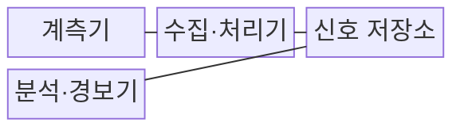
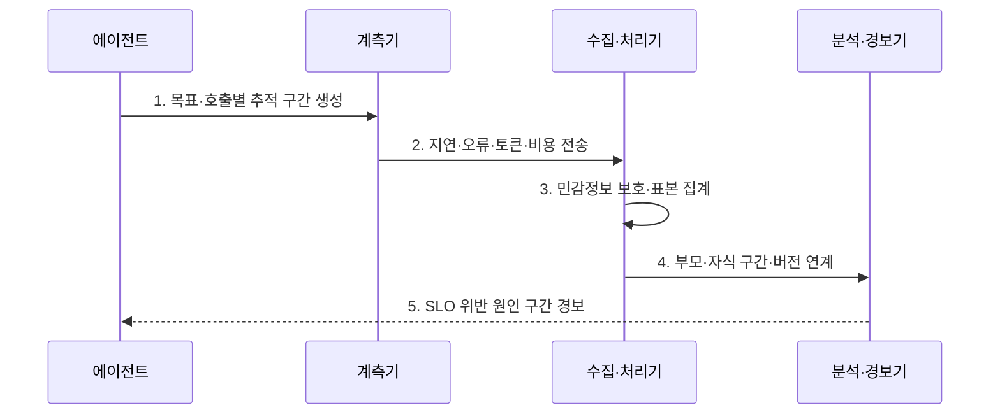

---
sidebar:
  order: 23
  label: "023. Agent Observability (에이전트 관측성)"
  badge:
    text: "미출 · 70%"
    variant: note
title: "Agent Observability (에이전트 관측성)"
date: "2026-07-30T11:04:43+09:00"
tags:
  - "notes-latest_tech"
weight: 23
extra:
  question_no: "023"
  source_status: "미출"
  source_history: ""
  priority: 70
  priority_note: "추적·비용·실패 관측이 운영 통제 기반"
---

## 미리 알고가기

- **에이전트 관측성(Agent Observability)**: 추적·지표·로그를 통해 에이전트의 내부 상태와 실패 원인을 파악하는 능력이다.
- **추적(Trace)**: 사용자 목표 단위의 종단 간 실행 기록
- **구간(Span)**: 모델 호출·도구 실행 등 추적의 작업 단위
- **구조적 로그(Structured Log)**: 상관 식별자를 포함한 이벤트 기록
- **의미 규약(Semantic Convention)**: 관측 필드의 이름과 의미를 통일한 규약
- **서비스 수준 목표(Service Level Objective, SLO)**: 서비스 지표의 목표 수준

## Ⅰ. 개요

- 정의/개념: **에이전트 관측성**은 모델·도구·상태 전이에서 발생한 추적·지표·로그를 연계하여 품질·오류·비용의 원인을 분석하는 운영 능력이다.
- 배경/필요성: 다단계 호출의 최종 결과만으로 **품질 저하·오류·비용 발생 구간** 추적이 곤란

### 쉽게 이해하기 (학습용)

- 하나의 목표를 처리한 모델과 도구의 기록을 연결하여 지연과 오류가 발생한 단계를 찾는다.

## Ⅱ. 특징

- **신호 연계**: 추적·지표·로그를 상관 식별자로 연결하여 종단 간 실행 경로를 재구성한다.
- **버전 추적**: 모델·프롬프트·도구 버전별 품질을 비교하여 성능 회귀의 원인을 찾는다.
- **수집 통제**: 상세한 실행 신호는 저장 비용과 개인정보 노출 위험을 높이므로 마스킹·샘플링이 필요하다.

### 쉽게 이해하기 (학습용)

- 같은 사건번호로 모델과 도구 기록을 이어 붙여 문제 지점을 찾음

## Ⅲ. 구조 및 구성요소

| 구성요소 | 책임 |
|:---|:---|
| 계측기 | 모델·도구 호출별 **구간·지표·로그** 생성 |
| 수집·처리기 | 상관 문맥 전파·**마스킹·샘플링** |
| 신호 저장소 | 추적·지표·로그의 **연계 보존** |
| 분석·경보기 | 병목·오류·비용의 **이상 구간** 탐지 |

### 쉽게 이해하기 (학습용)

- 실행 기록을 같은 사건번호로 모아 저장하고 이상이 생기면 담당자에게 알림

## Ⅳ. 흐름도

1. **목표·호출별 추적 구간 생성**: 공통 추적 식별자로 **종단 경로** 구성
2. **지연·오류·토큰·비용 전송**: 모델·도구 단계의 **운영 신호** 수집
3. **민감정보 보호·표본 집계**: 마스킹·샘플링으로 **관측 비용·노출** 통제
4. **부모·자식 구간·버전 연계**: 모델·프롬프트·도구 변경과 **성능 회귀** 연결
5. **SLO 위반 원인 구간 경보**: 목표 초과의 **병목·실패 지점** 통보

### 쉽게 이해하기 (학습용)

- 각 단계가 남긴 시간과 오류를 연결해 목표를 벗어난 지점을 알려 줌

## Ⅴ. 종류 및 비교

| 기록 체계 | 에이전트 관측성 | 감사 로그 |
|:---|:---|:---|
| 적용 기준 | 운영 개선·**장애 원인 분석** | 조사·감사·**책임 입증** |
| 핵심 특징 | 추적·지표·로그의 **연계·집계** | 주체·행위·결과의 **무결성 보존** |
| 한계 | 샘플링 누락·민감정보 비용 | 실시간 성능 분석 부족 |

### 쉽게 이해하기 (학습용)

- 관측성은 장애와 품질 저하의 원인을 분석하고, 감사 로그는 누가 어떤 행동을 수행했는지 증명한다.

## Ⅵ. 실무 고려사항 및 대책

| 고려사항 | 대책 | 효과 |
|:---|:---|:---|
| 모델·도구 간 **상관 문맥 단절** | 공통 추적 식별자와 의미 규약으로 구간 연결 | 종단 실행의 **원인 경로 재구성** |
| 원문 프롬프트의 **개인정보 노출** | 민감 필드 마스킹·해시·접근통제 적용 | 분석 가능성과 **정보 보호** 균형 |
| 전량 수집의 **저장·처리 비용** | 오류·고위험은 전수, 정상은 적응형 샘플링 | 핵심 사건 보존과 **비용 통제** |
| 버전 미기록에 따른 **회귀 원인 불명** | 모델·프롬프트·도구·정책 버전을 구간 속성에 기록 | 변경별 **품질 회귀 추적** |

### 쉽게 이해하기 (학습용)

- 문의가 오래 걸린 원인을 검색과 도구 사용 기록에서 찾아냄

## Ⅶ. 결론

- 에이전트의 **추적·지표·로그**를 목표 단위로 연계하고 SLO·위험도에 따라 계측·마스킹·샘플링 수준 결정

### 쉽게 이해하기 (학습용)

- 문제 원인을 찾는 데 필요한 기록만 안전하게 연결하고 나머지는 덜 수집함
