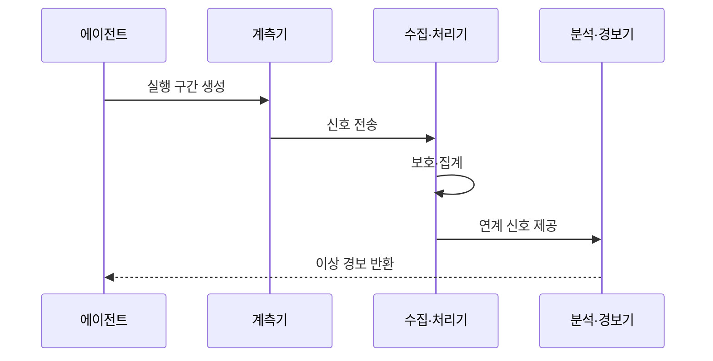

---
sidebar:
  order: 23
  label: "023. Agent Observability (에이전트 관측성)"
  badge:
    text: "미출제 · 70%"
    variant: note
title: "Agent Observability (에이전트 관측성)"
date: "2026-07-25T01:25:00+09:00"
tags:
  - "notes-latest_tech"
weight: 23
extra:
  question_no: "023"
  source_status: "미출제"
  source_history: ""
  priority: 70
  priority_note: "추적·비용·실패 관측이 운영 통제 기반"
---

## 미리 알고가기

- **에이전트 관측성(Agent Observability)**: 추적·지표·로그를 통해 에이전트의 내부 상태와 실패 원인을 파악하는 능력이다.
- **추적(Trace)**: 사용자 목표 단위의 종단 간 실행 기록
- **구간(Span)**: 모델 호출·도구 실행 등 추적의 작업 단위
- **구조적 로그(Structured Log)**: 상관 식별자를 포함한 이벤트 기록
- **의미 규약(Semantic Convention)**: 관측 필드의 이름과 의미를 통일한 규약
- **서비스 수준 목표(Service Level Objective, SLO)**: 서비스 지표의 목표 수준

## Ⅰ. 개요

- 정의/개념: **에이전트 관측성**은 모델·도구·상태 전이에서 발생한 추적·지표·로그를 연계하여 품질·오류·비용의 원인을 분석하는 운영 능력이다.
- 기존 한계: 다단계 호출로 구성된 에이전트는 최종 결과만으로 어느 단계에서 품질 저하나 오류가 발생했는지 추적하기 어렵다.

### 쉽게 이해하기 (학습용)

- 하나의 목표를 처리한 모델과 도구의 기록을 연결하여 지연과 오류가 발생한 단계를 찾는다.

## Ⅱ. 특징

- **신호 연계**: 추적·지표·로그를 상관 식별자로 연결하여 종단 간 실행 경로를 재구성한다.
- **버전 추적**: 모델·프롬프트·도구 버전별 품질을 비교하여 성능 회귀의 원인을 찾는다.
- **수집 통제**: 상세한 실행 신호는 저장 비용과 개인정보 노출 위험을 높이므로 마스킹·샘플링이 필요하다.

### 쉽게 이해하기 (학습용)

- 같은 사건번호로 모델과 도구 기록을 이어 붙여 문제 지점을 찾음

## Ⅲ. 아키텍처 및 구성요소

| 설계 요소 | 설명 |
|:---|:---|
| 계측기 | 호출별 구간과 지표·로그 생성 |
| 수집·처리기 | 문맥 전파·마스킹·샘플링 수행 |
| 신호 저장소 | 추적·지표·로그를 연계 보존 |
| 분석·경보기 | 병목·오류·비용 이상 탐지 |

### 쉽게 이해하기 (학습용)

- 실행 기록을 같은 사건번호로 모아 저장하고 이상이 생기면 담당자에게 알림

## Ⅳ. 원리 및 절차 흐름도

| 절차 | 설명 |
|:---|:---|
| 실행 구간 생성 | 목표·모델·도구 호출에 식별자 부여 |
| 신호 전송 | 지연·오류·토큰·비용 신호 전달 |
| 보호·집계 | 민감정보 마스킹 후 표본·지표 집계 |
| 연계 신호 제공 | 부모·자식 구간과 버전 연결 |
| 이상 경보 반환 | 목표 임계치 초과 원인과 구간 통보 |

### 쉽게 이해하기 (학습용)

- 각 단계가 남긴 시간과 오류를 연결해 목표를 벗어난 지점을 알려 줌

## Ⅴ. 종류 및 비교

| 판단 기준 | 에이전트 관측성 | 감사 로그 |
|:---|:---|:---|
| 주요 목적 | 품질·성능·비용 원인 분석 | 책임·규정 준수 입증 |
| 데이터 운용 | 연계·집계·샘플링 | 무결성·보존 중심 |
| 핵심 산출물 | 추적·지표·경보 | 주체·행위·결과 증거 |
| 적용 기준 | 운영 개선·장애 분석 | 조사·감사·법적 증명 |

> 요약: 운영 개선을 위한 관측 신호와 책임 증명을 위한 감사 기록은 목적에 맞게 분리하여 관리한다.

### 쉽게 이해하기 (학습용)

- 관측성은 장애와 품질 저하의 원인을 분석하고, 감사 로그는 누가 어떤 행동을 수행했는지 증명한다.

## Ⅵ. 실무 사례

1. 고객 지원 에이전트의 검색·모델·도구 호출 구간을 문의 해결률·응답 지연·처리 비용과 연계하여 병목과 실패 원인을 분석한다.

### 쉽게 이해하기 (학습용)

- 문의가 오래 걸린 원인을 검색과 도구 사용 기록에서 찾아냄

## Ⅶ. 결론

- 에이전트의 품질과 장애 원인을 신속히 파악하기 위해 운영 목표와 업무 위험도를 검토하여 계측 신호·샘플링·마스킹·보존 수준을 결정해야 한다.

### 쉽게 이해하기 (학습용)

- 문제 원인을 찾는 데 필요한 기록만 안전하게 연결하고 나머지는 덜 수집함
