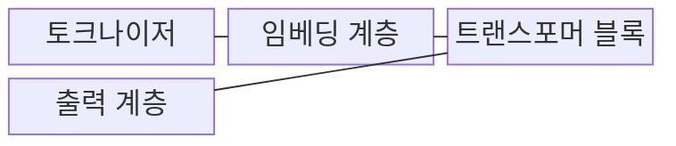
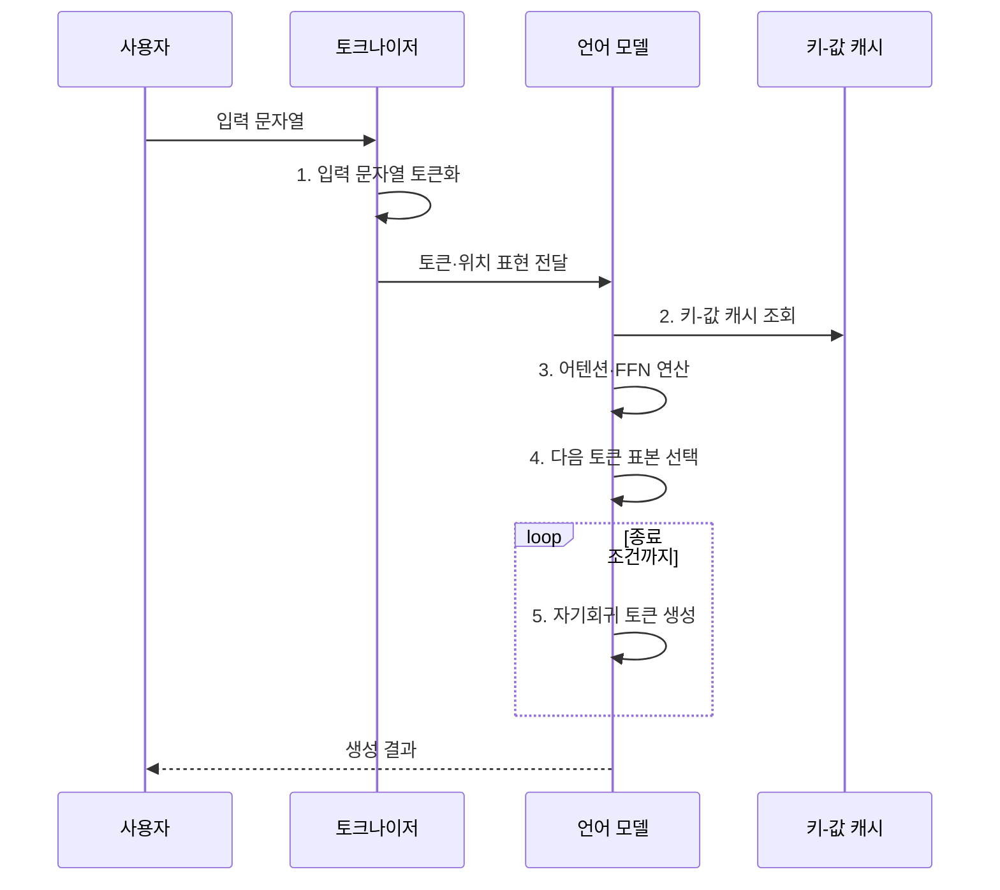

---
sidebar:
  order: 24
  label: "024. Large Language Model (거대 언어 모델, LLM)"
  badge:
    text: "기출 · 85%"
    variant: note
title: "Large Language Model (거대 언어 모델, LLM)"
date: "2026-08-02T08:54:00+09:00"
tags:
  - "notes-latest_tech"
weight: 24
extra:
  question_no: "024"
  source_status: "기출"
  source_history: "135회, 137회, 138회"
  priority: 85
  priority_note: "생성형 AI 전반을 연결하는 기반 주제"
---

## Ⅰ. 개요

핵심 용어

- **거대 언어 모델(Large Language Model, LLM)**: 대규모 말뭉치에서 토큰 간 관계를 학습하여 여러 언어 과업을 이해하고 생성하는 모델이다.
- **말뭉치(Corpus)**: 언어 패턴과 지식을 학습하도록 수집·정제한 대규모 텍스트 집합이다.

- 정의/개념: **LLM**은 대규모 말뭉치에서 토큰 관계와 언어 패턴을 사전학습하여 다양한 언어 이해·생성 과업을 수행하는 모델
- 배경/필요성: 과업별 전용 모델은 학습한 **지식·문맥 표현의 범용 재사용**이 곤란

### 쉽게 이해하기 (학습용)

- 많은 글의 이어지는 패턴을 익혀 질문·요약·번역에 공통으로 활용함

## Ⅱ. 특징

핵심 용어

- **자기지도 사전학습(Self-supervised Pre-training)**: 텍스트 자체에서 예측 목표를 만들어 별도 정답 표기 없이 언어 표현을 학습하는 방식이다.
- **문맥 학습(In-context Learning)**: 모델 매개변수를 바꾸지 않고 입력에 제공한 지시와 예시로 과업을 수행하는 능력이다.
- **확률적 생성**: 다음 토큰의 확률분포에서 출력을 선택하므로 같은 입력에도 결과가 달라질 수 있는 생성 방식이다.

- **자기지도 사전학습** 기반 비정형 언어 패턴 학습
- 문맥 지시·예시를 활용한 **과업 적응**
- **확률적 생성**에 따른 출력 변동과 근거·편향 한계

### 쉽게 이해하기 (학습용)

- 다음 말을 잘 예측해도 그 문장이 최신 사실이거나 공정하다는 보장은 없음

## Ⅲ. 구조 및 구성요소

핵심 용어

- **어텐션(Attention)**: 토큰 간 관련도에 따라 다른 토큰의 정보를 가중 결합하여 문맥 표현을 만드는 연산이다.
- **피드포워드 신경망(Feed-Forward Network, FFN)**: 어텐션을 거친 각 토큰 표현을 위치별로 비선형 변환하는 신경망이다.
- **토크나이저(Tokenizer)**: 입력 문자열을 모델 어휘에 대응하는 토큰 식별자 열로 변환하는 구성요소다.

| 구성요소 | 책임 |
|:---|:---|
| 토크나이저 | 문자열을 **토큰 식별자**로 변환 |
| 임베딩 계층 | 토큰·위치를 **연속 벡터**로 표현 |
| 트랜스포머 블록 | **어텐션·FFN**으로 문맥 표현 갱신 |
| 출력 계층 | 어휘별 **다음 토큰 확률** 산출 |

### 쉽게 이해하기 (학습용)

- 글을 작은 조각으로 바꾸고 조각 사이 관계를 계산해 다음 조각을 정함

## Ⅳ. 흐름도

핵심 용어

- **키-값 캐시(Key-Value Cache)**: 자기회귀 생성 중 이전 토큰의 어텐션 키와 값을 저장하여 중복 계산을 줄이는 저장소다.
- **자기회귀 생성(Autoregressive Generation)**: 지금까지의 입력과 생성 토큰을 조건으로 다음 토큰을 하나씩 예측하는 방식이다.

1. **입력 문자열 토큰화**: 문자열을 모델 **어휘 단위**로 분할
2. **키-값 캐시 조회**: 과거 토큰의 어텐션 상태 재사용
3. **어텐션·FFN 연산**: 관련 토큰 결합과 위치별 표현 변환
4. **다음 토큰 표본 선택**: 현재 문맥의 조건부 확률분포에서 출력 결정
5. **자기회귀 토큰 생성**: 새 키·값 상태를 추가하며 종료까지 반복

### 쉽게 이해하기 (학습용)

- 앞에서 읽은 내용을 기억하며 다음 말을 하나씩 예측해 문장을 완성함

## Ⅴ. 종류 및 비교

핵심 용어

- **디코더형 모델**: 앞선 토큰을 조건으로 다음 토큰을 생성하여 개방형 생성에 적합한 구조다.
- **인코더형 모델**: 입력의 양방향 문맥을 함께 반영하여 분류·검색 같은 이해 과업에 적합한 구조다.
- **인코더-디코더형 모델**: 입력을 인코딩한 표현을 조건으로 별도의 디코더가 출력 열을 생성하는 구조다.

| 모델 구조 | 디코더형 | 인코더형 | 인코더-디코더형 |
|:---|:---|:---|:---|
| 적용 기준 | **개방형 생성** 중심 | **입력 이해** 중심 | **입력·출력 변환** 중심 |
| 핵심 특징 | **자기회귀** 다음 토큰 생성 | **양방향 문맥** 표현 학습 | 입력 인코딩 후 **조건부 생성** |
| 한계 | 환각·**긴 생성 비용** | **직접 생성 능력** 제한 | 구조·**추론 비용 증가** |

### 쉽게 이해하기 (학습용)

- 이어 쓰기, 전체 읽기, 읽은 뒤 바꿔 쓰기 중 과업에 맞는 구조를 선택함

## Ⅵ. 실무 고려사항 및 대책

핵심 용어

- **검색 증강 생성(Retrieval-Augmented Generation, RAG)**: 외부에서 검색한 최신·권한별 근거를 모델 문맥에 넣어 답변을 생성하는 방식이다.
- **환각(Hallucination)**: 모델이 제공된 근거나 확인 가능한 사실과 일치하지 않는 내용을 그럴듯하게 생성하는 현상이다.
- **문맥 압축**: 긴 입력에서 목표에 필요한 정보만 요약·선별하여 토큰과 추론 비용을 줄이는 기법이다.

| 문제 | 대책 | 효과 |
|:---|:---|:---|
| 학습 시점 이후 지식의 **최신성 부족** | **RAG**로 최신·권한별 검색 근거 제공 | 답변의 **근거성·최신성** 보완 |
| 확률적 생성에 따른 **환각** | 인용 근거 검증·구조화 출력·고위험 인간 검토 | 사실 오류의 **업무 반영** 차단 |
| 긴 문맥·생성의 **추론 비용** | 문맥 압축·키-값 캐시·소형 모델 라우팅 | 지연·토큰·**컴퓨팅 비용** 절감 |
| 민감 데이터의 **모델 유출** | 입력 최소화·접근통제·보존 제한·출력 검사 | 비밀정보의 **무단 노출** 방지 |

### 쉽게 이해하기 (학습용)

- 사내 문서를 찾은 뒤 접근 권한이 있는 근거만 넣어 답하게 함

## Ⅶ. 결론

핵심 용어

- **검증형 적용**: 오류 피해가 큰 업무에서 근거 확인·구조화 출력·사람 검토를 결합하여 LLM 결과를 사용하는 방식이다.
- **소형 LLM 라우팅**: 과업 난도와 비용 기준에 따라 일부 요청을 더 작은 모델로 보내 지연과 컴퓨팅 비용을 줄이는 방식이다.

- 최신 지식은 **RAG**, 고위험은 **검증형**, 비용 제약은 소형 LLM 선택

### 쉽게 이해하기 (학습용)

- 자주 바뀌는 지식은 검색으로 보충하고 피해가 큰 업무는 검증을 강화함
