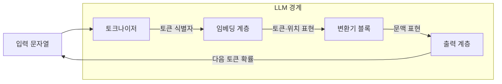
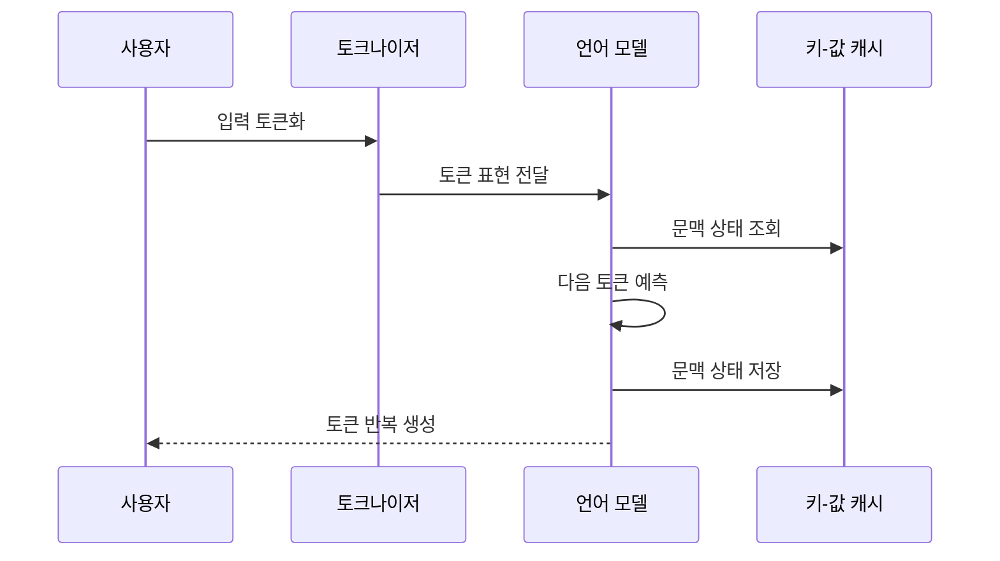

---
sidebar:
  order: 24
  label: "024. Large Language Model (거대 언어 모델, LLM)"
  badge:
    text: "기출 · 85%"
    variant: note
title: "Large Language Model (거대 언어 모델, LLM)"
date: "2026-07-27T23:59:59+09:00"
tags:
  - "notes-latest_tech"
weight: 24
extra:
  question_no: "024"
  source_status: "기출"
  source_history: "135회, 137회, 138회"
  priority: 85
  priority_note: "생성형 AI 전반을 연결하는 기반 주제"
---

## 미리 알고가기

- **거대 언어 모델(Large Language Model, LLM)**: 영문 머리글자를 딴 표기로 “엘엘엠”으로 읽으며, 대규모 말뭉치에서 토큰 관계를 학습한 언어 모델
- **인공지능(Artificial Intelligence, AI)**: 지능 과업을 컴퓨터로 수행하는 기술
- **어텐션(Attention)**: 토큰 간 관련도에 따라 문맥 정보를 결합하는 연산
- **피드포워드 신경망(Feed-Forward Network, FFN)**: 토큰 표현을 위치별로 변환하는 신경망
- **검색 증강 생성(Retrieval-Augmented Generation, RAG)**: 검색 근거를 문맥에 넣어 생성하는 방식
- **키-값 캐시(Key-Value Cache)**: 이전 토큰의 어텐션 계산값을 재사용하는 저장소
- **환각(Hallucination)**: 근거와 일치하지 않는 내용을 생성하는 현상

## Ⅰ. 개요

- 정의/개념: 토큰 조건부 확률로 언어 과업을 수행하는 모델
- **배경/필요성**: 과업별 전용 모델만으로 다양한 언어 과업의 지식·문맥 재사용 곤란

### 쉽게 이해하기 (학습용)

- 많은 글의 이어지는 패턴을 익혀 질문·요약·번역에 공통으로 활용함

## Ⅱ. 특징

- **자기지도 사전학습** 기반 비정형 언어 패턴 학습
- 문맥 지시·예시를 활용한 **과업 적응**
- **확률적 생성**에 따른 출력 변동과 근거·편향 한계

### 쉽게 이해하기 (학습용)

- 다음 말을 잘 예측해도 그 문장이 최신 사실이거나 공정하다는 보장은 없음

## Ⅲ. 아키텍처 및 구성요소

| 설계 요소 | 설명 |
|:---|:---|
| 토크나이저 | 문자열을 토큰 식별자로 변환 |
| 임베딩 계층 | 토큰·위치를 연속 벡터로 표현 |
| 변환기 블록 | 어텐션·FFN으로 문맥 표현 갱신 |
| 출력 계층 | 어휘별 다음 토큰 확률 산출 |

### 쉽게 이해하기 (학습용)

- 글을 작은 조각으로 바꾸고 조각 사이 관계를 계산해 다음 조각을 정함

## Ⅳ. 원리 및 절차 흐름도

| 절차 | 설명 |
|:---|:---|
| 입력 토큰화 | 문자열을 모델 어휘 단위로 분할 |
| 토큰 표현 전달 | 식별자를 의미·위치 벡터로 변환 |
| 문맥 상태 조회 | 이전 토큰의 어텐션 상태 재사용 |
| 다음 토큰 예측 | 문맥에 따른 어휘 확률 계산 |
| 문맥 상태 저장 | 생성 토큰의 키·값 상태 추가 |
| 토큰 반복 생성 | 종료 조건까지 선택 토큰을 연결 |

### 쉽게 이해하기 (학습용)

- 앞에서 읽은 내용을 기억하며 다음 말을 하나씩 예측해 문장을 완성함

## Ⅴ. 언어 모델 구조 비교

| 구분 | 디코더형 | 인코더형 | 인코더-디코더형 |
|:---|:---|:---|:---|
| 문맥 처리 | 이전 토큰 기반 생성 | 양방향 입력 표현 | 입력 표현 후 출력 생성 |
| 주요 과업 | 대화·코드·문서 생성 | 분류·검색·표현 학습 | 번역·요약·변환 |
| 적용 기준 | 개방형 생성 중심 | 입력 이해 중심 | 입력·출력 변환 중심 |
| 핵심 특징 | 다음 토큰 자기회귀 생성 | 양방향 문맥 표현 학습 | 입력 인코딩 후 출력 생성 |
| 한계 | 환각·긴 생성 비용 | 직접 생성 능력 제한 | 구조·추론 비용 증가 |

### 쉽게 이해하기 (학습용)

- 이어 쓰기, 전체 읽기, 읽은 뒤 바꿔 쓰기 중 과업에 맞는 구조를 선택함

## Ⅵ. 실무 사례

1. 사내 질의응답은 RAG로 권한별 근거 문서 제공
2. 코드 보조는 격리 실행과 테스트로 생성 코드 검증

### 쉽게 이해하기 (학습용)

- 사내 문서를 찾은 뒤 접근 권한이 있는 근거만 넣어 답하게 함
- 만든 코드는 바로 믿지 않고 격리된 환경에서 시험한 뒤 사용함

## Ⅶ. 결론

- 과업·근거 갱신성·위험도로 적응 방식을 선택

### 쉽게 이해하기 (학습용)

- 자주 바뀌는 지식은 검색으로 보충하고 피해가 큰 업무는 검증을 강화함
