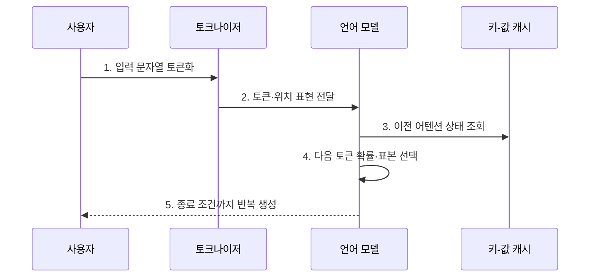

---
sidebar:
  order: 24
  label: "024. Large Language Model (거대 언어 모델, LLM)"
  badge:
    text: "기출 · 85%"
    variant: note
title: "Large Language Model (거대 언어 모델, LLM)"
date: "2026-07-30T11:04:43+09:00"
tags:
  - "notes-latest_tech"
weight: 24
extra:
  question_no: "024"
  source_status: "기출"
  source_history: "135회, 137회, 138회"
  priority: 85
  priority_note: "생성형 AI 전반을 연결하는 기반 주제"
---

## 미리 알고가기

- **거대 언어 모델(Large Language Model, LLM)**: 대규모 말뭉치에서 토큰 간 관계를 학습하여 언어를 이해하고 생성하는 모델이다.
- **인공지능(Artificial Intelligence, AI)**: 지능 과업을 컴퓨터로 수행하는 기술
- **어텐션(Attention)**: 토큰 간 관련도에 따라 문맥 정보를 결합하는 연산
- **피드포워드 신경망(Feed-Forward Network, FFN)**: 토큰 표현을 위치별로 변환하는 신경망
- **검색 증강 생성(Retrieval-Augmented Generation, RAG)**: 검색 근거를 문맥에 넣어 생성하는 방식
- **키-값 캐시(Key-Value Cache)**: 이전 토큰의 어텐션 계산값을 재사용하는 저장소
- **환각(Hallucination)**: 근거와 일치하지 않는 내용을 생성하는 현상

## Ⅰ. 개요

- 정의/개념: **거대 언어 모델**은 대규모 말뭉치에서 학습한 토큰의 조건부 확률을 바탕으로 질의응답·요약·번역·생성 등 다양한 언어 과업을 수행하는 모델이다.
- 배경/필요성: 과업별 전용 모델은 학습한 **지식·문맥 표현의 범용 재사용**이 곤란

### 쉽게 이해하기 (학습용)

- 많은 글의 이어지는 패턴을 익혀 질문·요약·번역에 공통으로 활용함

## Ⅱ. 특징

- **자기지도 사전학습** 기반 비정형 언어 패턴 학습
- 문맥 지시·예시를 활용한 **과업 적응**
- **확률적 생성**에 따른 출력 변동과 근거·편향 한계

### 쉽게 이해하기 (학습용)

- 다음 말을 잘 예측해도 그 문장이 최신 사실이거나 공정하다는 보장은 없음

## Ⅲ. 구조 및 구성요소

| 구성요소 | 책임 |
|:---|:---|
| 토크나이저 | 문자열을 **토큰 식별자**로 변환 |
| 임베딩 계층 | 토큰·위치를 **연속 벡터**로 표현 |
| 트랜스포머 블록 | 어텐션·FFN으로 **문맥 표현** 갱신 |
| 출력 계층 | 어휘별 **다음 토큰 확률** 산출 |

### 쉽게 이해하기 (학습용)

- 글을 작은 조각으로 바꾸고 조각 사이 관계를 계산해 다음 조각을 정함

## Ⅳ. 흐름도

1. **입력 문자열 토큰화**: 문자열을 모델 **어휘 단위**로 분할
2. **토큰·위치 표현 전달**: 식별자를 의미·순서가 있는 **임베딩 벡터**로 변환
3. **이전 어텐션 상태 조회**: 키-값 캐시로 과거 토큰의 **문맥 연산** 재사용
4. **다음 토큰 확률·표본 선택**: 현재 문맥의 **조건부 확률분포**에서 출력 결정
5. **종료 조건까지 반복 생성**: 새 키·값 상태를 추가하며 **자기회귀 생성**

### 쉽게 이해하기 (학습용)

- 앞에서 읽은 내용을 기억하며 다음 말을 하나씩 예측해 문장을 완성함

## Ⅴ. 종류 및 비교

| 모델 구조 | 디코더형 | 인코더형 | 인코더-디코더형 |
|:---|:---|:---|:---|
| 적용 기준 | 개방형 생성 중심 | 입력 이해 중심 | 입력·출력 변환 중심 |
| 핵심 특징 | **자기회귀** 다음 토큰 생성 | **양방향 문맥** 표현 학습 | 입력 인코딩 후 **조건부 생성** |
| 한계 | 환각·긴 생성 비용 | 직접 생성 능력 제한 | 구조·추론 비용 증가 |

### 쉽게 이해하기 (학습용)

- 이어 쓰기, 전체 읽기, 읽은 뒤 바꿔 쓰기 중 과업에 맞는 구조를 선택함

## Ⅵ. 실무 고려사항 및 대책

| 고려사항 | 대책 | 효과 |
|:---|:---|:---|
| 학습 시점 이후 지식의 **최신성 부족** | 검색 증강 생성으로 최신·권한별 근거 제공 | 답변의 **근거성·최신성** 보완 |
| 확률적 생성에 따른 **환각** | 인용 근거 검증·구조화 출력·고위험 인간 검토 | 사실 오류의 **업무 반영** 차단 |
| 긴 문맥·생성의 **추론 비용** | 문맥 압축·키-값 캐시·소형 모델 라우팅 | 지연·토큰·**컴퓨팅 비용** 절감 |
| 민감 데이터의 **모델 유출** | 입력 최소화·접근통제·보존 제한·출력 검사 | 비밀정보의 **무단 노출** 방지 |

### 쉽게 이해하기 (학습용)

- 사내 문서를 찾은 뒤 접근 권한이 있는 근거만 넣어 답하게 함

## Ⅶ. 결론

- 범용 언어 과업에는 **LLM**을 적용하되 지식 최신성·근거 요구·오류 피해·추론 비용에 따라 검색·검증·모델 규모 결정

### 쉽게 이해하기 (학습용)

- 자주 바뀌는 지식은 검색으로 보충하고 피해가 큰 업무는 검증을 강화함
