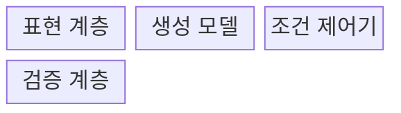
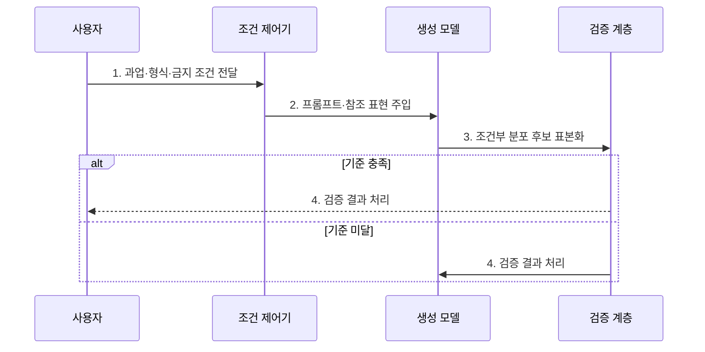

---
sidebar:
  order: 25
  label: "025. Generative AI (생성형 AI)"
  badge:
    text: "기출 · 85%"
    variant: note
title: "Generative AI (생성형 AI)"
date: "2026-07-30T11:04:43+09:00"
tags:
  - "notes-latest_tech"
weight: 25
extra:
  question_no: "025"
  source_status: "기출"
  source_history: "135회, 137회, 138회"
  priority: 85
  priority_note: "산업 적용·위험을 함께 묻는 대표 주제"
---

## 미리 알고가기

- **생성형 인공지능(Generative AI)**: 학습 분포에서 새 콘텐츠를 만드는 인공지능
- **자기회귀(Autoregressive)**: 앞선 출력을 조건으로 다음 값을 순차 생성하는 방식
- **확산 모델(Diffusion Model)**: 잡음에서 반복 복원해 표본을 생성하는 모델
- **생성적 적대 신경망(Generative Adversarial Network, GAN)**: 생성자와 판별자를 경쟁시켜 학습하는 모델
- **변분 오토인코더(Variational Autoencoder, VAE)**: 잠재 확률분포를 학습해 표본을 복원하는 모델
- **멀티모달(Multimodal)**: 텍스트·이미지·음성 등 여러 양식을 함께 처리하는 방식
- **합성 데이터(Synthetic Data)**: 생성 모델로 만든 학습·시험용 데이터

## Ⅰ. 개요

- 정의/개념: **생성형 AI**는 학습한 데이터 분포와 입력 조건을 바탕으로 텍스트·이미지·음성·코드 등 새로운 콘텐츠를 생성하는 인공지능이다.
- 배경/필요성: 판별형 모델은 범주·수치 예측에 집중해 **학습 분포 기반 신규 콘텐츠 생성**이 곤란

### 쉽게 이해하기 (학습용)

- 배운 자료의 특징을 조합해 조건에 맞는 새 글·그림·소리를 만듦

## Ⅱ. 특징

- **확률적 샘플링**에 따른 결과 다양성
- 데이터 양식별 **생성 구조·학습 목적** 차이
- 생성 품질과 **사실성·권리 적합성**의 분리

### 쉽게 이해하기 (학습용)

- 새 결과를 다양하게 만들 수 있지만 사실과 사용 권리까지 자동으로 보장하지 않음

## Ⅲ. 구조 및 구성요소

| 구성요소 | 책임 |
|:---|:---|
| 표현 계층 | 콘텐츠를 토큰·**잠재 벡터**로 변환 |
| 생성 모델 | 학습한 조건부 분포에서 **후보 표본화** |
| 조건 제어기 | 프롬프트·참조·금지 조건으로 **생성 방향** 제약 |
| 검증 계층 | 품질·사실·안전·**권리 기준** 판정 |

### 쉽게 이해하기 (학습용)

- 자료를 압축해 배운 생성기가 요청 조건에 맞춘 후보를 만들고 검사기가 걸러냄

## Ⅳ. 흐름도

### 동작 원리

1. **과업·형식·금지 조건 전달**: 생성 목적과 **출력 제약** 명시
2. **프롬프트·참조 표현 주입**: 사용자 조건을 모델의 **생성 문맥**에 결합
3. **조건부 분포 후보 표본화**: 학습 분포에서 확률적 **신규 콘텐츠** 생성
4. **검증 결과 처리**: 사실·안전·권리 기준에 따라 **반출 또는 재생성** 결정

### 쉽게 이해하기 (학습용)

- 요청에 맞춘 후보를 만들고 기준을 통과하지 못하면 조건을 고쳐 다시 만듦

## Ⅴ. 종류 및 비교

| AI 유형 | 생성형 AI | 판별형 AI |
|:---|:---|:---|
| 적용 기준 | 콘텐츠 생성·변형·합성 | 판정·탐지·수치 예측 |
| 핵심 특징 | 데이터 분포 기반 **신규 표본 생성** | 클래스 경계 기반 **범주·수치 판정** |
| 한계 | 환각·권리·안전 위험 | 학습 범주 밖 생성 불가 |

### 쉽게 이해하기 (학습용)

- 생성형은 새 고양이 그림을 만들고 판별형은 그림이 고양이인지 판정함

## Ⅵ. 실무 고려사항 및 대책

| 고려사항 | 대책 | 효과 |
|:---|:---|:---|
| 생성 결과의 **사실성 부족** | 근거 검색·사실 검증·고위험 인간 검토 | 환각의 **업무 반영** 차단 |
| 학습·참조 자료의 **권리 침해** | 데이터 출처·이용 조건과 생성물 유사성 검사 | 저작권·계약의 **준수 가능성** 확보 |
| 유해·편향 콘텐츠의 **대외 노출** | 안전 분류·금지 조건·승인 워크플로 적용 | 브랜드·사용자 **피해 예방** |
| 합성 데이터의 **분포 왜곡** | 실제 데이터와 분포·희귀 사례·다운스트림 성능 비교 | 학습 데이터의 **대표성 검증** |

### 쉽게 이해하기 (학습용)

- 광고 초안은 제품 정보와 금지 문구를 검사한 뒤 사람이 게시함

## Ⅶ. 결론

- 콘텐츠 생성·변형·합성에는 **생성형 AI**를 적용하되 사실성·데이터 권리·안전·분포 대표성 검증 후 결과 반출

### 쉽게 이해하기 (학습용)

- 만들 대상과 결과 검증 방법, 자료 사용 권리를 함께 보고 생성 방식을 정함
