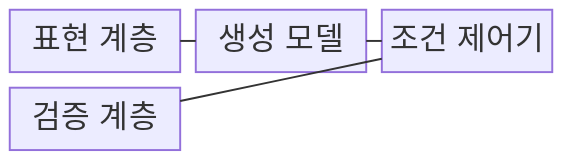
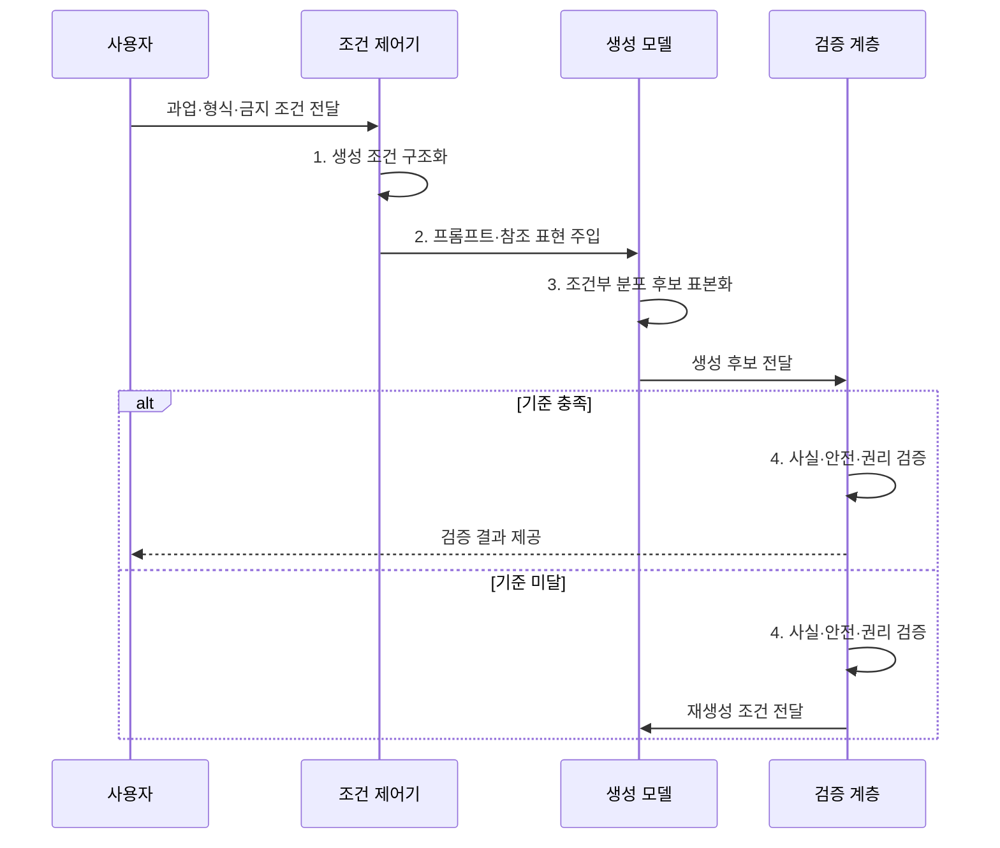

---
sidebar:
  order: 25
  label: "025. Generative AI (생성형 AI)"
  badge:
    text: "기출 · 85%"
    variant: note
title: "Generative AI (생성형 AI)"
date: "2026-08-02T08:54:00+09:00"
tags:
  - "notes-latest_tech"
weight: 25
extra:
  question_no: "025"
  source_status: "기출"
  source_history: "135회, 137회, 138회"
  priority: 85
  priority_note: "산업 적용·위험을 함께 묻는 대표 주제"
---

## Ⅰ. 개요

핵심 용어

- **생성형 인공지능(Generative Artificial Intelligence, Generative AI)**: 학습 데이터의 분포를 바탕으로 조건에 맞는 새로운 글·그림·음성·코드 등을 만드는 인공지능이다.
- **학습 분포**: 학습 데이터에서 모델이 익힌 특징과 값의 확률적 구조다.

- 정의/개념: 학습 데이터의 분포와 구조를 모델링해 새로운 콘텐츠를 만드는 **생성형 인공지능(Generative Artificial Intelligence, Generative AI)**
- 배경/필요성: 판별형 모델은 범주·수치 예측에 집중해 **학습 분포 기반 신규 콘텐츠 생성** 이 곤란

#### 한줄 요약

- 배운 자료의 특징을 조합해 조건에 맞는 새 글·그림·소리를 만듦

## Ⅱ. 특징

핵심 용어

- **자기회귀(Autoregressive)**: 앞서 생성한 값을 조건으로 다음 값을 순차적으로 예측하는 생성 방식이다.
- **확산 모델(Diffusion Model)**: 잡음이 섞이는 과정을 학습한 뒤 잡음에서 데이터를 반복 복원하여 표본을 생성하는 모델이다.
- **멀티모달(Multimodal)**: 텍스트·이미지·음성처럼 서로 다른 데이터 양식을 함께 이해하고 생성하는 방식이다.
- **생성적 적대 신경망(Generative Adversarial Network, GAN)**: 생성자와 판별자가 경쟁하며 실제와 유사한 표본을 생성하도록 학습하는 모델이다.
- **변분 오토인코더(Variational Autoencoder, VAE)**: 입력을 잠재 확률분포로 인코딩하고 그 분포에서 표본을 복원하는 모델이다.

- **확률적 샘플링·자기회귀·확산 모델·생성적 적대 신경망(Generative Adversarial Network, GAN)·변분 오토인코더(Variational Autoencoder, VAE)**별 방식으로 다양한 표본 생성
- **멀티모달·학습 목적**: 텍스트·이미지·음성의 데이터 양식별 구조와 교차 조건 처리
- 생성 품질과 **사실성·권리 적합성** 의 분리

#### 한줄 요약

- 새 결과를 다양하게 만들 수 있지만 사실과 사용 권리까지 자동으로 보장하지 않음

## Ⅲ. 구조 및 구성요소

핵심 용어

- **잠재 벡터(Latent Vector)**: 원본 콘텐츠의 핵심 특징을 낮은 차원의 연속 공간에 압축해 표현한 벡터다.
- **생성 모델(Generative Model)**: 학습 데이터의 조건부 분포에서 새 텍스트·이미지·음성·코드 후보를 표본화하는 핵심 모델이다.
- **조건 제어기**: 프롬프트·참조 자료·금지 조건을 생성 모델이 사용할 표현으로 구성하여 결과 방향을 제한한다.
- **검증 계층**: 생성 후보가 품질·사실·안전·권리 기준을 충족하는지 판정한다.

| 구성요소 | 책임 |
|:---|:---|
| 표현 계층 | 콘텐츠를 토큰·**잠재 벡터** 로 변환 |
| 생성 모델 | 학습한 조건부 분포에서 **후보 표본화** |
| 조건 제어기 | 프롬프트·참조·금지 조건으로 **생성 방향** 제약 |
| 검증 계층 | 품질·사실·안전·**권리 기준** 판정 |

#### 한줄 요약

- 자료를 압축해 배운 생성기가 요청 조건에 맞춘 후보를 만들고 검사기가 걸러냄

## Ⅳ. 흐름도

핵심 용어

- **조건부 분포**: 프롬프트나 참조 같은 조건이 주어졌을 때 가능한 출력과 각 출력의 확률을 나타낸 분포다.
- **표본화(Sampling)**: 학습한 확률분포에서 하나의 생성 후보를 선택하는 과정이다.

1. **생성 조건 구조화**: 생성 목적·형식·금지 조건과 출력 제약 구성
2. **프롬프트·참조 표현 주입**: 사용자 조건을 모델의 **생성 문맥** 에 결합
3. **조건부 분포 후보 표본화**: 학습 분포에서 확률적 **신규 콘텐츠** 생성
4. **사실·안전·권리 검증**: 기준 충족 시 반출하고 미달 시 재생성

#### 한줄 요약

- 요청에 맞춘 후보를 만들고 기준을 통과하지 못하면 조건을 고쳐 다시 만듦

## Ⅴ. 종류 및 비교

핵심 용어

- **생성형 인공지능(Generative Artificial Intelligence, Generative AI)**: 데이터 분포를 학습하여 기존에 없던 콘텐츠나 변형 표본을 만든다.
- **판별형 인공지능(Discriminative Artificial Intelligence, Discriminative AI)**: 입력의 특징을 바탕으로 범주·점수·수치 같은 정해진 결과를 판정한다.
- **생성적 적대 신경망(Generative Adversarial Network, GAN)**: 생성자와 판별자가 경쟁하며 실제와 유사한 표본을 만들도록 학습하는 모델이다.
- **변분 오토인코더(Variational Autoencoder, VAE)**: 입력을 잠재 확률분포로 인코딩하고 그 분포에서 표본을 복원하도록 학습하는 모델이다.

- **생성형 인공지능(Generative Artificial Intelligence, Generative AI)** 및 **판별형 인공지능(Discriminative Artificial Intelligence, Discriminative AI)** 사이를 신규 표본 생성과 범주·수치 판정 기준으로 구분한다.

| AI 유형 | 생성형 AI | 판별형 AI |
|:---|:---|:---|
| 적용 기준 | 콘텐츠 **생성·변형** 과 합성 | **판정·탐지** 와 수치 예측 |
| 핵심 특징 | 데이터 분포 기반 **신규 표본 생성** | 클래스 경계 기반 **범주·수치 판정** |
| 한계 | 환각·**권리·안전 위험** | **학습 범주 밖 생성** 불가 |

#### 한줄 요약

- 생성형은 새 고양이 그림을 만들고 판별형은 그림이 고양이인지 판정함

## Ⅵ. 실무 고려사항 및 대책

핵심 용어

- **합성 데이터(Synthetic Data)**: 생성 모델로 만들어 학습·시험·희귀 사례 보완에 사용하는 인공 데이터다.
- **분포 왜곡**: 합성 데이터가 실제 데이터의 빈도·다양성·희귀 사례를 다르게 반영하여 모델 성능을 편향시키는 현상이다.
- **생성물 유사성 검사**: 결과가 학습·참조 자료와 지나치게 유사하여 권리를 침해할 가능성이 있는지 비교하는 절차다.

| 문제 | 대책 | 효과 |
|:---|:---|:---|
| 생성 결과의 **사실성 부족** | 근거 검색·사실 검증·고위험 인간 검토 | 환각의 **업무 반영** 차단 |
| 학습·참조 자료의 **권리 침해** | 데이터 출처·이용 조건과 생성물 유사성 검사 | 저작권·계약의 **준수 가능성** 확보 |
| 유해·편향 콘텐츠의 **대외 노출** | 안전 분류·금지 조건·승인 워크플로 적용 | 브랜드·사용자 **피해 예방** |
| 합성 데이터의 **분포 왜곡** | 실제 데이터와 분포·희귀 사례·다운스트림 성능 비교 | 학습 데이터의 **대표성 검증** |

#### 한줄 요약

- 광고 초안은 제품 정보와 금지 문구를 검사한 뒤 사람이 게시함

## Ⅶ. 결론

핵심 용어

- **자기회귀 선택 기준**: 토큰처럼 순서가 있는 텍스트와 코드를 앞선 문맥에 이어 생성할 때 적용한다.
- **확산 모델 선택 기준**: 반복 복원을 통해 높은 품질과 다양성이 필요한 이미지·음성 표본을 만들 때 적용한다.

- 텍스트·코드는 **자기회귀**, 고품질 이미지·음성은 **확산 모델** 선택 후 검증

#### 한줄 요약

- 만들 대상과 결과 검증 방법, 자료 사용 권리를 함께 보고 생성 방식을 정함
