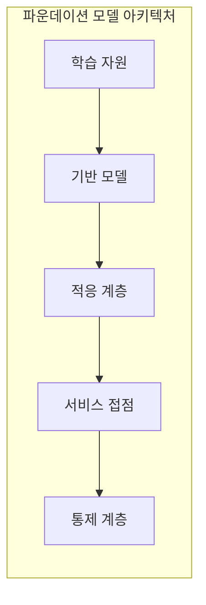
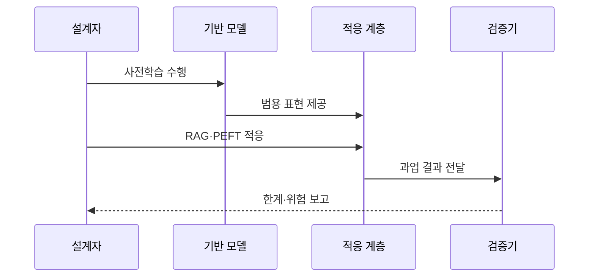

---
sidebar:
  order: 26
  label: "026. Foundation Model (파운데이션 모델)"
  badge:
    text: "기출 · 70%"
    variant: note
title: "Foundation Model (파운데이션 모델)"
date: "2026-07-25T01:25:00+09:00"
tags:
  - "cspe-latest_tech"
weight: 26
extra:
  question_no: "026"
  exam_status: "기출"
  exam_history: "135회"
  exam_probability: 70
  exam_note: "범용 사전학습과 전이 구조가 핵심"
---

## 미리 알고가기

- **파운데이션 모델(Foundation Model)**: 광범위한 데이터로 사전학습한 뒤 여러 하위 과업에 적응하여 재사용하는 범용 모델이다.
- **거대 언어 모델(Large Language Model, LLM)**: 토큰 분포로 언어 과업 수행
- **검색 증강 생성(Retrieval-Augmented Generation, RAG)**: 검색 근거를 문맥에 결합
- **매개변수 효율 미세조정(Parameter-Efficient Fine-Tuning, PEFT)**: 일부 매개변수만 학습
- **저순위 적응(Low-Rank Adaptation, LoRA)**: 저순위 행렬로 가중치 학습
- **응용 프로그래밍 인터페이스(Application Programming Interface, API)**: 모델 기능을 서비스에 제공
- **전이학습(Transfer Learning)**: 학습 표현을 타 과업 재사용
- **시스템 위험(Systemic Risk)**: 공통 결함이 하위로 전파

## Ⅰ. 개요

- 정의/개념: **파운데이션 모델**은 대규모 범용 데이터로 사전학습한 표현과 능력을 다양한 하위 과업에 적응하여 재사용하는 모델이다.
- 기존 한계: 과업마다 전용 모델을 처음부터 학습하면 데이터·연산 비용이 반복되고 학습한 표현을 다른 업무에 재사용하기 어렵다.

### 쉽게 이해하기 (학습용)
- 하나의 범용 사전학습 모델을 RAG·PEFT 등으로 조정하여 여러 업무에 활용한다.

## Ⅱ. 특징

- 범용 데이터 사전학습이 일반 표현을 학습한다
- 공통 모델 결함은 모든 하위 과업에 전파된다

### 쉽게 이해하기 (학습용)
- 공통 기반 모델의 편향이나 취약점은 이를 사용하는 여러 하위 서비스에 함께 전파될 수 있다.

## Ⅲ. 아키텍처 및 구성요소

| 설계 요소 | 설명 |
|:---|:---|
| 학습 자원 | 광범위 데이터와 사전학습 목표 |
| 기반 모델 | 범용 표현 생성과 대규모 사전학습 |
| 적응 계층 | RAG·PEFT 기반 하위 과업 적응 |
| 서비스 접점 | API·런타임 통한 응용 서비스 연동 |
| 통제 계층 | 모델 카드 작성과 전파 위험 통제 |

### 쉽게 이해하기 (학습용)
- 검색과 추가 학습으로 여러 서비스에 맞춤

## Ⅳ. 원리 및 절차 흐름도

| 절차 | 설명 |
|:---|:---|
| 사전학습 수행 | 대규모 범용 데이터 기반 사전학습 |
| 범용 표현 제공 | 하위 과업 적응용 공유 표현 전달 |
| RAG·PEFT 적응 | 문맥 주입 및 가중치 미세조정 |
| 과업 결과 전달 | 도메인별 특화 과업 결과 전송 |
| 한계·위험 보고 | 품질 평가와 전파 위험 수준 진단 |

### 쉽게 이해하기 (학습용)
- 실제 환경과 사용자를 반영한 추가 검증 필요

## Ⅴ. 종류 및 비교

| 판단 기준 | 파운데이션 | 과업 전용 |
|:---|:---|:---|
| 학습 범위 | 인터넷 규모의 광범위 범용 데이터 | 특정 과업에 제한된 소규모 데이터 |
| 적응 방식 | RAG·PEFT 등 경량 적응 계층 활용 | 처음부터 아키텍처 설계 및 사전학습 |
| 적용 기준 | 다수 범용 과업의 빠른 배포 필요 시 | 단일 특정 과업의 극대화된 최적화 필요 시 |

> 요약: 범용 표현 재사용을 통한 다수 과업의 신속한 전이

### 쉽게 이해하기 (학습용)
- 전용은 단일 업무에 적합하고 기반 모델은 다수 업무의 출발점임

## Ⅵ. 실무 사례

1. 금융 기관이 공통 파운데이션 모델을 상담·문서 요약·검색 서비스에 적용하고, 모델 업데이트 시 모든 하위 서비스의 정확성·편향·보안을 회귀 검증한다.

### 쉽게 이해하기 (학습용)
- 공통 모델을 변경하면 영향을 받는 모든 하위 서비스의 품질과 안전성을 다시 검증한다.

## Ⅶ. 결론

- 여러 과업에서 사전학습 능력을 재사용하기 위해 도메인 적합성과 공통 결함의 전파·회귀 위험을 검토하여 **파운데이션 모델**을 활용해야 한다.

### 쉽게 이해하기 (학습용)
- 공통 모델의 변경이 하위 서비스에 미치는 영향을 지속적으로 평가하고 통제해야 한다.
