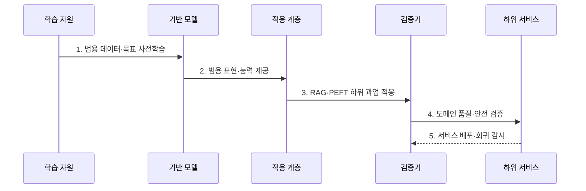

---
sidebar:
  order: 26
  label: "026. Foundation Model (파운데이션 모델)"
  badge:
    text: "기출 · 70%"
    variant: note
title: "Foundation Model (파운데이션 모델)"
date: "2026-07-30T11:04:43+09:00"
tags:
  - "notes-latest_tech"
weight: 26
extra:
  question_no: "026"
  source_status: "기출"
  source_history: "135회"
  priority: 70
  priority_note: "범용 사전학습과 전이 구조가 핵심"
---

## 미리 알고가기

- **파운데이션 모델(Foundation Model)**: 광범위한 데이터로 사전학습한 뒤 여러 하위 과업에 적응하여 재사용하는 범용 모델
- **거대 언어 모델(Large Language Model, LLM)**: 토큰 분포로 언어 과업 수행
- **검색 증강 생성(Retrieval-Augmented Generation, RAG)**: 검색 근거를 문맥에 결합
- **매개변수 효율 미세조정(Parameter-Efficient Fine-Tuning, PEFT)**: 일부 매개변수만 학습
- **저순위 적응(Low-Rank Adaptation, LoRA)**: 저순위 행렬로 가중치 학습
- **응용 프로그래밍 인터페이스(Application Programming Interface, API)**: 모델 기능을 서비스에 제공
- **전이학습(Transfer Learning)**: 학습 표현을 타 과업 재사용
- **시스템 위험(Systemic Risk)**: 공통 결함이 하위로 전파

## Ⅰ. 개요

- 정의/개념: **파운데이션 모델**은 대규모 범용 데이터로 사전학습한 표현과 능력을 다양한 하위 과업에 적응하여 재사용하는 모델이다.
- 배경/필요성: 과업별 전용 모델 학습은 데이터·연산 비용이 반복되고 **학습 표현의 범용 재사용** 곤란

### 쉽게 이해하기 (학습용)
- 하나의 범용 모델을 검색이나 소규모 추가 학습으로 조정해 여러 업무에 활용함

## Ⅱ. 특징

- 대규모 범용 데이터의 **자기지도 사전학습**
- RAG·PEFT에 의한 **하위 과업 적응·재사용**
- 공통 모델의 결함이 하위 서비스로 전파되는 **시스템 위험**

### 쉽게 이해하기 (학습용)
- 여러 업무를 빠르게 만들 수 있지만 공통 기반의 편향과 취약점도 함께 물려받음

## Ⅲ. 구조 및 구성요소

| 구성요소 | 책임 |
|:---|:---|
| 학습 자원 | 범용 데이터·연산 자원과 **사전학습 목표** 제공 |
| 기반 모델 | 여러 과업에 재사용할 **범용 표현·능력** 학습 |
| 적응 계층 | RAG·PEFT로 **도메인 지식·과업 방식** 반영 |
| 서비스 접점 | API·런타임으로 **하위 서비스** 연동 |
| 통제 계층 | 모델 카드·평가·접근 통제로 **전파 위험** 관리 |

### 쉽게 이해하기 (학습용)
- 공통 두뇌에 업무별 자료와 조정 계층을 붙여 여러 서비스에서 사용함

## Ⅳ. 흐름도

1. **범용 데이터·목표 사전학습**: 대규모 자기지도 학습으로 **공통 패턴** 내재화
2. **범용 표현·능력 제공**: 여러 과업이 활용할 **공유 기반** 제공
3. **RAG·PEFT 하위 과업 적응**: 검색 문맥이나 일부 매개변수 학습으로 **도메인 적합성** 확보
4. **도메인 품질·안전 검증**: 정확성·편향·보안·규제 기준의 **배포 적합성** 판정
5. **서비스 배포·회귀 감시**: 하위 서비스 적용 후 기반 모델 변경의 **공통 영향** 추적

### 쉽게 이해하기 (학습용)
- 범용 모델을 업무에 맞춘 뒤 시험하고, 공통 모델 변경 시 연결된 서비스를 다시 검사함

## Ⅴ. 종류 및 비교

| 비교 기준 | 파운데이션 모델 | 과업 전용 모델 |
|:---|:---|:---|
| 적용 기준 | 다수 과업의 빠른 개발·확장 | 단일 과업의 강한 통제·최적화 |
| 핵심 특징 | 범용 사전학습 후 **RAG·PEFT 적응** | 제한 데이터로 **과업 목적 직접 학습** |
| 한계 | 공통 결함의 광범위한 전파 | 과업별 데이터·연산 비용 반복 |

### 쉽게 이해하기 (학습용)
- 여러 업무의 공통 출발점은 파운데이션 모델, 좁은 업무의 정밀 통제는 전용 모델이 적합함

## Ⅵ. 실무 고려사항 및 대책

| 고려사항 | 대책 | 효과 |
|:---|:---|:---|
| 공통 편향·취약점의 **하위 서비스 전파** | 중앙 위험 목록과 서비스별 영향·완화책 추적 | **시스템 위험**의 확산 범위 통제 |
| 범용 능력과 업무 데이터의 **도메인 불일치** | RAG·PEFT 후보를 업무 평가셋으로 비교 | 최소 비용의 **적응 방식** 선정 |
| 기반 모델 업데이트의 **성능 회귀** | 버전 고정·카나리 배포·전체 하위 서비스 회귀 시험 | 변경 영향의 **조기 탐지·복구** |
| 중앙 모델·API에 대한 **의존·정보 노출** | 대체 모델·장애 우회와 입력 분류·최소 전송 | 연속성·기밀성 **동시 확보** |

### 쉽게 이해하기 (학습용)
- 공통 모델을 바꾸면 상담·요약·검색처럼 연결된 모든 서비스를 다시 시험함

## Ⅶ. 결론

- 다수 과업의 빠른 적응·재사용에는 **파운데이션 모델**을 적용하되 도메인 적합성, 공통 결함 전파, 업데이트 회귀를 하위 서비스 단위로 통제

### 쉽게 이해하기 (학습용)
- 하나의 기반을 여러 서비스가 공유하는 만큼 변경 영향도 함께 추적해야 함
