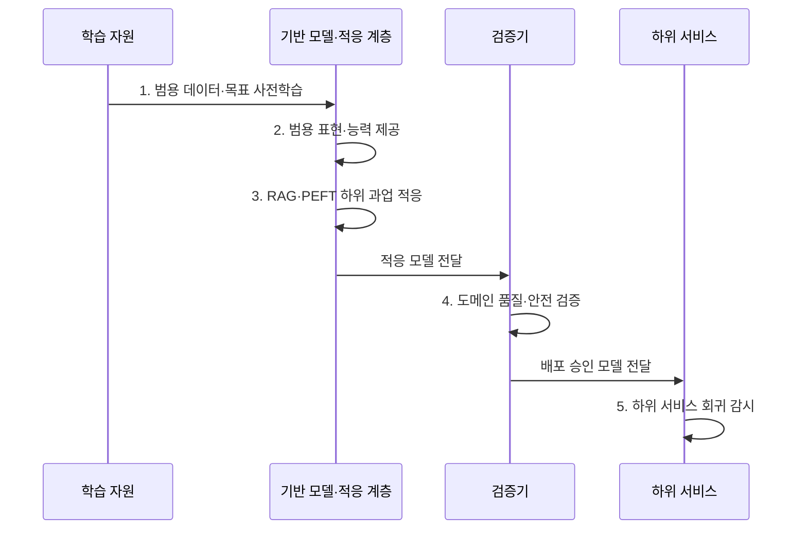

---
sidebar:
  order: 26
  label: "026. Foundation Model (파운데이션 모델)"
  badge:
    text: "기출 · 70%"
    variant: note
title: "Foundation Model (파운데이션 모델)"
date: "2026-08-02T08:54:00+09:00"
tags:
  - "notes-latest_tech"
weight: 26
extra:
  question_no: "026"
  source_status: "기출"
  source_history: "135회"
  priority: 70
  priority_note: "범용 사전학습과 전이 구조가 핵심"
---

## Ⅰ. 개요

핵심 용어

- **파운데이션 모델(Foundation Model)**: 광범위한 데이터로 사전학습한 뒤 여러 하위 과업에 적응하여 재사용하는 범용 모델이다.
- **전이학습(Transfer Learning)**: 한 과업이나 데이터에서 학습한 표현과 능력을 다른 과업에 재사용하는 학습 방식이다.

- 정의/개념: 광범위한 데이터로 범용 표현을 사전학습하고 조정·프롬프트로 여러 하위 과업에 재사용하는 **파운데이션 모델**
- 배경/필요성: 과업별 전용 모델 학습은 데이터·연산 비용이 반복되고 **학습 표현의 범용 재사용** 곤란

#### 한줄 요약
- 하나의 범용 모델을 검색이나 소규모 추가 학습으로 조정해 여러 업무에 활용함

## Ⅱ. 특징

핵심 용어

- **자기지도 사전학습**: 데이터 자체에서 예측 목표를 구성하여 대규모 범용 표현을 미리 학습하는 방식이다.
- **대규모 언어 모델(Large Language Model, LLM)**: 대규모 토큰 분포를 학습하여 여러 언어 과업을 수행하는 파운데이션 모델의 한 유형이다.
- **검색 증강 생성(Retrieval-Augmented Generation, RAG)**: 외부 검색 근거를 모델 문맥에 결합해 최신·도메인 지식을 보완하는 방식이다.
- **매개변수 효율 미세조정(Parameter-Efficient Fine-Tuning, PEFT)**: 일부 추가·선택 매개변수만 학습해 과업에 적응하는 방식이다.
- **시스템 위험(Systemic Risk)**: 공통 기반 모델의 편향·취약점·오류가 이를 사용하는 여러 하위 서비스로 함께 전파되는 위험이다.

- 대규모 범용 데이터의 **자기지도 사전학습**
- **대규모 언어 모델(Large Language Model, LLM)·전이학습**: 범용 표현과 능력을 여러 언어 과업에 재사용
- **검색 증강 생성(Retrieval-Augmented Generation, RAG)·매개변수 효율 미세조정(Parameter-Efficient Fine-Tuning, PEFT)** 기반 하위 과업 적응·재사용
- 공통 모델의 결함이 하위 서비스로 전파되는 **시스템 위험**

#### 한줄 요약
- 여러 업무를 빠르게 만들 수 있지만 공통 기반의 편향과 취약점도 함께 물려받음

## Ⅲ. 구조 및 구성요소

핵심 용어

- **검색 증강 생성(Retrieval-Augmented Generation, RAG)**: 외부에서 검색한 도메인 근거를 모델 문맥에 결합하여 과업에 적응시키는 방식이다.
- **매개변수 효율 미세조정(Parameter-Efficient Fine-Tuning, PEFT)**: 전체 모델 대신 일부 추가·선택 매개변수만 학습하여 과업에 적응하는 방식이다.
- **저순위 적응(Low-Rank Adaptation, LoRA)**: 가중치 변화량을 작은 저순위 행렬로 학습하는 PEFT 기법이다.
- **응용 프로그래밍 인터페이스(Application Programming Interface, API)**: 기반 모델의 추론 기능을 하위 서비스가 호출할 수 있게 제공하는 접점이다.

| 구성요소 | 책임 |
|:---|:---|
| 학습 자원 | 범용 데이터·연산 자원과 **사전학습 목표** 제공 |
| 기반 모델 | 여러 과업에 재사용할 **범용 표현·능력** 학습 |
| 적응 계층 | **검색 증강 생성(Retrieval-Augmented Generation, RAG)·매개변수 효율 미세조정(Parameter-Efficient Fine-Tuning, PEFT)·저순위 적응(Low-Rank Adaptation, LoRA)** 기반 도메인 지식 반영 |
| 서비스 접점 | **응용 프로그래밍 인터페이스(Application Programming Interface, API)·런타임 기반 하위 서비스 연동** |
| 통제 계층 | 모델 카드·평가·접근 통제로 **전파 위험** 관리 |

#### 한줄 요약
- 공통 두뇌에 업무별 자료와 조정 계층을 붙여 여러 서비스에서 사용함

## Ⅳ. 흐름도

핵심 용어

- **도메인 적응**: 범용 모델을 특정 업무의 데이터·용어·성공 기준에 맞도록 검색이나 추가 학습으로 조정하는 과정이다.
- **회귀 감시**: 기반 모델이나 적응 계층 변경 뒤 연결된 서비스의 품질과 안전성이 낮아지는지 지속 확인하는 활동이다.

1. **범용 데이터·목표 사전학습**: 대규모 자기지도 학습으로 **공통 패턴** 내재화
2. **범용 표현·능력 제공**: 여러 과업이 활용할 **공유 기반** 제공
3. **검색 증강 생성(Retrieval-Augmented Generation, RAG)·매개변수 효율 미세조정(Parameter-Efficient Fine-Tuning, PEFT) 기반 하위 과업 적응**: 검색 문맥이나 일부 매개변수 학습으로 **도메인 적합성** 확보
4. **도메인 품질·안전 검증**: 정확성·편향·보안·규제 기준의 **배포 적합성** 판정
5. **하위 서비스 회귀 감시**: 기반 모델 변경의 공통 영향 추적

#### 한줄 요약
- 범용 모델을 업무에 맞춘 뒤 시험하고, 공통 모델 변경 시 연결된 서비스를 다시 검사함

## Ⅴ. 종류 및 비교

핵심 용어

- **파운데이션 모델**: 범용 사전학습 결과를 여러 과업이 공유하고 검색 증강 생성(Retrieval-Augmented Generation, RAG)·매개변수 효율 미세조정(Parameter-Efficient Fine-Tuning, PEFT) 등으로 적응한다.
- **과업 전용 모델**: 제한된 데이터와 목표로 하나의 과업을 직접 학습하여 세밀한 통제와 최적화를 추구한다.

| 비교 기준 | 파운데이션 모델 | 과업 전용 모델 |
|:---|:---|:---|
| 적용 기준 | 다수 과업의 **빠른 개발·확장** | 단일 과업의 **강한 통제·최적화** |
| 핵심 특징 | 범용 사전학습 후 **검색 증강 생성(Retrieval-Augmented Generation, RAG)·매개변수 효율 미세조정(Parameter-Efficient Fine-Tuning, PEFT) 적응** | 제한 데이터로 **과업 목적 직접 학습** |
| 한계 | 공통 결함의 **광범위한 전파** | 과업별 **데이터·연산 비용** 반복 |

#### 한줄 요약
- 여러 업무의 공통 출발점은 파운데이션 모델, 좁은 업무의 정밀 통제는 전용 모델이 적합함

## Ⅵ. 실무 고려사항 및 대책

핵심 용어

- **카나리 배포(Canary Deployment)**: 새 모델 버전을 일부 트래픽이나 서비스에 먼저 적용해 이상을 확인한 뒤 범위를 확대하는 방식이다.
- **버전 고정(Version Pinning)**: 검증된 기반 모델 버전을 명시하여 공급자의 변경이 예고 없이 하위 서비스에 반영되지 않게 하는 통제다.
- **대체 모델 전환**: 중앙 모델이나 API 장애 시 미리 검증한 다른 모델로 요청을 보내 서비스 연속성을 유지하는 방식이다.

| 문제 | 대책 | 효과 |
|:---|:---|:---|
| 공통 편향·취약점의 **하위 서비스 전파** | 중앙 위험 목록과 서비스별 영향·완화책 추적 | **시스템 위험**의 확산 범위 통제 |
| 범용 능력과 업무 데이터의 **도메인 불일치** | 업무 평가셋으로 **검색 증강 생성(Retrieval-Augmented Generation, RAG)·매개변수 효율 미세조정(Parameter-Efficient Fine-Tuning, PEFT) 후보 비교** | 최소 비용의 **적응 방식** 선정 |
| 기반 모델 업데이트의 **성능 회귀** | 버전 고정·카나리 배포·전체 하위 서비스 회귀 시험 | 변경 영향의 **조기 탐지·복구** |
| 중앙 모델·응용 프로그래밍 인터페이스(Application Programming Interface, API)에 대한 **의존·정보 노출** | 장애 시 대체 모델 전환과 입력 분류·최소 전송 | 연속성·기밀성 **동시 확보** |

#### 한줄 요약
- 공통 모델을 바꾸면 상담·요약·검색처럼 연결된 모든 서비스를 다시 시험함

## Ⅶ. 결론

핵심 용어

- **파운데이션 모델 선택 기준**: 여러 과업을 빠르게 개발·확장하고 공통 표현을 재사용할 때 선택한다.
- **전용 모델 선택 기준**: 단일 과업의 데이터·동작·성능을 강하게 통제하고 최적화해야 할 때 선택한다.

- 다수 과업은 **파운데이션 모델**, 고통제 단일 과업은 **전용 모델** 선택

#### 한줄 요약
- 하나의 기반을 여러 서비스가 공유하는 만큼 변경 영향도 함께 추적해야 함
