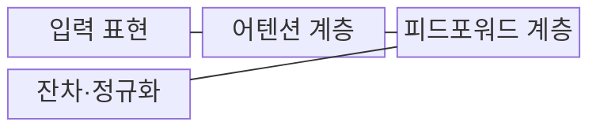
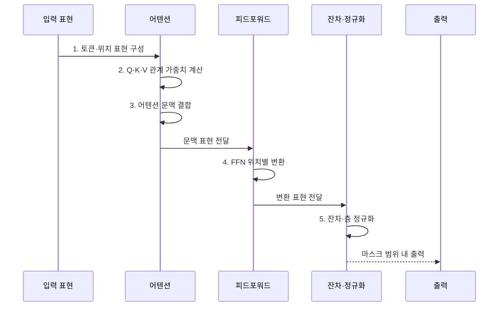

---
sidebar:
  order: 27
  label: "027. Transformer (트랜스포머)"
  badge:
    text: "기출 · 70%"
    variant: note
title: "Transformer (트랜스포머)"
date: "2026-07-31T11:55:20+09:00"
tags:
  - "notes-latest_tech"
weight: 27
extra:
  question_no: "027"
  source_status: "기출"
  source_history: "135회, 137회"
  priority: 70
  priority_note: "어텐션 기반 구조가 반복 출제되는 기반"
---

## 미리 알고가기

- **트랜스포머 기반 양방향 인코더 표현(Bidirectional Encoder Representations from Transformers, BERT)**: 양방향 인코더를 사전 학습한 문맥 모델
- **쿼리·키·밸류(Query·Key·Value, Q·K·V)**: 관계 기준과 전달 정보 벡터
- **셀프 어텐션(Self-Attention)**: 같은 시퀀스 내 토큰 관계 계산
- **크로스 어텐션(Cross-Attention)**: 타 시퀀스 정보 참조
- **피드포워드 신경망(Feed-Forward Network, FFN)**: 위치별 표현 변환 층
- **순환 신경망(Recurrent Neural Network, RNN)**: 은닉상태 순차 전달 구조
- **그래픽 처리 장치(Graphics Processing Unit, GPU)**: 행렬 병렬 연산 장치
- **잔차 연결(Residual Connection)**: 하위 입력에 출력 가산
- **층 정규화(Layer Normalization)**: 차원별 정규화 연산

> **키워드:** Transformer (트랜스포머)

## Ⅰ. 개요

- 정의/개념: 셀프 어텐션으로 토큰 관계를 직접 계산하는 **트랜스포머 신경망**
- 배경/필요성: RNN의 순차 상태 전달은 **학습 병렬화와 장거리 의존성 학습**에 한계

### 쉽게 이해하기 (학습용)
- 단어 간 관계를 한 층에서 동시 계산함

## Ⅱ. 특징

- 셀프 어텐션에 의한 **모든 토큰 쌍 관계의 직접 계산**
- **셀프·크로스 어텐션**: 동일·외부 시퀀스의 문맥 관계 결합
- 순환 구조 제거와 **GPU 병렬 학습**
- 마스크에 의한 참조 범위 제어와 **O(N²) 어텐션 비용**

### 쉽게 이해하기 (학습용)
- 학습은 병렬이나 생성은 순차적임

## Ⅲ. 구조 및 구성요소

| 구성요소 | 책임 |
|:---|:---|
| 입력 표현 | 토큰 임베딩과 **위치 인코딩** 결합 |
| 어텐션 계층 | **셀프 어텐션**으로 토큰 관계 추출 |
| 피드포워드 계층 | 위치별 비선형 변환으로 **표현 차원** 확장·압축 |
| 잔차·정규화 | 잔차 연결과 층 정규화로 **정보·학습 안정성** 유지 |

### 쉽게 이해하기 (학습용)
- 관계를 모으는 단계와 각 단어 표현을 다듬는 단계를 잔차 연결로 반복함

## Ⅳ. 흐름도

1. **토큰·위치 표현 구성**: 토큰 의미와 **순서 정보** 결합
2. **Q·K·V 관계 가중치 계산**: 토큰 쌍의 **참조 중요도** 산출
3. **어텐션 문맥 결합**: 가중치에 따라 Value를 합성해 **문맥 표현** 생성
4. **FFN 위치별 변환**: 각 토큰 표현의 비선형 확장·압축
5. **잔차·층 정규화**: 잔차 경로와 정규화로 정보·기울기 안정화

### 쉽게 이해하기 (학습용)
- 단어별 정보를 모으고 다듬어 전달함

## Ⅴ. 종류 및 비교

| 비교 기준 | Transformer | RNN 계열 |
|:---|:---|:---|
| 적용 기준 | 긴 문맥의 **병렬 학습·확장** | 짧은 스트림의 **순차 상태 처리** |
| 핵심 특징 | 어텐션으로 **토큰 관계 직접 계산** | 은닉 상태로 **정보 순차 전달** |
| 한계 | 문맥 길이의 **O(N²) 비용** | 병렬화 제한·**장거리 정보 소실** |

### 쉽게 이해하기 (학습용)
- RNN은 순차 전달이나 트랜스포머는 관계 직접 계산함

## Ⅵ. 실무 고려사항 및 대책

| 고려사항 | 대책 | 효과 |
|:---|:---|:---|
| 긴 문맥의 **O(N²) 메모리·연산량** | 청크·윈도·희소 어텐션과 길이별 부하 시험 | 처리량·문맥 보존의 **균형 확보** |
| 위치 표현의 **학습 길이 외 일반화** | 상대·회전 위치 표현과 최대 길이 평가 | 장문 순서 정보의 **왜곡 완화** |
| 자기회귀 생성의 **순차 지연** | KV 캐시·배치·추측 디코딩 적용 | 토큰당 지연·비용 **절감** |
| 마스크 오류에 의한 **미래·패딩 정보 누출** | 마스크 단위 시험과 학습·추론 조건 일치 검증 | 잘못된 참조와 평가 과대 **차단** |

### 쉽게 이해하기 (학습용)
- 긴 문맥을 구간별로 나누거나 중요한 토큰 관계만 계산하여 메모리와 처리 비용을 절감한다.

## Ⅶ. 결론

- 긴 문맥 병렬 학습은 **트랜스포머**, 짧은 순차 상태는 **RNN** 선택

### 쉽게 이해하기 (학습용)
- 문맥 처리 성능과 어텐션의 제곱 복잡도 사이의 균형을 고려하여 모델 구조를 선택해야 한다.
