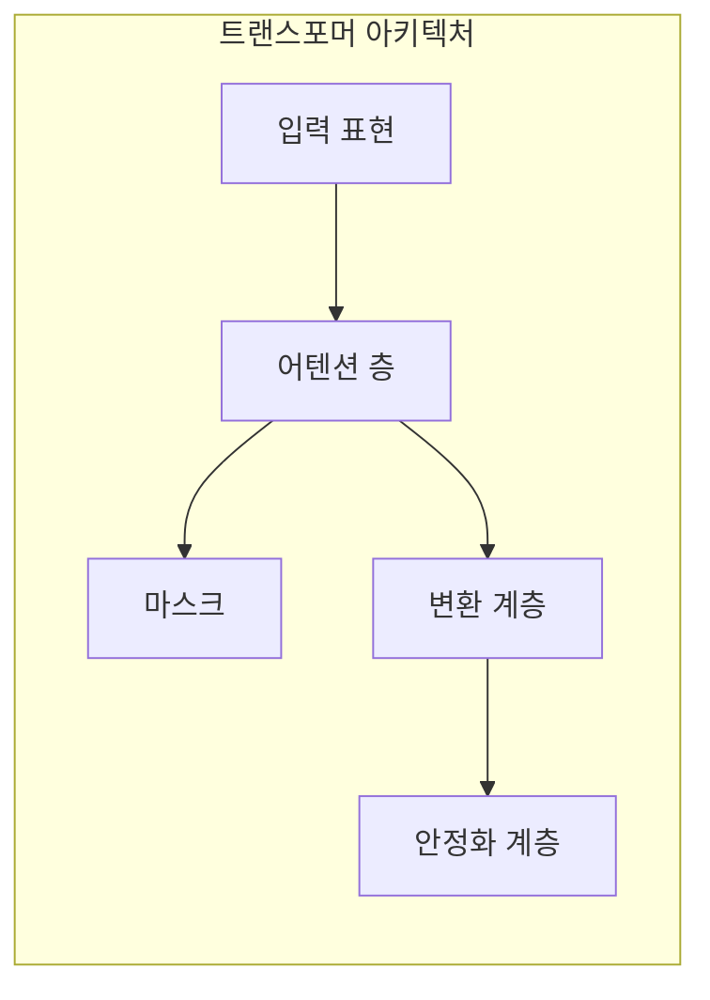
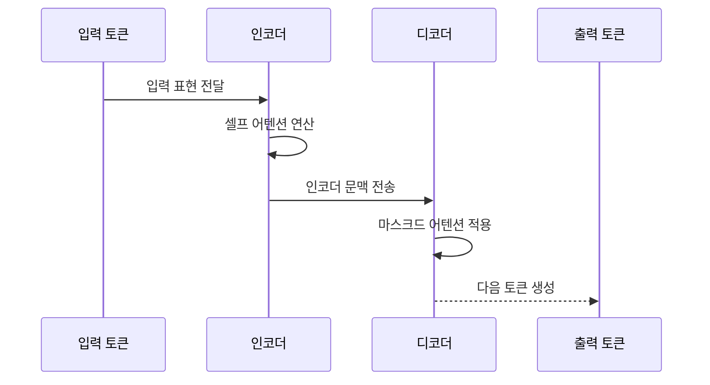

---
sidebar:
  order: 27
  label: "027. Transformer (트랜스포머)"
  badge:
    text: "기출 · 70%"
    variant: note
title: "Transformer (트랜스포머)"
date: "2026-07-25T01:25:00+09:00"
tags:
  - "cspe-latest_tech"
weight: 27
extra:
  question_no: "027"
  exam_status: "기출"
  exam_history: "135회, 137회"
  exam_probability: 70
  exam_note: "어텐션 기반 구조가 반복 출제되는 기반"
---

## 미리 알고가기

- **트랜스포머 기반 양방향 인코더 표현(Bidirectional Encoder Representations from Transformers, BERT)**: 양방향 인코더를 사전 학습한 문맥 모델
- **쿼리·키·밸류(Query·Key·Value, Q·K·V)**: 관계 기준과 전달 정보 벡터
- **셀프 어텐션(Self-Attention)**: 같은 시퀀스 내 토큰 관계 계산
- **크로스 어텐션(Cross-Attention)**: 타 시퀀스 정보 참조
- **피드포워드 신경망(Feed-Forward Network, FFN)**: 위치별 표현 변환 층
- **순환 신경망(Recurrent Neural Network, RNN)**: 은닉상태 순차 전달 구조
- **그래픽 처리 장치(Graphics Processing Unit, GPU)**: 행렬 병렬 연산 장치
- **잔차 연결(Residual Connection)**: 하위 입력에 출력 가산
- **층 정규화(Layer Normalization)**: 차원별 정규화 연산

## Ⅰ. 개요

- 정의/개념: **트랜스포머**는 셀프 어텐션으로 토큰 간 관계를 직접 계산하여 문맥을 학습하는 신경망 구조다.
- 기존 한계: RNN의 순차 연산은 학습 병렬화를 제한하고, 긴 시퀀스에서 장기 의존성을 안정적으로 전달하기 어렵다.

### 쉽게 이해하기 (학습용)
- 단어 간 관계를 한 층에서 동시 계산함

## Ⅱ. 특징

- 어텐션이 모든 토큰 쌍 관계를 직접 계산한다
- 학습은 병렬이지만 자기회귀 생성은 순차적이다
- 마스크가 토큰의 참조 범위를 제한한다
- 셀프 어텐션 비용은 문맥 길이 제곱으로 늘어난다

### 쉽게 이해하기 (학습용)
- 학습은 병렬이나 생성은 순차적임

## Ⅲ. 아키텍처 및 구성요소

| 설계 요소 | 설명 |
|:---|:---|
| 입력 표현 | 토큰 임베딩과 순서 정보를 담은 위치 인코딩 |
| 어텐션 층 | 셀프 어텐션을 통한 입력 토큰 간 관계 추출 |
| 마스크 | 인코더·디코더의 토큰 참조 범위 제어 |
| 변환 계층 | 위치별 피드포워드 신경망 기반 차원 변환 |
| 안정화 계층 | 잔차 연결과 층 정규화 기반 학습 안정화 |

### 쉽게 이해하기 (학습용)
- 관계를 모으는 단계와 각 단어 표현을 다듬는 단계를 잔차 연결로 반복함

## Ⅳ. 원리 및 절차 흐름도

| 절차 | 설명 |
|:---|:---|
| 입력 표현 전달 | 토큰 임베딩과 위치 정보 결합 |
| 셀프 어텐션 연산 | 시퀀스 내 토큰 간 가중 유사도 계산 |
| 인코더 문맥 전송 | 디코더의 크로스 어텐션용 문맥 전달 |
| 마스크드 어텐션 적용 | 미래 토큰 가림막 적용 후 문맥 계산 |
| 다음 토큰 생성 | 확률 분포 기반 순차적 다음 단어 예측 |

### 쉽게 이해하기 (학습용)
- 단어별 정보를 모으고 다듬어 전달함

## Ⅴ. 종류 및 비교

| 판단 기준 | Transformer | RNN 계열 |
|:---|:---|:---|
| 문맥 전달 | 셀프 어텐션 기반 모든 토큰 직접 연결 | 은닉 상태 벡터를 통한 순차 정보 전파 |
| 학습 병렬성 | 모든 시퀀스 위치의 병렬 학습 수행 | 이전 은닉 상태 의존으로 순차 학습 제한 |
| 적용 기준 | 긴 문맥의 병렬 학습이 필요할 때 | 입력 데이터의 순차적 처리가 필요할 때 |

> 요약: 트랜스포머는 셀프 어텐션으로 전체 문맥의 토큰 관계를 병렬 학습한다.

### 쉽게 이해하기 (학습용)
- RNN은 순차 전달이나 트랜스포머는 관계 직접 계산함

## Ⅵ. 실무 사례

1. 법률·연구 문서 분석 서비스에서 긴 입력을 청크로 분할하고 희소 어텐션을 적용하여 핵심 문맥을 유지하면서 연산량을 줄인다.

### 쉽게 이해하기 (학습용)
- 긴 문맥을 구간별로 나누거나 중요한 토큰 관계만 계산하여 메모리와 처리 비용을 절감한다.

## Ⅶ. 결론

- 긴 문맥의 의존성을 병렬로 학습하기 위해 입력 길이·어텐션 범위·연산량을 검토하여 **트랜스포머**를 활용해야 한다.

### 쉽게 이해하기 (학습용)
- 문맥 처리 성능과 어텐션의 제곱 복잡도 사이의 균형을 고려하여 모델 구조를 선택해야 한다.
